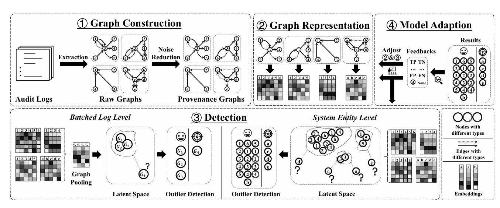

# MAGIC

> [论文连接](https://www.usenix.org/conference/usenixsecurity24/presentation/jia-zian)  
> [Github连接:https://github.com/FDUDSDE/MAGIC](https://github.com/FDUDSDE/MAGIC)

## 背景

最近关于APT检测的研究利用数据来源进行APT检测。数据溯源将审计日志转换为溯源图，从审计日志中提取丰富的上下文信息，为细粒度因果关系分析和APT检测提供了一个完美的平台。

早期的工作基于典型或特定的APT模式构建规则，并根据这些规则匹配审计日志以检测潜在的APT。最近的一些研究采用统计异常检测方法来检测关注不同来源图元素的APT，例如系统实体、交互和社区。然而，最近的研究都是基于深度学习的方法。他们利用各种深度学习技术来建模APT模式或系统行为，并以分类或异常检测方式执行APT检测。

### 各种APT检测方法的挑战

1. **监督学习方法**存在数据缺乏（LOD）的问题，因为他们需要关于APT的先验知识（即攻击模式或包括攻击的日志）。此外，这些方法在未经训练的新型APT时尤其脆弱。
2. **基于统计的方法**通过这些系统实体、交互和社区基于它们的稀缺性或异常得分。然而，系统实体的稀缺性不一定表明它们的异常，通过因果分析或标签传播获得的异常分数是对来源图的浅层特征提取，从而导致高假阳性率。
3. **基于深度学习的方法**，特别是基于序列和基于图的方法，计算开销过大，在现实的检测场景中不切实际。

## How To Do

1. 溯源图构建
2. 图表示模块
3. 检测模块
4. 模型适应机制(可选)

Overview of MAGIC’s detection pipeline.

用(1)变换训练数据，用(2)学习图嵌入，记忆(3)中的良性行为。在推理过程中，MAGIC用(1)变换目标数据，用训练后的(2)得到图嵌入，通过(3)检测异常值。

为了使APT检测器在实际检测场景中有效地发挥作用，必须考虑概念漂移。当面对良性但以前未见过的系统行为时，MAGIC会产生假阳性检测结果，这可能会误导后续应用程序（例如攻击调查和故事恢复）。最近的研究通过忘记过时的数据或通过模型适应机制使模型适应良性的系统变化来解决这一问题。MAGIC还集成了一个模型适应机制，以防止概念漂移

### 检测模块

首先从训练源图中提取良性输出嵌入。检测模块在这个阶段所做的只是简单地记忆这些嵌入，并将它们组织在K-D树中。经过训练后，检测模块通过k近邻搜索、相似度计算和过滤三步来发现异常点。给定目标嵌入，检测模块首先通过K-D树搜索得到目标的k近邻。这样的搜索过程只需要$log(N)$的时间，其中N为记忆的训练嵌入的总数。然后，应用相似度准则来评估目标嵌入与其邻居的接近程度，并计算异常分数。如果其异常得分高于超参数$\theta$，则认为目标嵌入是异常值，其对应的系统实体或系统状态是恶意的。

## 创新点

文章采用了自监督学习的方法，通过在训练过程对节点屏蔽，通过图掩码自编码器，以自监督的方式输出嵌入。图掩码自编码器由一个编码器和一个解码器组成。编码器通过传播和聚合图特征产生输出嵌入，解码器重构图特征，为训练提供监督信号。这样的编码器-解码器架构在生成的嵌入中保持上下文和语义信息，同时通过掩模学习显着降低其计算开销。

## GraphMAE

 **`Self-Supervised Masked Graph Autoencoders`** 

GraphMAE（Graph Masked Autoencoder）是一种[自监督](https://www.notion.so/Machine-learning-a4a1a6d23d724953843eb0a500cf95ba?pvs=21)学习方法，用于图数据的表示学习。其主要特点和工作原理如下：

- 生成式方法：GraphMAE采用生成式的自监督学习策略，不同于常见的对比学习方法。
- 掩码机制：它通过随机掩码图中的节点特征，然后尝试重建这些被掩码的特征来学习图的表示。
- 编码器-解码器结构：使用图神经网络作为编码器来学习图的结构信息，解码器则用于重建被掩码的节点特征。
- 自监督学习：GraphMAE不需要标签数据，可以直接从图的结构和节点特征中学习有意义的表示。
- 性能优势：在多个图学习任务中，GraphMAE展现出优于传统对比学习方法的性能。

GraphMAE的这种设计使其能够有效地捕捉图数据的结构和语义信息，为下游任务如节点分类、图分类等提供高质量的图表示。
### 论文
[GraphMAE: Self-Supervised Masked Graph Autoencoders | Proceedings of the 28th ACM SIGKDD Conference on Knowledge Discovery and Data Mining](https://dl.acm.org/doi/abs/10.1145/3534678.3539321)

### 讲解
[[KDD'22] GraphMAE: 生成式图自监督学习超越对比学习 - 知乎](https://zhuanlan.zhihu.com/p/520389049)

## 和SOTA的对比

## 对我的启发

在特征提取阶段，**GraphGAE这种无监督的方法比较新颖**，可以借鉴论文，用无监督的方法（类似GraphGAE）训练一个特征提取器，再用少量有监督的数据训练一个分类头（或者沿着论文的使用无监督方式进行APT检测）。