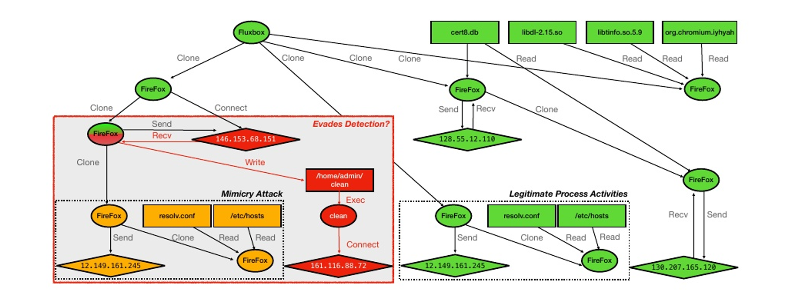

# Sometimes You Aren’t What You Do

> [Sometimes, You Aren’t What You Do:Mimicry Attacks against Provenance Graph Host Intrusion Detection Systems](https://par.nsf.gov/biblio/10412012)


## 摘要

摘要 - 主机层入侵检测仍是计算机安全的一个开放性问题。随着机器学习和因果图审计的发展，入侵检测被重新定义为起源图异常检测。这些方法虽有前景，但其对抗自适应攻击的能力尚待验证，特别是在应对传统模拟攻击时的表现仍不明确。

本研究发现系统设计缺陷导致模仿攻击在起源图主机入侵检测系统（Prov-HIDS）中普遍存在。我们开发的规避策略让攻击者能在良性进程中隐藏，并通过公开数据集验证实现了100%的检测规避率。我们的方法在实时场景中优于现有对抗技术，并通过开源促进未来研究。

## 思路

1. 文章首先通过一个攻击实例来说明它的做法
    
    
    
    这是一个来自DARPA 透明计算参与活动的一个起源图，描述了使用 Drakon 对 Firefox 后门攻击的情况，可以理解为通过浏览器脚本来操作被攻击者的操作系统。
    
    - 绿色表示良性系统行为
    - 红色表示攻击子图
    - 橙色表示模仿攻击，这种子图类似于合法的进程活动，这些活动可能足以迷惑分类器，
    导致对攻击的误分类。
    
    所以，我们是不是可以通过加入这种模仿攻击的子图来迷惑入侵检测器
    

## 入侵检测方案的分类

文章将入侵检测系统根据学习任务分成了两类，分别是**检测**和，在**检测**任务中，通过学习任务的不同将其分为多个子类


## 几种入侵检测方法的概述

### StreamSpot

> 在介绍怎么攻击前，文章先讲述了`StreamSpot`入侵检测系统的思路，这个入侵检测系统是**基于领域的整个图**进行分析的。
> 


1. 以起源图作为输入
2. 遍历
3. 并划分图邻域以构建直方图表示
4. StreamHash编码（使用L个哈希函数，将shingles映射到{+1， - 1}）
5. 构建最终的二进制特征嵌入
6. 聚类进行入侵检测

### Unicorn

> 然后讲述了`Unicorn`入侵检测系统的思路，这个入侵检测系统是**基于领域的整个图**进行分析的。
> 


1. 对于流式起源图，在每个时间步长（由虚线圆圈标记） 
2. 遍历并划分图邻域以构建直方图表示
3. 使用 HistoSketch 对每个直方图进行编码
4. 从所有嵌入中构建模型
5. 最终模型是所有训练图模型的集合，在运行时，如果测试图不符合任何模型，`Unicorn`就会检测到异常

### ProvDetector

> 这个入侵检测系统是**基于路径的分析整个图**的代表。
> 


1. 给定一个起源图，
2. ProvDetector 从该图中提取所有路径
3. 选择
4. 使用 `doc2vec` 对top-K 条路径进行编码
5. 将编码后的路径与训练好的模型进行比较

## 数据集

> 由于文章主要还是做的数据，所以数据集我们要重点分析，首先将讲解一下原始数据集的内容，然后我们讲讲他们在文章是如何做处理的
> 

### SteamSpot(SS)

- StreamSpot数据集由SystemTap生成，用于StreamSpot和Unicorn的原始评估。该数据集于2016年生成，包含一个驱动下载攻击场景和五个良性主机活动场景（观看YouTube、浏览CNN、下载文件、检查电子邮件和玩游戏）
- 每一行的数据格式
    
    ```
    		source-id	 source-type	destination-id	destination-type	edge-type	graph-id
    ```
    
- graph-id对应如下场景
    
    
    |  | 分类 | Graph属于编号 |
    | --- | --- | --- |
    | 1 | YouTube | graph ID's 0 - 99 |
    | 2 | GMail  | graph ID's 100 - 199 |
    | 3 | VGame | graph ID's 200 - 299 |
    | 4 | Drive-by-download attack | graph ID's 300 - 399 |
    | 5 | Download | graph ID's 400 - 499 |
    | 6 | CNN | graph ID's 500 - 599 |
- 论文中的实验设置
    
    StreamSpot只描述一个攻击行为，攻击描述了一个Firefox漏洞，其中受害者点击恶意URL时意外触发了Flash中的漏洞。论文为了**分类器能够更紧密地定义正常性范围**只对浏览CNN场景进行训练，这使得分类器能够更紧密地定义正常性范围
    
- 文章的数据生成过程：
    - 首先找到StreamSpot的**原始日志文件**:我找了很久，找到了StreamSpot的github的仓库的issue中，发现作者原先提供原始日志数据的网盘链接已经过期，可以继续关注。
    
    
    
    - 经过观察代码，论文的做法不是直接从StreamSpot的图数据生成数据的，而是拿到了日志文件，通过转化为**更多信息的溯源图（Output_ADM）**，再进行边的插入，最后再转化为StreamSpot格式（更简单的溯源图）
    - 第一步日志的解析：源代码有一个py文件`ssParser.py` 我理解为StreamSpot解析器，对StreamSpot数据的原始日志进行解析并转化为中间变量**Output_ADM**(**更多信息的溯源图**)
        
        ```
            #日志文件格式：ret_val , ret_time , call_time , process_name , pid , tid , syscall , arg1 , arg2 
            #类型定义
            graphIds = {
            "gmail/": 100,
            "youtube/": 0,
            "game/": 200,
            "download/": 400,
            "cnn/": 300,
            "attack/": 500
        }
        		#输出的格式（中间格式）
        		#output_ADM.csv: 
        		#source_id, source_type, target_id, target_type, syscall, process_name, timestamp, pid, args
        		#1234, process, 5678, file, open, firefox, 1629153600, 1234, /etc/hosts;O_RDONLY
        		
        		#process_metadata.csv:
        		#graph, id, pid, name, type
        		#game/, 1234, 0, firefox, process
        		
        		#file_metadata.csv:
        		#graph, id, ppid_fd, path, type
        		#game/, 1234, 0:1234, /etc/hosts, file
        ```
        
        - `sourceId`：起始节点id
        - `sourceType`：起始节点类型
        - `destinationId` : 目标节点id
        - `destinationType` : 目标节点类型
        - `syscal` :系统行为
        - `process_name` ：进程名
        - `timestamp` ：触发时间
        - `pid` : 进程id
        - `args` : 参数
    - `insertAttackPath.py`,实现了在良性图中**插入攻击路径**和**插入良性子结构的行为**来逃避检测,输入是前面提到的**Output_ADM**(**更多信息的溯源图**)，输出是StreamSpot格式
        
        输入文件如下：
        • `attackPath.pkl`：包含攻击路径的数据。
        • `benign.csv`：包含良性日志数据。
        • `benignSubstructs.csv`：包含良性子结构数据。
        
        输出文件如下：
        • `output.csv`：包含插入了攻击路径后的日志数据。
        • `malicious_nodes.pkl`：包含插入的恶意节点信息。
        
    - **加载攻击路径和良性文件**：
        - `getAttackPath(fl)`：从pickle文件加载攻击路径，并按时间戳排序。
        - `getBenignFile(fl)`：读取良性文件，解析为DataFrame，并提取PID列表。
    - **找到插入点**：
        - `findInsertPoint(rows, parentProcess, inFront = False, processName = None)`：在良性日志中找到可以插入攻击路径的起始点，通常是某个特定进程（如`firefox`）的首次出现位置。
    - **接管进程**：
        - `takeOver(attackPath, parentP, benDf)`：修改良性日志中的某些行，以模拟攻击者接管了某个进程，并生成新的PID。
    - **插入攻击路径**：
        - `insertAttackPath(attackPath, parentP, rows, tempDir, numberOfClones, inFront = False)`：根据攻击路径，在良性日志中插入恶意行为，调整时间戳和PID等信息，确保插入后的日志看起来合理。
    - **插入良性子结构**：
        - `insertBenSubstructs(benSub, parentP, rows, tempDir, numberOfClones, inFront = False)`：在插入攻击路径之前或之后，插入一些额外的良性子结构，以增加混淆度。
    - **保存结果**：
        - `saveRows(rows, fileName)`：将最终生成的日志保存为CSV文件。
        - `saveMalNodes(nodes, path)`：保存恶意节点信息到pickle文件。
    - **主函数**：
        - `main(attackPath, benignFilePath, benignSubstructs, savePath, inFront = True)`：协调上述各个步骤，完成攻击路径的插入并保存结果

### DARPA THEIA

> 由DARPA的透明计算项目发布了多个攻击模拟数据集，描述了专业红队试图渗透一个小型主机网络的过程。文章在由THEIA团队生成的Engagement 3数据集上评估我们的规避策略，该数据集包括一个单一的起源图，被分为25个不同的时间段。虽然数据集中还包括了其他一些不成功的入侵尝试，但我们主要关注在§II中描述的成功且更复杂的**Drakon入侵**。在评估我们的图变换的复杂性时，我们注意到数据集中的总活动大约为**4.8M条边**。THEIA代表了更真实的系统活动，并展示了攻击行为与正常系统活动同时发生的情况。
> 
- THEIA 的一个起源图，被分割成 25 个起源子图，分别代表不同的时间段。因此，THEIA 中进行了四种不同的攻击，而StreamSpot只有一种攻击

两个数据集的信息


## 一、对于StreamSpot

文章使用了**第一个攻击工具-滥用非加权图编码（§V-B1）**

对于StreamSpot，从训练数据集中将良性图拆解为K跳子结构，然后将**所有**子结构多次添加到攻击图中。

根据论文描述，对于StreamSpot数据集，一些攻击图在添加25万条边后开始逃避检测，而添加30万条边后所有攻击都变得无法检测到。在DARPA数据集中，攻击在添加8万条边后开始逃避检测。对于这两个数据集，我们的逃避策略都达到了100%的成功率。

在 StreamSpot 数据集中，良性图平均有295K 条边，而攻击图平均有 28K 条边。必要的转换至少添加了 250K 条边，占良性图大小的 85%。说明第一个攻击工具虽然有效，但是代价过大。

## 二、对于Unicorn

对于Unicorn，文章计算良性图内每个K跳子结构的归一化计数，然后将归一化计数，按子结构出现的频率，将K跳子结构的集合多次添加到攻击图中。

## 三、对于ProDetector

对于ProvDetector，我们从良性图生成一个频率数据库（其中ProvDetector存储不同边的频率）然后我们从图中提取所有路径，并根据频率数据库识别最异常的路径。如果最异常路径的正则性得分低于攻击路径，则我们采样另一个良性图。我们将路径多次引入攻击图。

四、五

—这部分还在看—

## 复现

- 复现代码时遇到问题，已发邮箱向作者求助
    
    问题如下：
    

    1. 它目前提交的版本缺少部分依赖的说明
    2. 论文提到的中不同工具（§V-B1）没有在代码部分被清晰地区分开来
    3. 代码应该有缺少的部分，一些函数没有出现过，没有StreamSpot和Unicorn入侵检测系统的源码


- 根据代码git中之前的提交记录，找到一些原来作者遗留的代码，根据以及生成好的数据集，尝试按照论文的说法，跑一下**ProDetector的代码**
    - **第一步：读取训练数据集并生成频率数据库**
    - 第二步：**读取测试数据**，加载频率数据库
    - 第三步： **对测试数据中的每个图**，构建邻接表，计算最短路径，并提取前 20 条异常路径。
    - 第四步：**保存异常路径的结果**，供后续分析使用。
    
    
    
    生成了正则性得分低于攻击路径的20条异常路径（取自良性图），可以将该路径插入到攻击图中。
    

## 引用这篇文章的文章,同时高被引的文章

1. [**Kairos: Practical intrusion detection and investigation using whole-system provenance**](https://x.sci-hub.org.cn/target?link=https://ieeexplore.ieee.org/abstract/document/10646673/)
2. [**FLASH: A Comprehensive Approach to Intrusion Detection via Provenance Graph Representation Learning**](https://x.sci-hub.org.cn/target?link=https://dartlab.org/assets/pdf/flash.pdf)