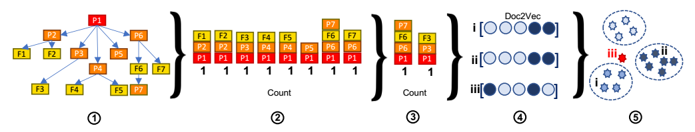

# ProvDetector

> [**You Are What You Do: Hunting Stealthy Malware via Data Provenance Analysis.**](https://x.sci-hub.org.cn/target?link=https://kangkookjee.io/wp-content/uploads/2021/06/provdetector-ndss2020.pdf)
> 

1. 给定一个溯源图
2. 从图中提取所有路径
3. 根据路径稀有性，提取出稀有性排名前K的路径。
4. 使用doc2vec对进行编码，
    
    ProvDetector使用doc2vec中的PV-DM模型进行嵌入，其可以将不同的路经长度嵌入到相同的维度。在这里作者将因果路径视为句子/文档：路径中的节点和边是组成描述程序行为的“句子”的单词。例如：Process:winword.exe write File:t1.txt read by Process:outlook.exe write Socket:168.x.x.x。
    
5. 将编码路径与训练模型进行比较，使用局部离群因子（LOF）作为新颖性检测模型。LOF是一种基于密度的方法。如果一个点的局部密度低于其邻居，则视为异常值。

## 路径稀有度计算

### **1. 定义正则性分数（Regularity Score）**

正则性分数用于量化一个事件或路径在系统中出现的普遍程度。分数越低，表示该事件或路径越稀有，可能与恶意行为相关。

### **2. 计算事件的正则性分数**

对于每个事件 *e*={*src*,*dst*}，其正则性分数 *R*(*e*) 定义为：

$$
R(e)=\frac{OUT(src)⋅∣H(e)∣}{∣H∣⋅IN(dst)}
$$

其中：

- *H*(*e*) 是事件 *e* 发生的主机集合。
- *H* 是企业中所有主机的集合。
- *OUT*(*src*) 是从源实体发出的边的数量。
- *IN*(*dst*) 是流入目标实体的边的数量。

### **3. 计算节点的流入和流出稳定性**

为了计算 *IN*(*v*) 和 *OUT*(*v*)，PROVDETECTOR 将训练数据划分为 *n* 个时间窗口 *T*={*t*1​,*t*2​,...,*tn*​}：

- *IN*(*v*) 是在 *v* 没有新入边添加的稳定窗口数量。
- *OUT*(*v*) 是在 *v* 没有新出边添加的稳定窗口数量。

$$
IN(v)=\frac{∣T_{to′}∣}{∣T∣}
$$

$$
OUT(v)=\frac{∣T_{from′}∣}{T}
$$

其中：

- ∣*Tfrom*′​∣ 是没有边从 *v* 发出的稳定窗口的数量。
- ∣*Tto*′​∣ 是没有边连接到 *v* 的稳定窗口的数量。
- ∣*T*∣ 是窗口的总数。

### **4. 选择稀有路径**

PROVDETECTOR使用路径的正则性分数来选择最稀有的路径。这通过将正则性分数转换为路径长度来实现，从而将问题转化为寻找最长路径问题。对于有向图 *G*，添加一个伪源节点 *vsource*​ 和一个伪汇节点 *vsink*​，然后为每条边分配一个权重 *W*(*e*)=−log2​*R*(*e*)。这样，图中最长的路径就是正则性分数最低的路径。

### **5. 实现最长路径算法**

虽然在一般图中寻找最长路径是NP-hard问题，但可以通过将其简化为有向无环图（DAG）上的最长路径问题来有效解决。PROVDETECTOR通过将图转换为DAG，并使用如Epstein算法等现有算法来找到最长路径。

## 局部离群因子（LOF）

> LOF算法的核心思想是：如果一个数据点的局部密度显著低于其邻居的局部密度，则该点可能是一个离群点。具体来说，LOF算法通过以下步骤来识别离群点：
> 
1. **计算每个点的局部可达密度（Local Reachability Density, LRD）**：对于每个数据点，计算其到其每个邻居的可达距离，并基于这些距离计算局部可达密度。局部可达密度反映了一个点的局部区域的密度。
2. **计算局部离群因子（Local Outlier Factor, LOF）**：对于每个数据点，计算其局部离群因子，这是其邻居的局部可达密度与该点自身的局部可达密度的比值。LOF值越高，表示该点与其邻居相比密度越低，因此更可能是一个离群点。
3. **识别离群点**：根据计算出的LOF值，可以识别出那些LOF值显著高于某个阈值的数据点作为离群点。