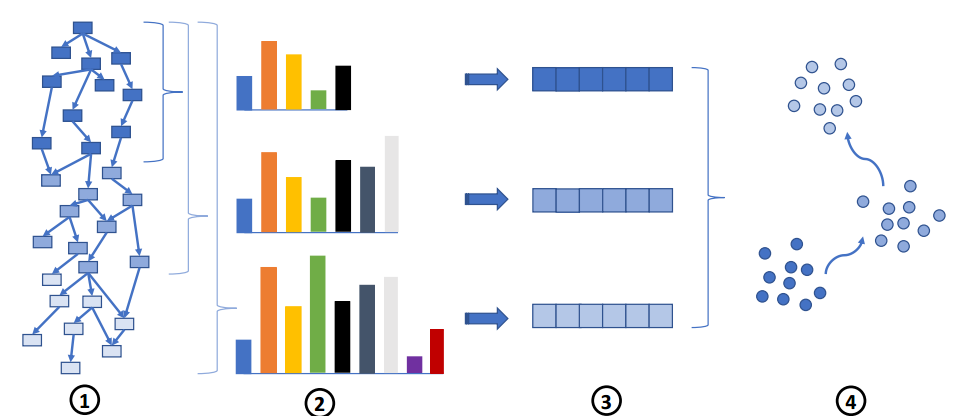

# Unicorn

> [Unicorn: Runtime Provenance-Based Detector for Advanced Persistent Threats](https://x.sci-hub.org.cn/target?link=https://arxiv.org/abs/2001.01525)
> 

1. 采用流式来源图，
2. 定期将图特征总结为直方图
3. 创建固定大小的图草图。由此产生的基于聚类的模型
4. 捕获了系统执行的动态。在部署过程中，通过相同的步骤（1、2和3）创建图形草图，然后与4中的模型进行比较。

## **图直方图（Graph Histogram）**

> UNICORN 使用一种基于**Weisfeiler-Lehman（WL）子图核**的算法来构建图直方图。该算法通过迭代标签传播来捕捉每个节点的邻域结构。
> 

Unicorn使用Weisfeiler-Lehman（WL）子树图核算法来构建图直方图。WL算法通过迭代传播顶点的标签，逐步扩展顶点的邻居范围（即R-hop邻居）。每个顶点的标签不仅包含自身的初始标签，还包含其邻居顶点的标签和边的标签。通过多次迭代，顶点的标签能够捕捉到更大范围的上下文信息。

## 图草图（Graph Sketch）的生成

图草图是图直方图的一个紧凑表示，用于在流式环境中高效地计算图之间的相似性。Unicorn使用HistoSketch算法来生成图草图，具体过程如下：

- **相似性保持哈希**：HistoSketch使用一种称为“相似性保持哈希”（Locality Sensitive Hashing, LSH）的技术，将高维的直方图投影到低维空间，同时保持图之间的相似性。具体来说，HistoSketch使用归一化的最小-最大相似性（Jaccard相似性）来衡量两个直方图的相似性。
- **草图的生成**：Unicorn为每个直方图生成一个固定大小的草图。草图的每个元素是通过对直方图中的标签进行加权采样得到的。草图的生成过程是增量的，Unicorn可以在新数据到达时快速更新草图，而不需要重新计算整个直方图。
- **草图的更新**：当新的边到达时，Unicorn会根据权重衰减因子（Weight Decay Factor）对直方图进行更新，并相应地更新草图。通过这种方式，Unicorn能够在保持草图紧凑的同时，捕捉到系统的动态变化。

## 进化模型

进化模型是Unicorn系统中的一个关键组件，用于捕捉系统行为的动态变化。与传统的静态模型不同，进化模型能够适应系统的长期行为变化，从而更好地检测APT攻击。具体原理如下：

- **模型的构建**：在训练阶段，Unicorn会生成一系列按时间顺序排列的草图，并使用K-medoids算法对这些草图进行聚类。每个聚类代表系统执行的一个“元状态”（meta-state），如系统启动、初始化、稳态等。Unicorn会根据草图的时序信息和聚类的统计信息（如直径、中心点等）构建一个进化模型。
- **模型的进化**：Unicorn的进化模型在训练阶段构建，但在部署阶段不会动态更新。这种设计可以防止攻击者在APT攻击的长期过程中逐渐“毒化”模型。Unicorn通过逐渐遗忘机制（Weight Decay Factor）来平衡过去和当前的系统行为，确保模型能够捕捉到系统的动态变化。
- **异常检测**：在部署阶段，Unicorn会定期生成新的草图，并将其与进化模型中的聚类进行比较。如果新的草图无法匹配到现有的聚类，或者发生了无效的状态转换，Unicorn会将其标记为异常。