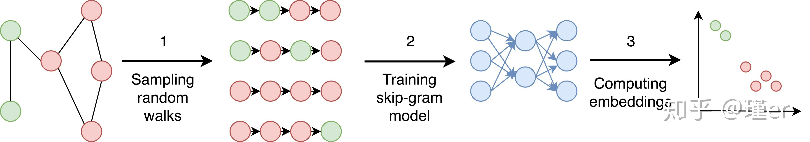

# 2024.11.2-2024.11.8

[上周周记请点这里](https://hwq1215.github.io/research/#/record/1-9/README)

## 方向

上周提到我打算从**基于异常检测的攻击调查方法**出发，而在**基于异常检测的攻击调查方法**一个通用的方法是将图按子图或按路径进行拆分，再使用**图嵌入**技术，将图转化为低纬度向量，在下游任务再做异常行为分类或聚类。**图自编码器（Graph Autoencoder, GAE）**自监督学习是图嵌入深度方法的一种，上周看的论文**MAGIC**使用了**最新的图自编码网络GraphMAE对溯源图图嵌入编码，再通过无监督学习完成APT的检测。**这周我对图嵌入的知识做了总结，并深入了解了图嵌入技术深度方法的图自编码器（GraphGAE）的发展和研究现状，并且将介绍**MAGIC**的后人研究**APT-MGL**（Computers & Security、CCF-B），两者都运用了图自编码器，因此我放到一起介绍。

## 什么是图嵌入

> [图嵌入](https://zhuanlan.zhihu.com/p/100586855)（Graph Embedding，也叫Network Embedding）是一种将图数据（通常为高维稠密的矩阵）映射为低微稠密向量的过程，能够很好地解决图数据难以高效输入机器学习算法的问题。


大致可以分为两类

1. 顶点嵌入:每个顶点(节点)用其自身的向量表示进行编码。这种嵌入一般用于在顶点层次上执行可视化或预测。比如，在2D平面上显示顶点，或者基于顶点相似性预测新的连接。节点嵌入的方法可以分为三大类:**因式分解方法**、**随机游走方法**和**深度方法**。GraphSAGE属于深度方法，**图自编码器像GraphGAE，GraphMAE、GraphMAE2属于深度方法**
    
    几个典型的顶点嵌入方法：
    
    1. DeepWalk
        
        DeepWalk使用随机漫步来生成嵌入。随机游走从一个选定的节点开始，然后我们从一个当前节点移动到随机邻居节点，移动一定数量的步。
        
        该方法主要包括三个步骤:
        
        抽样:用随机游动抽样一个图。从每个节点执行的随机游走很少。作者证明了从每个节点执行32到64个随机游走是足够的。一般良好的随机漫步的长度约为40步。
        
        训练跳跃图:随机漫步与word2vec方法中的句子相似。跳跃图网络接受随机游走中的一个节点作为一个独热向量作为输入，并最大化预测邻居节点的概率。它通常被训练来预测大约20个邻居节点——左边10个节点，右边10个节点。
        
        计算嵌入:嵌入是网络隐含层的输出。DeepWalk计算图中每个节点的嵌入。
        
        步骤如下图所示：
        
        
        
    2. Node2vec
        
        DeepWalk方法执行随机步，这意味着嵌入不能很好地保留节点的局部邻域。Node2vec方法解决了这个问题。
        
        Node2vec是DeepWalk的一个改进，只是随机漫步的差异很小。它有参数P和Q。参数Q定义了random walk发现图中未发现部分的概率，而参数P定义了random walk返回到前一个节点的概率。参数P控制节点周围微观视图的发现。参数Q控制较大邻域的发现。它可以推断出社区和复杂的依赖关系。
        
        下图中显示了Node2vec中一个随机行走步长的概率。我们只是从红结点走了一步到绿结点。返回到红色节点的概率是1/P，而返回到与前一个(红色)节点没有连接的节点的概率是1/Q。到红结点相邻结点的概率是1。
        
        
        
    3. 结构深度网络嵌入（SDNE）
        
        结构深度网络嵌入(SDNE)与前两种方法没有任何共同之处，因为它不执行随机游走。SDNE在不同任务上的表现非常稳定。
        
        SDNE提出的自动编码器神经网络有两个部分-见下图。自动编码器(左、右网络)接受节点邻接向量，并经过训练来重建节点邻接。这些自动编码器被命名为原始自动编码器，它们学习二级邻近性。邻接向量(邻接矩阵中的一行)在表示连接到所选节点的位置上具有正值。
        
        
        
2. 图嵌入:用单个向量表示整个图。这种嵌入用于在图的层次上做出预测，可者想要比较或可视化整个图。例如，比较化学结构。Graph2vec是一个图嵌入例子
    
    Graph2vec方法包括三个步骤:
    
    - 从图中采样并重新标记所有子图。
    - 训练跳跃图模型
    - 通过在输入处提供一个图ID作为一个独热向量来计算嵌入。
    
    
    

## 图自编码器（GraphGAE）

> [图自编码器（Graph Autoencoder，GAE）](https://zhuanlan.zhihu.com/p/485593493)是一种用于学习图数据嵌入的无监督神经网络模型。它基于自编码器的概念，自编码器是一种通过最小化输入和输出之间的差异来学习数据压缩表示的神经网络。
> 

在一个 GAE 中, 我们有一个 编码器 (encoder), 其目的是映射输入图到一个更低的维度; 我们还有一个 解码器 (decoder), 其目的是从更低维度的嵌入**重构 (reconstruct)**输入图. 也就是说, 我们可以理解解码器的输出为**重构的邻接矩阵**A∗。 那么我们的目标就是去优化这个模型**使得重构损失（**也就是A∗与原始图输入A的差异）**最小。**


可以使用一个 GCN 编码器来实例化 GAE 模型。具体来说，一个 GCN 包含两个图卷积层，一个 ReLU，和一个 dropout。但是需要注意的是, 我们也可以使用其他的 GNNs 来构建编码器, 事实上, 我们甚至可以使用非神经网络结构的编码器。

至于解码器，最常规的选择是点积操作. 对于图中连通的两个节点，我们希望它们嵌入向量的点积结果足够大，这样在邻接矩阵项中, 该点积结果可以代表 "1"。相似地, 我们希望没有连通的两个节点有足够小的点积结果，这样邻接矩阵项中该点积结果可以代表 "0”。

下面我将几个主流的图自编码器（后续有论文用到的我会稍微介绍一下）

1. 变分图自编码器 (Variational Graph AutoEncoder, VGAE)
    
    > 论文地址[[1611.07308] Variational Graph Auto-Encoders](https://arxiv.org/abs/1611.07308)
    > 
    
    变分图自编码器 (Variational Graph AutoEncoder, VGAE). VGAE 与 GAE 非常相似，但是 VGAE 不是将每个节点编码为 隐藏嵌入空间 (latent embedding space) 的特定点，而是使用多维高斯分布 (multivariate Gaussian distribution) 作为编码器的 输出头 (output head)，然后解码器从这个分布中采样。
    
2. GraphMAE
    
    > 论文地址[GraphMAE: Self-Supervised Masked Graph Autoencoders | Proceedings of the 28th ACM SIGKDD Conference on Knowledge Discovery and Data Mining](https://dl.acm.org/doi/abs/10.1145/3534678.3539321)
    > 
    
    GraphMAE（Graph Mask Autoencoder）是一种基于自监督学习的图表示学习方法，它通过随机掩码（masking）图中的一部分节点或边，然后训练模型来预测这些被掩码的部分，从而学习到节点的低维嵌入表示。
    
3. GraphMAE2
    
    > 论文地址 https://dl.acm.org/doi/abs/10.1145/3543507.3583379
    > 
    
    GraphMAE掩蔽特征重建的性能自然依赖于输入特征的可区分性，并且通常容易受到特征干扰的影响。本文提出了一个掩蔽自监督学习框架GraphMAE2，旨在解决这个问题。其思想是对图SSL的特征重建施加正则化。具体来说，我们设计了多视图随机重掩蔽解码和潜在表示预测策略来正则化特征重建。
    

## 图嵌入应用到异常检测

时间过久，可以作为图嵌入应用到异常检测的例子，可以不必深入研究。

### PROV-GEM（2021）

> 论文地址
> 
- 多关系语义上下文
- 语义自注意力机制：
    
    为了整合节点在不同关系中的多种潜在表示，PROV-GEM应用了语义自注意力机制。这个机制可以学习到每种关系的注意力权重，并结合这些权重来生成节点的最终嵌入表示。
    

### Threatrace （2022）

> 论文地址[THREATRACE: Detecting and Tracing Host-Based Threats in Node Level Through Provenance Graph Learning | IEEE Journals & Magazine | IEEE Xplore](https://ieeexplore.ieee.org/abstract/document/9899459)
> 
- GrpahSAGE
    
    对采样的邻居节点，GraphSAGE聚合它们的嵌入表示，聚合方式可以是求平均、求和、最大值或其他自定义函数。
    

## 图自编码器在异常检测的应用

图自编码是图嵌入技术深度方法的一个分支，这里梳理最新的两篇

### MAGIC（2024）

> 论文地址[MAGIC: Detecting Advanced Persistent Threats via Masked Graph Representation Learning | USENIX](https://www.usenix.org/conference/usenixsecurity24/presentation/jia-zian)
> 

MAGIC利用掩蔽图表示学习来模拟良性系统实体和行为，在来源图上执行高效的深度特征提取和结构抽象。具体来说，文章采用了自监督学习的方法，通过在训练过程对节点屏蔽，通过图掩码自编码器，以自监督的方式输出嵌入（**GraphMAE的方法**）。通过异常检测方法挖掘异常系统行为，MAGIC能够执行系统实体级别和批量日志级别的APT检测。MAGIC还专门设计了**处理概念漂移的模型适应机制**，并成功应用于通用条件和检测场景。


- 重点代码,GMAEModel的网络结构

```python
class GMAEModel(nn.Module):
    def __init__(self, n_dim, e_dim, hidden_dim, n_layers, n_heads, activation,
                 feat_drop, negative_slope, residual, norm, mask_rate=0.5, loss_fn="sce", alpha_l=2):
        super(GMAEModel, self).__init__()
        self._mask_rate = mask_rate
        self._output_hidden_size = hidden_dim
        self.recon_loss = nn.BCELoss(reduction='mean')

        def init_weights(m):
            if isinstance(m, nn.Linear):
                nn.init.xavier_uniform(m.weight)
                nn.init.constant_(m.bias, 0)

        self.edge_recon_fc = nn.Sequential(
            nn.Linear(hidden_dim * n_layers * 2, hidden_dim),
            nn.LeakyReLU(negative_slope),
            nn.Linear(hidden_dim, 1),
            nn.Sigmoid()
        )
        self.edge_recon_fc.apply(init_weights)

        assert hidden_dim % n_heads == 0
        enc_num_hidden = hidden_dim // n_heads
        enc_nhead = n_heads

        dec_in_dim = hidden_dim
        dec_num_hidden = hidden_dim

        # build encoder
        self.encoder = GAT(
            hidden_dim=enc_num_hidden,
            encoding=True,
        )

        # build decoder for attribute prediction
        self.decoder = GAT(
            hidden_dim=dec_num_hidden,
            encoding=False,
        )

        self.enc_mask_token = nn.Parameter(torch.zeros(1, n_dim))
        self.encoder_to_decoder = nn.Linear(dec_in_dim * n_layers, dec_in_dim, bias=False)

        # * setup loss function
        self.criterion = self.setup_loss_fn(loss_fn, alpha_l)
```

- 使用StreamSpot数据集开始训练
    
    
    

### **APT-MGL（2025）**

> 2025在《Computers&Security》见刊，现在是在线版，论文地址[Provenance-based APT campaigns detection via masked graph representation learning - ScienceDirect](https://www.sciencedirect.com/science/article/pii/S0167404824004644?via%3Dihub)
> 

工作参考了MAGIC ，使用改进的GraphMAE2 来学习节点嵌入，并通过多头自注意力机制融合特征。最后，使用无监督离群值检测方法对计算得到的嵌入进行分析，得到最终的检测结果。然后，通过结合图特征和结构信息使用掩码图表示学习获得节点嵌入。最后，使用无监督异常检测方法分析计算出的嵌入，并得出最终的检测结果。

- APT-MGL总体架构
    1. 日志预处理：将系统日志转化为消除冗余的溯源图。
    2. 节点特征的收集和嵌入：考虑了节点特征的三个维度，即节点类型、节点行为特征和节点度特征，使用word2vec 转化为向量嵌入到训练模型的初始参数。
    3. 节点特征融合与模型训练：采用了一种新颖的图掩码自编码器GraphMAE2 和图注意神经网络（GAT）作为模型的编码器和解码器，结合基于样本的结构重构，将边缘和节点属性嵌入、传播和聚合到输出嵌入中。
    4. 节点聚类和离群点检测


- 多头自注意机制特征融合
    
    文章从节点类型、节点行为和节点程度三个方面描述节点的行为模式，并使用多头自注意机制进行语义增强。通过收集每个节点的行为记录，然后使用word2vec （Mikolov et al ., 2013）来训练这些交互行为的向量。这些特征通过多头自注意机制进行转换（嵌入），然后进行特征增强（嵌入到训练模型的训练参数中），作为GNN模型训练的初始特征。
    
- 采用新颖的图自编码器GraphMAE2
- 实验结果


以上是APT-MGL的实验结果。从实验结果可以看到，APT-MGL相对于MAGIC和其他自监督学习的方法均实现了持平和领先。

### MAGIC和APT-MGL两篇的总结

MAGIC接着前人的工作继续采用图自编码器的自监督学习进行embedding，并采用了当时最新的图自编码算法GraphMAE，同时采用处理概念漂移的模型适应机制加强了自己的工作。APT-MGL相对于MAGIC的提升除了新网络GraphMAE2，主要是多头自注意机制特征融合这方面，而这里实际上是将节点类型、节点行为和节点程度通过多头自注意机制进行转换，再特征增强，作为GNN模型的初始权重。这里其实有一个疑问，做多头自注意机制特征融合必然能使得模型更快更好的训练，但是再训练前期计算初期的成本就比MAGIC高，这应该不太合理再来和MAGIC对比。

## 之后的任务

1. 继续深入阅读MAGIC的代码内容
2. 尝试复现APT-MGL的代码，并研究其代码
3. 以MAGIC和APT-MGL为基础开始研究