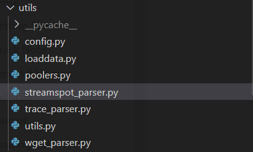

# 2024.11.9-2024.11.15

[上周周记请点这里](https://hwq1215.github.io/research/#/record/1-10/README)

## 方向

在**基于异常检测的攻击调查方法**一个通用的方法是将图按子图或按路径进行拆分，再使用**图嵌入**技术，将图转化为低纬度向量，在下游任务再做异常行为分类或聚类，这是目前我主要的一个方向和目标，并且在收集和读相应的论文。**图自编码器（Graph Autoencoder, GAE）**自监督学习是图嵌入深度方法的一种，之前看的论文**MAGIC**使用了**最新的图自编码网络GraphMAE对溯源图图嵌入编码，再通过无监督学习完成APT的检测。MAGIC**的后人研究**APT-MGL 使用改进的GraphMAE2 来学习节点嵌入，并通过多头自注意力机制融合特征**。这周我将对以往工作做一个汇总，在代码层面对MAGIC数据预处理以及模型的内容做一个分析。

## 图自编码器解决ATP攻击的论文汇总

| 算法 | 时间，等级 | 方法 |
| --- | --- | --- |
| **GCA(Graph Competitive Autoencoder)** | 2023,CNCIT  | 从主机日志中提取实体及其交互，以构建来源图。随后，我们使用GNN（图神经网络）作为图编码器来获得图级嵌入。在异常检测部分，使用**竞争自编码器和互信息最大化**来识别攻击图。 |
| **MAGIC** | 2024,CCF-A | 通过图掩码自编码器，以自监督的方式输出嵌入（**GraphMAE的方法**）。通过异常检测方法挖掘异常系统行为 |
| **APT-MGL** | 2025,CCF-B | 采用了一种新颖的图掩码自编码器**GraphMAE2** 和图注意神经网络（GAT）作为模型的编码器和解码器，结合基于样本的结构重构，将边缘和节点属性嵌入、传播和聚合到输出嵌入中。 |

## 数据预处理部分

MAGIC将`streamspot`等APT攻击溯源图数据集通过解析器`parser`转化为`json`格式表示，



转化为的`json`格式如下，`node`具有`id`和`type`两个属性，`id`是节点的唯一标识符，`type`表示节点的种类；links是节点的连接信息，包括`source`，`target`，`type`三个属性，`source`表示连接的源节点，`target`表示连接的目标节点，`type`表示连接的种类：

```javascript
{
  "nodes": [
    {"id": 0, "type": 2},
    {"id": 1, "type": 5},
    // ... 更多节点
  ],
  "links": [
    {"source": 0, "target": 1, "type": 10},
    {"source": 1, "target": 2, "type": 3},
    // ... 更多边
  ]
}
```

## 模型定义细节

> MAGIC使用的图掩码自编码器`GMAEModel`，
> 
- 初始化参数
    
    
    | 参数 | 意义 |
    | --- | --- |
    | `n_dim` | 输入特征的维度 |
    | `e_dim` | 边的特征维度 |
    | `hidden_dim` | 隐藏层的维度 |
    | `n_layers` | 网络的层数 |
    | `n_heads` | 多头注意力机制中的头数 |
    | `activation` | 激活函数 |
    | `feat_drop` |  特征dropout率 |
    | `negative_slope` | `LeakyReLU`的负斜率参数 |
    | `residual` | 是否使用残差连接 |
    | `norm` | 是否进行标准化 |
    | `mask_rate` | 用于边重建任务的掩码率 |
    | `loss_fn` | 损失函数类型 |
    | `alpha_l` | 用于损失函数的参数 |
    | `self._mask_rate` | 边重建任务中使用的掩码率 |
    | `self._output_hidden_size` | 隐藏层的维度 |
    | `self.recon_loss` | 用于边重建任务的二元交叉熵损失函数 |
    | `enc_num_hidden` | 每个注意力头的隐藏维度 |
    | `enc_nhead` | 编码器的头数 |
    | `dec_in_dim`| 解码器的输入维度 |
    | `dec_num_hidden` | 解码器的隐藏维度 |
    | `self.criterion` | 根据`loss_fn`参数设置的损失函数 |
- 结合了编码器-解码器架构和图注意力机制（`GAT`）的模型，用于图结构数据的表示学习和边重建任务，运用了多注意力头
- **边重建全连接层**
`self.edge_recon_fc`: 一个序列模型，包含两个线性层，一个`LeakyReLU`激活函数和一个`Sigmoid`激活函数，用于预测边的存在概率。
- **掩码令牌和解码器到编码器的线性层**
    
    `self.enc_mask_token`: 一个可学习的参数，用于编码器的掩码令牌。
    
    `self.encoder_to_decoder`: 一个线性层，用于将编码器的输出映射到解码器的输入维度。
    
- **`encoding_mask_noise` 方法**
    
    用于在图的节点特征中引入噪声，通过随机掩码（masking）一部分节点的特征。每一行代码详细注释
    
- **`compute_loss` 方法**
    
    计算损失函数，包括特征重建损失和结构重建损失，每一行代码详细注释
    

```python
class GMAEModel(nn.Module):
    def __init__(self, n_dim, e_dim, hidden_dim, n_layers, n_heads, activation,
                 feat_drop, negative_slope, residual, norm, mask_rate=0.5, loss_fn="sce", alpha_l=2):
        super(GMAEModel, self).__init__()
        self._mask_rate = mask_rate
        self._output_hidden_size = hidden_dim
        self.recon_loss = nn.BCELoss(reduction='mean')

        def init_weights(m):
            if isinstance(m, nn.Linear):
                nn.init.xavier_uniform(m.weight)
                nn.init.constant_(m.bias, 0)

        self.edge_recon_fc = nn.Sequential(
            nn.Linear(hidden_dim * n_layers * 2, hidden_dim),
            nn.LeakyReLU(negative_slope),
            nn.Linear(hidden_dim, 1),
            nn.Sigmoid()
        )
        self.edge_recon_fc.apply(init_weights)

        assert hidden_dim % n_heads == 0
        enc_num_hidden = hidden_dim // n_heads
        enc_nhead = n_heads

        dec_in_dim = hidden_dim
        dec_num_hidden = hidden_dim
        
        self.enc_mask_token = nn.Parameter(torch.zeros(1, n_dim))
        self.encoder_to_decoder = nn.Linear(dec_in_dim * n_layers, dec_in_dim, bias=False)

        # * setup loss function
        self.criterion = self.setup_loss_fn(loss_fn, alpha_l)
        
    def setup_loss_fn(self, loss_fn, alpha_l):
        if loss_fn == "sce":
            criterion = partial(sce_loss, alpha=alpha_l)
        else:
            raise NotImplementedError
        return criterion

    def encoding_mask_noise(self, g, mask_rate=0.3):
        new_g = g.clone()
        num_nodes = g.num_nodes() #获取图中节点的数量
        perm = torch.randperm(num_nodes, device=g.device) #生成一个随机排列的索引数组

        # random masking
        num_mask_nodes = int(mask_rate * num_nodes) #计算需要掩码的节点数量
        mask_nodes = perm[: num_mask_nodes] #获取被掩码的节点索引
        keep_nodes = perm[num_mask_nodes:]  #获取保留的节点索引

        new_g.ndata["attr"][mask_nodes] = self.enc_mask_token #将被掩码的节点特征设置为enc_mask_token

        return new_g, (mask_nodes, keep_nodes)

    def forward(self, g):
        loss = self.compute_loss(g)
        return loss

    def compute_loss(self, g):
        # Feature Reconstruction
        pre_use_g, (mask_nodes, keep_nodes) = self.encoding_mask_noise(g, self._mask_rate) #对图g应用编码掩码噪声
        pre_use_x = pre_use_g.ndata['attr'].to(pre_use_g.device) #获取处理后的节点特征
        use_g = pre_use_g
        enc_rep, all_hidden = self.encoder(use_g, pre_use_x, return_hidden=True) #使用编码器获取图的表示和所有隐藏层的表示
        enc_rep = torch.cat(all_hidden, dim=1) #将所有隐藏层的表示拼接起来
        rep = self.encoder_to_decoder(enc_rep) #将编码器的输出转换为解码器的输入

        recon = self.decoder(pre_use_g, rep) #使用解码器重建节点特征
        x_init = g.ndata['attr'][mask_nodes] #使用解码器重建节点特征
        x_rec = recon[mask_nodes]            #获取原始被掩码节点的特征
        loss = self.criterion(x_rec, x_init) #计算特征重建损失
        
        #结构重建损失的计算涉及到边的负采样和预测边的存在概率，使用self.edge_recon_fc和self.recon_loss
        # Structural Reconstruction
        threshold = min(10000, g.num_nodes())

        negative_edge_pairs = dgl.sampling.global_uniform_negative_sampling(g, threshold) #全局均匀负采样
        positive_edge_pairs = random.sample(range(g.number_of_edges()), threshold) #从图中随机采样出threshold数量的正边对。正边对是指图中实际存在的边对。
        positive_edge_pairs = (g.edges()[0][positive_edge_pairs], g.edges()[1][positive_edge_pairs])  #获取正边对的源节点和目标节点的索引。
        sample_src = enc_rep[torch.cat([positive_edge_pairs[0], negative_edge_pairs[0]])].to(g.device) #获取正负边对源节点的编码表示，并移动到图g的设备上。 
        sample_dst = enc_rep[torch.cat([positive_edge_pairs[1], negative_edge_pairs[1]])].to(g.device) #获取正负边对目标节点的编码表示，并移动到图g的设备上。
        y_pred = self.edge_recon_fc(torch.cat([sample_src, sample_dst], dim=-1)).squeeze(-1)     #将源节点和目标节点的编码表示合并，并输入到边重建的全连接层edge_recon_fc中，得到边重建的预测概率y_pred。      
        y = torch.cat([torch.ones(len(positive_edge_pairs[0])), torch.zeros(len(negative_edge_pairs[0]))]).to(
            g.device)                       #创建一个标签向量y，正边对的标签为1，负边对的标签为0，并移动到图g的设备上。
        loss += self.recon_loss(y_pred, y) #计算边重建的预测概率y_pred和真实标签y之间的损失，并累加到总损失loss中
        return loss

    def embed(self, g):
        x = g.ndata['attr'].to(g.device)
        rep = self.encoder(g, x)
        return rep
```

> 图注意力神经网络`GAT`
> 
- `GAT`类实现了一个图注意力网络（Graph Attention Network），每一层都是基于`GATConv`这个图注意力层，一共有三层，分别是**输入层，中间层和输出层。**
- 在`GAT`中，注意力机制是核心。对于图中的每个节点，它会计算与其它所有节点的注意力系数，然后根据这些系数对邻居节点的特征进行加权求和。这样，每个节点的表示不仅包含了自身的信息，还包含了邻居节点的信息。
- 最后一层的输出可以用于节点分类、图分类或其他下游任务。如果设置了`concat_out`，则输出将是多个头的拼接结果；否则是求和。通过`reset_classifier`方法，可以将最后的输出层替换为一个新的线性层，以适应不同的分类任务

```python
class GAT(nn.Module):
    def __init__(self,
                 n_dim,
                 e_dim,
                 hidden_dim,
                 out_dim,
                 n_layers,
                 n_heads,
                 n_heads_out,
                 activation,
                 feat_drop,
                 attn_drop,
                 negative_slope,
                 residual,
                 norm,
                 concat_out=False,
                 encoding=False
                 ):
        super(GAT, self).__init__()
        self.out_dim = out_dim
        self.n_heads = n_heads
        self.n_layers = n_layers
        self.gats = nn.ModuleList()
        self.concat_out = concat_out

        last_activation = create_activation(activation) if encoding else None
        last_residual = (encoding and residual)
        last_norm = norm if encoding else None

        if self.n_layers == 1:
            self.gats.append(GATConv(
                n_dim, e_dim, out_dim, n_heads_out, feat_drop, attn_drop, negative_slope,
                last_residual, norm=last_norm, concat_out=self.concat_out
            ))
        else:
            self.gats.append(GATConv(
                n_dim, e_dim, hidden_dim, n_heads, feat_drop, attn_drop, negative_slope,
                residual, create_activation(activation),
                norm=norm, concat_out=self.concat_out
            ))
            for _ in range(1, self.n_layers - 1):
                self.gats.append(GATConv(
                    hidden_dim * self.n_heads, e_dim, hidden_dim, n_heads,
                    feat_drop, attn_drop, negative_slope,
                    residual, create_activation(activation),
                    norm=norm, concat_out=self.concat_out
                ))
            self.gats.append(GATConv(
                hidden_dim * self.n_heads, e_dim, out_dim, n_heads_out,
                feat_drop, attn_drop, negative_slope,
                last_residual, last_activation, norm=last_norm, concat_out=self.concat_out
            ))
        self.head = nn.Identity()

    def forward(self, g, input_feature, return_hidden=False):
        h = input_feature
        hidden_list = []
        for layer in range(self.n_layers):
            h = self.gats[layer](g, h)
            hidden_list.append(h)
        if return_hidden:
            return self.head(h), hidden_list
        else:
            return self.head(h)

    def reset_classifier(self, num_classes):
        self.head = nn.Linear(self.num_heads * self.out_dim, num_classes)
```

## 训练细节

`load_batch_level_dataset()` 加载数据集，`build_model()`获得设置好的`GMAEModel`模型，`create_optimizer()` 获得优化器，`batch_level_train` 执行每一步的训练

```python
        dataset_name = 'streamspot'
        dataset = load_batch_level_dataset(dataset_name)
        n_node_feat = dataset['n_feat']
        n_edge_feat = dataset['e_feat']
        graphs = dataset['dataset']
        train_index = dataset['train_index']
        main_args.n_dim = n_node_feat
        main_args.e_dim = n_edge_feat
        model = build_model(main_args)
        model = model.to(device)
        optimizer = create_optimizer(main_args.optimizer, model, main_args.lr, main_args.weight_decay)
        model = batch_level_train(model, graphs, (extract_dataloaders(train_index, batch_size)),
                                  optimizer, main_args.max_epoch, device, main_args.n_dim, main_args.e_dim)
        torch.save(model.state_dict(), "./checkpoints/checkpoint-{}.pt".format(dataset_name))
```

## 损失函数

`SCE`损失函数通过计算真实标签的`one-hot`编码向量与预测标签之间的交叉熵，以评估模型的性能

```python
def sce_loss(x, y, alpha=3):
    x = F.normalize(x, p=2, dim=-1)
    y = F.normalize(y, p=2, dim=-1)
    loss = (1 - (x * y).sum(dim=-1)).pow_(alpha)
    loss = loss.mean()
    return loss
```

## 运行结果

`streamspot`数据集：

1. 数据预处理和训练
    
    
    
2. 评估
    
    
    

## 之后的任务

1. 尝试复现APT-MGL的代码，并研究其代码
2. 阅读一下GCA算法的论文，研究下**竞争自编码器和互信息最大化是如何做的**
3. 以MAGIC和APT-MGL为基础开始研究,融合其他的？