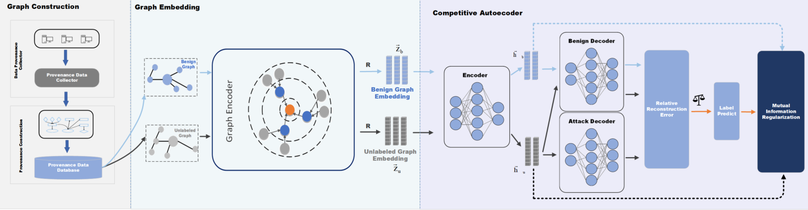

# 2024.11.16-2024.11.22

[上周周记请点这里](https://hwq1215.github.io/research/#/record/1-11/README)

## 方向

在**基于异常检测的攻击调查方法**一个通用的方法是将图按子图或按路径进行拆分，再使用**图嵌入**技术，将图转化为低纬度向量，在下游任务再做异常行为分类或聚类，这是目前我主要的一个方向和目标，并且在收集和读相应的论文。**图自编码器（Graph Autoencoder, GAE）**自监督学习是图嵌入深度方法的一种，之前看的论文**MAGIC**使用了最新的图自编码网络GraphMAE对溯源图图嵌入编码，再通过无监督学习完成APT的检测。**MAGIC**的后人研究**APT-MGL**使用改进的GraphMAE2 来学习节点嵌入，并通过多头自注意力机制融合特征。**这周我将继续研究路线，解读使用GCA（图竞争自编码器）和互信息最大化解决APT问题的文章（虽然文章不是顶会，方法比较新颖，可以学习其思想），并且学习图自编码器最新研究ProtoMGAE。**

## [Detect Advanced Persistent Threat In Graph-Level UsingCompetitive AutoEncoder](https://dl.acm.org/doi/10.1145/3605801.3605807)(在图级别使用竞争自编码检测APT)

### 系统架构

1. 图构建（Graph Construction）：根据日志内容生成溯源图
2. 图嵌入（Graph Embedding）：将高维稀疏图转化为低维密集连续的向量空间，最大程度地保持图的结构特征。
3. 图自编码（Graph Embedding）：使用编码器将输入数据映射到低维潜在空间，然后使用解码器将其映射回原始输入空间来学习重建输入数据，由一个编码器和两个解码器组成：一个良性解码器和一个攻击解码器。

### 创新点

自编码器是一种神经网络，它可以通过使用编码器将输入数据映射到低维潜在空间，然后使用解码器将其映射回原始输入空间来学习重建输入数据，它已被证明在正常数据上训练时对异常检测是有效的，因为具有高重建误差（高于预设阈值）的新数据点可能是异常。然而，该方法要求所有用于训练的数据都是良性的，并且阈值的设置高度依赖于专家知识，可能会严重影响检测结果。

为了解决上述问题，文章提出了提出了竞争性自动编码器，如图1所示，它由一个编码器和两个解码器组成：一个良性解码器和一个攻击解码器。我们可以通过比较这些解码器的相对重构误差来识别攻击图。通过这样的设计，训练数据可以分为**有标记的良性图** $\mathcal{G}_b$ 和**未标记的未知图**$\mathcal{G}_u$。

**良性图的损失函数**：

$z^b_i$是良性图的嵌入， $GE$ 表示图卷积， $D_{benigh}$ 表示良性编码器。

$$
\operatorname{Loss}_{\text {benigh }}=\sum_{i=1}^N\left\|z_i^b-D_{\text {benigh }}\left(G E\left(z_i^b\right)\right)\right\|^2
$$

**未知图的损失函数**

$z^{un}_i$是未知图的嵌入， $GE$ 表示图卷积， $D_{benigh}$ 表示良性编码器， $D_{attack}$ 表示攻击编码器

$$
y_i= \begin{cases}1, & \left\|z_i^{u n}-D_{\text {attack }}\left(G E\left(z_i^{u n}\right)\right)\right\|^2< \\ & \left\|z_i^{u n}-D_{\text {benign }}\left(G E\left(z_i^{u n}\right)\right)\right\|^2 \\ 0, & \text { otherwise }\end{cases}
$$

$$
\begin{array}{r}L o s_{\text {unlabeled }}=\sum_{i=1}^M\left(\left(1-y_i\right)\left\|z_i^{u n}-D_{\text {benigh }}\left(G E\left(z_i^{u n}\right)\right)\right\|^2\right. \\\left.+y_i\left\|z_i^{u n}-D_{\text {attack }}\left(G E\left(z_i^{u n}\right)\right)\right\|^2\right)\end{array}
$$

为了进一步分离嵌入空间中的良性图和攻击图，文章最大化攻击图与其嵌入之间的**MI（互信息）**,我们将检测到的攻击图作为正样本，将检测到的和手动标记的良性图作为负样本，损失函数如图所示

$$
\begin{array}{r}\operatorname{Loss}_{\mathrm{MI}}=\frac{1}{M+N} \times\left(\sum_{i=1}^M y_i E_p\left[\log \operatorname{Disc}\left(z_i^u, \overline{G E\left(z_{\text {attack }}\right)}\right)\right]\right. \\+\sum_{i=1}^M\left(1-y_i\right) E_p\left[\log \left(1-\operatorname{Disc}\left(z_i^u, \overline{G E\left(z_{\text {attack }}\right)}\right)\right)\right] \\\left.\quad+\sum_{i=1}^N E_p^{\prime}\left[\log \left(1-\operatorname{Disc}\left(z_i^b, \overline{G E\left(z_{\text {attack }}\right)}\right)\right)\right]\right)\end{array}
$$

其中 $Disc$表示用于互信息最大化的鉴别器， $\overline{{G E}\left(z_{\text {attack }}\right)}$ 表示检测到的所有攻击图的平均隐藏嵌入

**三部分的损失函数相加得到**

$$
\text { Loss }=\operatorname{Loss}_{\text {benigh }}+\operatorname{Loss}_{\text {unlabeled }}-\lambda \operatorname{Loss}_{\mathrm{MI}}
$$

$\lambda$在文章取的是0.1

---

## [ProtoMGAE：Prototype-Aware Masked Graph Auto-Encoder](https://dl.acm.org/doi/10.1145/3649143)（原型感知的掩码图自编码器）

### 背景

- 图自监督表示学习在无标签数据的情况下提取图的有意义表示方面取得了显著效果。
- 现有的图自编码器主要关注全局结构，可能忽略了一些细粒度信息。
- 图对比学习方法强调嵌入空间中相关视图的节点相似性，可能忽略了原始输入空间中的全局图信息。
- 现实世界的图通常是不完整的，某些节点缺少特征，这对现有的方法构成挑战。

### 方法

**重构损失函数**

重构损失函数 $\mathcal{L}_{r e c}$定义为原始特征 $X$ 和 由编码器和解码器重建的特征 $\hat{X}$ 重构的之间的相似度的负对数似然：

$$
\mathcal{L}_{r e c}=\frac{1}{|\tilde{V}|} \sum_{v_i \in \tilde{V}}\left(1-\frac{x_i^T \hat{x}_i}{\left\|x_i\right\| \cdot\left\|\hat{x_i}\right\|}\right)^\gamma
$$

**对比损失函数：**

模型中的对比损失函数 $\mathcal{L}_{\text {tra }}$ 旨在通过对比学习策略优化节点表示，使得来自同一图的不同视图（例如，掩码图和原始图）的节点表示在嵌入空间中更接近，而不同节点的表示则更分散。对于每个节点定义为

$$
\begin{aligned}\mathcal{L}_{\text {tra }}\left(v_i\right) & =-\log \frac{\exp \left(\operatorname{sim}\left(z_i^m, h_i^o\right)\right)}{\sum_{j=1}^n \exp \left(\operatorname{sim}\left(z_i^m, h_j^o\right)\right)} \\& \approx-\operatorname{sim}\left(z_i^m, h_i^o\right)+\log \sum_{j=1, j \neq i}^n \exp \left(\operatorname{sim}\left(z_i^m, h_j^o\right)\right)\end{aligned}
$$

构建方法：

- 掩码图视图：在线网络的编码器 $f_{\theta}$ 和投影器联合作用于掩码图，产生在线表示$H_m$
- 原始图视图：目标网络的编码器 $f_{\theta}$ 和投影器联合作用于原始图，产生目标表示$H_0$
- 预测器：在线网络的表示 $H_m$ 通过一个预测器，产生预测表示 $Z_m$，这个预测再和 $H_0$ 做对比
- 余弦相似度： $\exp \left(\operatorname{sim}\left(z_i^m, h_i^o\right)\right)$ 衡量两个向量的方向一致性，公式下部分是所有在线表示和该节点预测表示的余项相似度。

整个图的对比损失$\mathcal{L}_{\text {tra }}$是所有节点对比损失的平均值，因此以n为分子

$$
\mathcal{L}_{\text {tra }}=\frac{1}{n} \sum_{i=1}^n \mathcal{L}_{t r a}\left(v_i\right)
$$

**聚类一致性损失函数**：

$$
\mathcal{L}_{c l u}=\frac{1}{\left|V_r\right|} \sum_{i \in V_r}\left(-\sum_{k=1}^K q_{i k}^o \log p_{i k}^m\right)
$$

构建方法：

- 原型向量（Prototype Vector）：模型引入一个可学习的原型向量 $C=[c_1,c_2,...c_k]$ ，其中 $k$ 是聚类的数量，每个 $c_k$ 表示一个聚类的中心
- 软分配（Soft Assignment）：对于掩码图和原始图，模型计算节点表示与原型向量之间的相似度，以获得每个节点的聚类分配，对于掩码图的预测表示 $Z_m$ 和原始图 $H_0$ 的目标表示，软分配可以表示为 $\mathbf{P}_{\mathbf{m}}=\operatorname{softmax}\left(\mathbf{Z}_{\mathbf{m}} \cdot \mathbf{C}\right), \mathbf{P}_{\mathbf{o}}=\operatorname{softmax}\left(\mathbf{H}_{\mathbf{0}} \cdot \mathbf{C}\right)$

其中, $p_{m_{ik}}$ 是节点 $v_i$在掩码图中属于聚类 $k$ 的概率， $q_{o_{ik}}$是节点 $v_i$ 在原始图中属于聚类 $k$ 的目标分配。

**总体损失函数**：

$$
\mathcal{L}=\mathcal{L}_{r e c}+\alpha * \mathcal{L}_{t r a}+\beta * \mathcal{L}_{c l u}
$$

**步骤**

1. 构造掩码图 $G_m=\left(\mathrm{A}, \mathrm{X}_{\mathrm{m}}\right)$
2. 获得掩码图的节点表示 $\mathbf{H}_{\mathbf{m}}=g_\theta\left(f_\theta\left(\mathbf{A}, \mathbf{X}_{\mathrm{m}}\right)\right)$
3. 重建掩码特征 $\hat{\mathbf{X}}=d_\omega\left(\mathbf{A}, \mathbf{H}_{\mathrm{m}}\right)$
4. 计算重构损失 $\mathcal{L}_{r e c}$
5. 学习原始节点表示 $\mathbf{H}_{\mathbf{o}}=g_\phi\left(f_\phi(\mathbf{A}, \mathbf{X})\right)$
6. 获得预测表示 $Z_m=p\theta(H_m)$
7. 计算对比损失 $\mathcal{L}_{tra}$
8. 获得平滑分配 $\mathbf{P}_{\mathbf{m}}=\operatorname{softmax}\left(\mathbf{Z}_{\mathbf{m}} \cdot \mathbf{C}\right), \mathbf{P}_{\mathbf{o}}=\operatorname{softmax}\left(\mathbf{H}_{\mathbf{0}} \cdot \mathbf{C}\right)$
9. 计算目标分配 $\mathbf{Q}_{\mathbf{o}}=\operatorname{Diag}(u) \mathbf{P}_{\mathbf{o}} \operatorname{Diag}(v)$
10. 计算聚类一致性损失 $\mathcal{L}_{clu}$
11. 组成总体的损失函数 $\mathcal{L}=\mathcal{L}_{r e c}+\alpha * \mathcal{L}_{t r a}+\beta * \mathcal{L}_{c l u}$,最小化它
12. 通过梯度下降和动量更新来更新θ和φ

### 对比

和GraphMAE，GraphMAE2的性能对比，可以看到，除了少数的指标落后，**ProtoMGAE**大部分指标都处于领先地位。

## 图自编码器的对比

| 图自编码器 | 基础网络 | 特点 |
| --- | --- | --- |
| **GCA** | 图卷积神经网络(GCN) | 由一个编码器和两个解码器组成：一个良性解码器和一个攻击解码器，并做互信息最大化。 |
| **GraphMAE** | 图注意力网络(GAT) | 使用掩码自编码策略进行节点特征重建，通过掩码和重建任务学习图的表示 |
| **GraphMAE2** | 图注意力网络(GAT)和图变换器 | 在GraphMAE基础上增加了边重建任务，并使用多头注意力机制增强特征融合 |
| **ProtoMGAE** | 图注意力网络(GAT) | 引入原型学习机制，通过学习类原型来增强模型的表示能力和可解释性 |

## 之后的任务

1. 继续完善图自编码器的学习
   
2. 以**MAGIC**和**APT-MGL**为基础,目前打算使用性能最优的**原型感知的掩码图自编码器为方法。**
   
3. **APT-MGL**的源码还未找到，应该是论文未见刊，后续需要对其代码进行详细分析