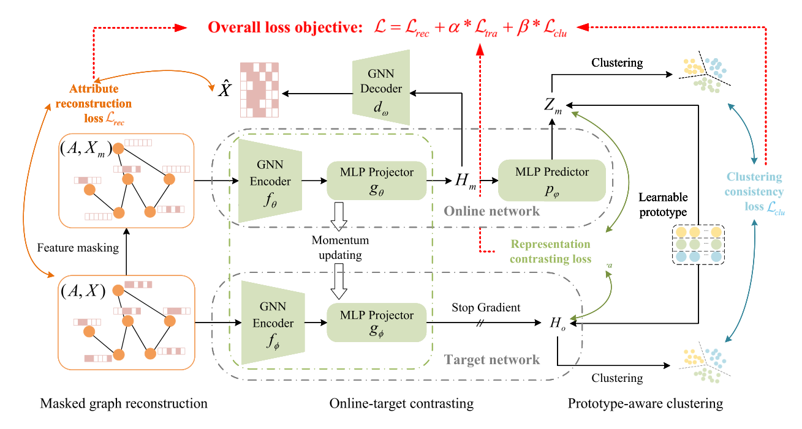
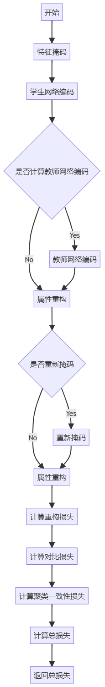

# 2024.11.23-2024.11.29

[上周周记请点这里](https://hwq1215.github.io/research/#/record/1-12/README)

## 方向

在**基于异常检测的攻击调查方法**一个通用的方法是将图按子图或按路径进行拆分，再使用**图嵌入**技术，将图转化为低纬度向量，在下游任务再做异常行为分类或聚类，这是目前我主要的一个方向和目标，并且在收集和读相应的论文。**图自编码器（Graph Autoencoder, GAE）**自监督学习是图嵌入深度方法的一种，之前看的论文**MAGIC**使用了最新的图自编码网络GraphMAE对溯源图图嵌入编码，再通过无监督学习完成APT的检测。**MAGIC**的后人研究**APT-MGL**使用改进的GraphMAE2 来学习节点嵌入，并通过多头自注意力机制融合特征。**图自编码器最新研究ProtoMGAE在图掩码自编码器中引入原型学习机制，通过学习类原型来增强模型的表示能力和可解释性，**上周对其论文尤其是创新部分-几个损失函数,做了有关梳理，这周将对**ProtoMGAE**代码需移植的部分进行剖析并理解透彻，后续可以将该将代码移植到**MAGIC**中，应用在异常检测图数据集上，并开始实验**。**

## [ProtoMGAE：Prototype-Aware Masked Graph Auto-Encoder](https://dl.acm.org/doi/10.1145/3649143)（原型感知的掩码图自编码器）

### 方法



### Forward()

> `Model`类中的`Forward()`是最主要的部分，输入图和节点特征，最后计算出损失函数
> 

**代码逻辑**



**代码解析**

```python

    def forward(self, g, x):
        # mask feature 构造掩码图
        pre_use_g, use_x, (mask_nodes, keep_nodes) = self.encoding_mask_noise(g, x, self._mask_rate)
        use_g = pre_use_g
				
				#将掩码图输入到学生编码器中，这个s_encoder还包括一个MLP层
				#得到掩码特征的编码 enc_mask 和投影 pro_mask
        enc_mask, pro_mask = self.s_encoder(use_g, use_x, return_hidden=True)

        # teacher network - original graph
        #将原始图输入到教师编码器中，这个t_encoder和s_encoder是一样的结构
        #得到原始特征的编码 enc_ori 和投影 pro_ori
        with torch.no_grad():
            enc_ori, pro_ori = self.t_encoder(use_g, x, return_hidden=True)

        # ---- attribute reconstruction ----
        #结构重建，文章中选择的解码器是GAT
        recon_mask = pro_mask.clone()

        # * re-mask
        #如果解码器类型不是 mlp 或 linear，则将被掩码的节点特征设置为0。
        if self._decoder_type not in ("mlp", "linear"):
            recon_mask[mask_nodes] = 0

        # reconstruction
        #如果解码器类型是 mlp 或 linear，则直接使用解码器重构节点特征。否则，使用解码器和掩码后的图重构节点特征。
        if self._decoder_type in ("mlp", "linear"):
            recon = self.decoder(recon_mask)
        else:
            recon = self.decoder(pre_use_g, recon_mask)
            
				#获取原始图中被掩码的节点特征。
        x_init = x[mask_nodes]
        #获取重构后被掩码的节点特征
        x_rec = recon[mask_nodes]
				# 计算重构损失，使用x_rec,x_init相似度的负对数似然为重构的损失
        rec_loss = self.criterion(x_rec, x_init)

        # 对比损失的计算过程
        # 通过学生预测器对掩码特征的投影进行预测。
        pred_mask = self.s_predictor(pro_mask)
        
				#计算掩码特征和原始特征之间的对比损失
        contra_loss = contrastive_loss(pred_mask, pro_ori.detach(), loss=self.contrast, temperature=self.tau)

        # clustering consistency loss
        #聚类一致性损失的计算过程
        
        #计算掩码特征的聚类相似度。
        cz_mask_sim = self.prototype(F.normalize(pred_mask, dim=1)) / self.tau
        #计算原始特征的聚类相似度。
        cz_ori_sim = self.prototype(F.normalize(pro_ori.detach(), dim=1)) / self.tau
        
        #通过分布式Sinkhorn算法计算掩码特征的聚类分配。
        q_mask = distributed_sinkhorn(cz_mask_sim)    
        #通过分布式Sinkhorn算法计算原始特征的聚类分配
        q_ori = distributed_sinkhorn(cz_ori_sim)

				#获取掩码特征的高置信度节点
        high_confidence_mask = torch.max(q_mask, dim=1).values   # max - high confidence
        #计算高置信度阈值。
        threshold_mask = torch.sort(high_confidence_mask).values[-int(len(high_confidence_mask) * self.threshold)]
        #获取高置信度节点的索引。
        high_confidence_idx = torch.where(high_confidence_mask > threshold_mask)[0]
				#计算聚类一致性损失
        clu_loss = - torch.mean(torch.sum(
            q_ori[high_confidence_idx] * F.log_softmax(cz_mask_sim, dim=1)[high_confidence_idx], dim=1))

        loss = self.rec * rec_loss + self.beta * contra_loss + self.gamma * clu_loss

        return loss
```

**编码器的结构**

> 学生编码器和老师编码器都采用一样的结构，一个GNN类型的网络作为Encoder，一个线性层作为`projector`（投影器），`forward`中返回编码 `enc_mask` 和投影`pro_mask` 。
> 

```python

        self.encoder = GAT(
            m_type=encoder_type,
            enc_dec="encoding",
            in_dim=in_dim,
            num_hidden=enc_num_hidden,
            out_dim=enc_num_hidden,
            num_layers=num_layers,
            nhead=enc_nhead,
            nhead_out=enc_nhead,
            concat_out=True,
            activation=activation,
            dropout=feat_drop,
            attn_drop=attn_drop,
            negative_slope=negative_slope,
            residual=residual,
            norm=norm,
        )

        self.projector = nn.Linear(dec_in_dim, dec_in_dim, bias=False)
    def forward(self, g, x, return_hidden=False):
        enc, all_hid = self.encoder(g, x, return_hidden=True)

        pro = self.projector(enc)

        return enc, pro
```

**重构损失函数**

重构损失函数 $\mathcal{L}_{r e c}$定义为原始特征 $X$ 和 由编码器和解码器重建的特征 $\hat{X}$ 重构的之间的相似度的负对数似然：

$$
\mathcal{L}_{r e c}=\frac{1}{|\tilde{V}|} \sum_{v_i \in \tilde{V}}\left(1-\frac{x_i^T \hat{x}_i}{\left\|x_i\right\| \cdot\left\|\hat{x_i}\right\|}\right)^\gamma
$$

**对比损失函数：**

模型中的对比损失函数 $\mathcal{L}_{\text {tra }}$ 旨在通过对比学习策略优化节点表示，使得来自同一图的不同视图（例如，掩码图和原始图）的节点表示在嵌入空间中更接近，而不同节点的表示则更分散。对于每个节点定义为

$$
\begin{aligned}\mathcal{L}_{\text {tra }}\left(v_i\right) & =-\log \frac{\exp \left(\operatorname{sim}\left(z_i^m, h_i^o\right)\right)}{\sum_{j=1}^n \exp \left(\operatorname{sim}\left(z_i^m, h_j^o\right)\right)} \\& \approx-\operatorname{sim}\left(z_i^m, h_i^o\right)+\log \sum_{j=1, j \neq i}^n \exp \left(\operatorname{sim}\left(z_i^m, h_j^o\right)\right)\end{aligned}
$$

构建方法：

- 掩码图视图：在线网络的编码器 $f_{\theta}$ 和投影器联合作用于掩码图，产生在线表示$H_m$
- 原始图视图：目标网络的编码器 $f_{\theta}$ 和投影器联合作用于原始图，产生目标表示$H_0$
- 预测器：在线网络的表示 $H_m$ 通过一个预测器，产生预测表示 $Z_m$，这个预测再和 $H_0$ 做对比
- 余弦相似度： $\exp \left(\operatorname{sim}\left(z_i^m, h_i^o\right)\right)$ 衡量两个向量的方向一致性，公式下部分是所有在线表示和该节点预测表示的余项相似度。

整个图的对比损失$\mathcal{L}_{\text {tra }}$是所有节点对比损失的平均值，因此以n为分子

$$
\mathcal{L}_{\text {tra }}=\frac{1}{n} \sum_{i=1}^n \mathcal{L}_{t r a}\left(v_i\right)
$$

**聚类一致性损失函数**：

$$
\mathcal{L}_{c l u}=\frac{1}{\left|V_r\right|} \sum_{i \in V_r}\left(-\sum_{k=1}^K q_{i k}^o \log p_{i k}^m\right)
$$

构建方法：

- 原型向量（Prototype Vector）：模型引入一个可学习的原型向量 $C=[c_1,c_2,...c_k]$ ，其中 $k$ 是聚类的数量，每个 $c_k$ 表示一个聚类的中心
- 软分配（Soft Assignment）：对于掩码图和原始图，模型计算节点表示与原型向量之间的相似度，以获得每个节点的聚类分配，对于掩码图的预测表示 $Z_m$ 和原始图 $H_0$ 的目标表示，软分配可以表示为 $\mathbf{P}_{\mathbf{m}}=\operatorname{softmax}\left(\mathbf{Z}_{\mathbf{m}} \cdot \mathbf{C}\right), \mathbf{P}_{\mathbf{o}}=\operatorname{softmax}\left(\mathbf{H}_{\mathbf{0}} \cdot \mathbf{C}\right)$

其中, $p_{m_{ik}}$ 是节点 $v_i$在掩码图中属于聚类 $k$ 的概率， $q_{o_{ik}}$是节点 $v_i$ 在原始图中属于聚类 $k$ 的目标分配。

**总体损失函数**：

$$
\mathcal{L}=\mathcal{L}_{r e c}+\alpha * \mathcal{L}_{t r a}+\beta * \mathcal{L}_{c l u}
$$

**聚类一致性的疑惑：**

> 上周还不是很理解，这周通过代码又加深了理解
> 
1. **计算聚类相似度**：
    - 对预测的掩码特征 `pred_mask` 和原始特征 `pro_ori` 进行归一化，确保每个特征向量的长度为1。
    - 通过原型层计算归一化特征的聚类相似度，得到 `cz_mask_sim` 和 `cz_ori_sim`。
2. **应用分布式Sinkhorn算法**：
    - 使用分布式Sinkhorn算法将相似度矩阵转换为概率分布矩阵 `q_mask` 和 `q_ori`。这个算法确保了每个节点在所有聚类上的概率和为1，从而得到一个软聚类分配。
3. **筛选高置信度节点**：
    - 计算每个节点的最大聚类概率，即高置信度值。
    - 根据设定的阈值 `self.threshold`，筛选出高置信度节点的索引。
4. **计算聚类一致性损失**：
    - 对高置信度节点，计算其在原始特征和掩码特征上的聚类分配的一致性。
    - 通过负对数似然损失函数计算聚类一致性损失，**确保高置信度节点在不同视图下的聚类结果一致。**

## 之后的任务

1. 继续完善图自编码器的学习
2. 以**MAGIC**和**APT-MGL**为基础,使用**原型感知的掩码图自编码器为算法，实现APT检测，并做实验。**
3. **APT-MGL**的源码还未找到，应该是论文未见刊，后续需要对其代码进行详细分析