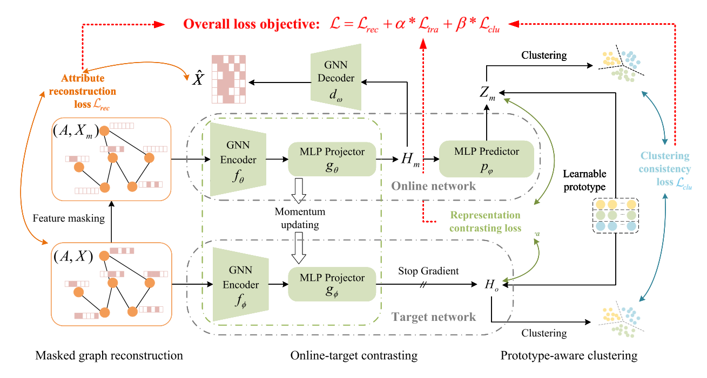

# 2024.11.29-2024.12.5

[上周周记请点这里](https://hwq1215.github.io/research/#/record/1-13/README)

## 方向

在**基于异常检测的攻击调查方法**一个通用的方法是将图按子图或按路径进行拆分，再使用**图嵌入**技术，将图转化为低纬度向量，在下游任务再做异常行为分类或聚类，这是目前我主要的一个方向和目标，并且在收集和读相应的论文。**图自编码器（Graph Autoencoder, GAE）**自监督学习是图嵌入深度方法的一种，之前看的论文**MAGIC**使用了最新的图自编码网络GraphMAE对溯源图图嵌入编码，再通过无监督学习完成APT的检测。**MAGIC**的后人研究**APT-MGL**使用改进的GraphMAE2 来学习节点嵌入，并通过多头自注意力机制融合特征。**图自编码器最新研究ProtoMGAE在图掩码自编码器中引入原型学习机制，通过学习类原型来增强模型的表示能力和可解释性，**上周对**ProtoMGAE**的代码做了梳理，这周将对**ProtoMGAE**的代码移植**MAGIC**的框架中去，并开始实验**。

## 实验改写的部分

> 将**MAGIC**代码的`compute_loss` 改写为**ProtoMGAE**的方法，引入学生编码器`s_encoder`和教师编码器`t_encoder`
> 

**代码**

```python

      def compute_loss(self, g):
        pre_use_g, (mask_nodes, keep_nodes) = self.encoding_mask_noise(g, self._mask_rate)
        use_x = pre_use_g.ndata["attr"]
        use_g = pre_use_g

        enc_mask, pro_mask = self.s_encoder(use_g, use_x, return_hidden=True)
        dec_mask = self.encoder_to_decoder(enc_mask)

        # ---- attribute reconstruction ----
        recon_mask = pro_mask.clone()
        recon_mask[mask_nodes] = 0

        recon = self.decoder(pre_use_g, recon_mask)
        x_init = g.ndata["attr"][mask_nodes]
        x_rec = recon[mask_nodes]
        rec_loss = self.criterion(x_rec, x_init)

        # ------contrastive loss -----
        pred_mask = self.s_predictor(pro_mask)
        with torch.no_grad():
            enc_ori, pro_ori = self.t_encoder(use_g, g.ndata["attr"], return_hidden=True)

        contra_loss = contrastive_loss(pred_mask, pro_ori.detach(), loss="infonce", temperature=self.temperature)

        # clustering consistency loss
        cz_mask_sim = self.prototype(F.normalize(pred_mask, dim=1)) / self.temperature
        cz_ori_sim = self.prototype(F.normalize(pro_ori.detach(), dim=1)) / self.temperature

        q_mask = distributed_sinkhorn(cz_mask_sim)
        q_ori = distributed_sinkhorn(cz_ori_sim)

        high_confidence_mask = torch.max(q_mask, dim=1).values
        threshold_mask = torch.sort(high_confidence_mask).values[-int(len(high_confidence_mask) * self.threshold)]
        high_confidence_idx = torch.where(high_confidence_mask > threshold_mask)[0]

        clu_loss = - torch.mean(torch.sum(
            q_ori[high_confidence_idx] * F.log_softmax(cz_mask_sim, dim=1)[high_confidence_idx], dim=1))

        loss = self.coef_rec * rec_loss + self.coef_contra * contra_loss + self.coef_clucon * clu_loss

        return loss
```

## 实验结果

> 由于数据集过大，目前只完成了**streamspot**数据集的实验，以下是**MAGIC**和**ProtoMGAE**在streamspot的表现
> 
1. **MAGIC**基础方法（GraphMAE1代）
    
    
    
2. **ProtoMGAE**（原型感知的掩码图自编码器）
    
    

可以看出，ProtoMGAE相比MAGIC确实带来了一些提升，主要是在准确率的提升，但是其网络的复杂程度也有所增加，训练消耗的内存有所增加。未来可以把ProtoMGAE作为基础算法，在其上进行创新点的增加。

## 之后的任务

1. 以**MAGIC**和**APT-MGL**为基础,使用原型感知的掩码图自编码器为算法，实现APT检测，完成剩下的实验。
2. 继续自编码的学习，尝试在**ProtoMGAE**的基础上，加入新的创新点。
3. **APT-MGL**的源码还未找到，应该是论文未见刊，后续需要对其代码进行详细分析