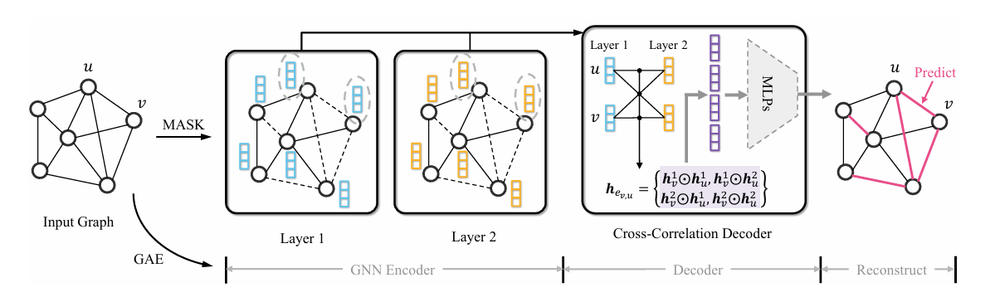

# 2024.12.6-2024.12.13

[上周周记请点这里](https://hwq1215.github.io/research/#/record/1-14/README)

## 方向

在**基于异常检测的攻击调查方法**一个通用的方法是将图按子图或按路径进行拆分，再使用**图嵌入**技术，将图转化为低纬度向量，在下游任务再做异常行为分类或聚类，这是目前我主要的一个方向和目标，并且在收集和读相应的论文。**图自编码器（Graph Autoencoder, GAE）**自监督学习是图嵌入深度方法的一种，之前看的论文**MAGIC**使用了最新的图自编码网络GraphMAE对溯源图图嵌入编码，再通过无监督学习完成APT的检测。**MAGIC**的后人研究**APT-MGL**使用改进的GraphMAE2 来学习节点嵌入，并通过多头自注意力机制融合特征。**图自编码器最新研究ProtoMGAE在图掩码自编码器中引入原型学习机制，通过学习类原型来增强模型的表示能力和可解释性，**上周将对**ProtoMGAE**的代码移植**MAGIC**的框架中去，并开始实验**。这周我读了一篇23年的图自编码器相关的论文S2GAE，和GMAE很类似，但是加强了对图结构的学习。**

## [S2GAE: Self-Supervised Graph Autoencoders Are Generalizable Learners with Graph Masking](https://dl.acm.org/doi/abs/10.1145/3539597.3570404)

（通用性图形掩码学习的自编码器）

### 方法

S2GAE框架的核心思想是随机掩码图中的一部分边，然后学习重建这些缺失的边。

1. **图结构扰动**：
    
    在训练阶段，S2GAE首先对输入图G=(V,E)进行扰动，通过随机采样一部分边集合E'⊂E，并从图中移除这些边，得到扰动后的图G'=(V,E\E')。
2. **特征编码**：
    
    扰动后的图G'被送入GNN编码器，生成节点的隐藏表示H={h1, h2, ..., hN}，其中每个hi∈R^d是节点i的d维向量表示。

3. **边重建**：
    
    使用跨相关性解码器，S2GAE重建被掩码的边E'。解码器通过比较节点对之间的隐藏表示来预测边的存在概率。

4. **损失函数**：
  
    S2GAE的损失函数是基于重构的边和掩码边集合E'之间的差异。模型通过最大化掩码边集的似然来训练，这可以看作是一个边缘级别的对比学习框架。
        
    $$
    L=-\frac{1}{\left|E^{\prime}\right|} \sum_{(u, v) \in E^{\prime}} \log \frac{\exp \left(f\left(h_u, h_v\right)\right)}{\sum_{u^{\prime} \in V} \exp \left(f\left(h_{u^{\prime}}, h_v\right)\right)}
    $$
    
    - $|E'|$ 是边集合 $E'$ 的大小
    - $(u,v)$ 是掩码边集合中的一条边。
    - $h_u,h_v$ 分别是节点 $u$,$v$ 的隐藏表示
    - $f(h_v,h_u)$ 是解码器的输出，表示节点 $u$和 $v$ 之间边的存在概率。这通常是通过一个MLP（多层感知机）或其他函数来计算的，例如点积（dot product）或其他相似度度量。
    - 分母是对所有节点 $u'$ 的负采样项的指数化求和，这有助于模型学习区分正样本（掩码边）和负样本（非掩码边）。
    - 在实践中，负采样操作通常用于近似分母中的求和，以加速训练过程。这种损失函数鼓励模型学习到的节点表示能够使得掩码边的重建概率最大化，同时使得非掩码边的重建概率最小化。
  
5. **下游任务应用**：
    训练完成后，S2GAE可以应用于各种下游任务，如链接预测、节点分类和图分类。对于分类任务，可以直接使用学习到的节点表示；对于链接预测任务，可以通过输入节点对的表示到解码器来估计边的存在概率。

### 创新点

1. **方向感知的图掩码策略**
    
    S2GAE提出了两种方向感知的图掩码策略：无向掩码（UM）和有向掩码（DM）。UM将图中的边视为无向的，而DM将边视为有向的，这有助于生成更有意义的自监督训练目标。
    
2. **跨相关性解码器**
    
    S2GAE设计了一种跨相关性解码器，用于重建被掩码的边。该解码器通过捕捉锚点边两端节点在多粒度表示中的共同主题，生成信息丰富的边表示，从而提高边重建的准确性。
    

### 对比**GraphMAE**

- **S2GAE**：提出了方向感知的图掩码策略，包括无向掩码（UM）和有向掩码（DM）。这些策略通过随机掩码图中的一部分边来生成自监督信号，迫使模型学习图的结构信息。引入了跨相关性解码器，该解码器能够捕捉锚点边两端节点在多粒度表示中的共同主题，从而为边的重构提供信息丰富的表示。
- **GMAE**：GMAE主要关注于通过特征重构来学习节点表示，而不是直接通过图结构的掩码和重构。GMAE采用了一种重掩码解码策略，受MAE（Masked Autoencoder）启发。GMAE的解码器可能没有特别强调跨相关性解码，而是更侧重于节点特征的重构。

## 实验结果

> **S2GAE和MGAE相比，在涉及边任务和结构依赖强的数据上表现会更好**
> 
- 图连接预测任务

- 节点分类任务

## 之后的任务

1. 继续自编码的学习，尝试在**ProtoMGAE**的基础上，加入新的创新点。
   
2. 寻找更大更难的APT溯源图数据集
   
3. **APT-MGL**的源码还未找到，应该是论文未见刊，后续需要对其代码进行详细分析