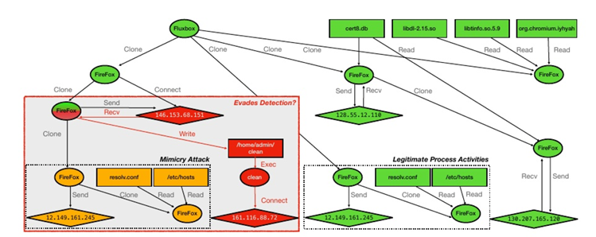

# 2024.12.14-2024.12.20

[上周周记请点这里](https://hwq1215.github.io/research/#/record/1-15/README)

## 工作内容

这周，我粗浅地阅读了一下Sometimes, You Aren’t What You Do:Mimicry Attacks against Provenance Graph Host Intrusion Detection Systems，该文章针对溯源图主机入侵检测系统（Prov-HIDS）开发了规避检测的策略，使攻击者能够隐藏在良性进程行为中，躲避检测率高达100%。

## 文章方法

<aside>
💡

文章通过3个滥用方法来针对不同的溯源图入侵检测系统，规避检测

</aside>

### 1. 滥用无权图编码（Abusing Unweighted Graph Encoding）

**概述**

当 Prov-HIDS 以这样一种方式对图进行总结，即每个子结构**都具有相等的权重**时，攻击者可以
通过添加额外的活动来简单地更改图的嵌入。

考虑一个 L维嵌入，它是由对 Nβγ(Gi) 输出的一组子结构的求和得到的。从事虚假系统活动的攻击者会在 Gi中创建额外的子结构，改变 Nβγ(Gi) 的输出，进而改变 L 维嵌入。事实上，由于 L维嵌入是一个固定长度的特征向量，描述的图的规模在攻击者的控制之下，我们预测对于无权 Prov-HIDS，总会存在一组子结构，可以将攻击图转换为 L 维空间中的任何嵌入。

**实验的检测系统：StreamSpot、Pagoda**

**类似的检测系统：FRAPpuccino、PIDAS**

### 2. 滥用分布式图编码（Abusing Distributional Graph Encoding）

**概述**

专注于总结子结构分布的图嵌入技术会在突出异常活动方面有所牺牲，同时保留全局图结构。与之前对所有子结构进行等权重处理的总结方法不同，保留潜在分布的技术会**根据每个独特子结构的流行程度对其进行加权**。

在Nβγ(Gi)内。使用这些编码技术的 Prov-HIDS 假设恶意图中的子结构分布与良性图中的分布有显著差异。然而，恶意图中的子结构分布（至少在一定程度上）是在攻击者的控制之下。此外，为了考虑到起源图会随着时间的推移不断增长这一事实，这些 Prov-HIDS 必须对子结构分布进行标准化，以比较过去的（即训练数据）和当前的嵌入（即测试数据）。因此，我们预测，总会存在一组子结构，可以将攻击图转换为 L 维空间中的任何嵌入。

**实验的检测系统：Unicorn、Pagoda**

**类似的检测系统：Prov-HIDS，P-Gaussian** 

### 3. 滥用降采样图编码

在图嵌入之前执行降采样过程，这可能会提高训练效率和模型的泛化能力。同样有理由认为，降采样图嵌入可能更难插入模拟子结构，因为它们必须首先绕过降采样函数。

考虑一个 Prov-HIDS，它首先将目标图传递给降采样函数，即 DS(Gi) = G′ i，然后分解其子结构 (Nβγ(G′ i))。我们观察到这种方法存在一个问题，即通过决定哪些子图与分类决策相关，DS（·） 实际上复制了 Prov-HIDS 核心决策函数 F δ（·） 的功能。

**实验的检测系统：Unicorn、Pagoda**

**类似的检测系统：Prov-HIDS，P-Gaussian** 

**示例** 

ProvDetector，试图通过对测试图进行降采样，仅保留具有最低正则性分数的前 K 条路径来对其进行分类。正则性分数是通过观察系统中单个事件的频率，然后使用扩散算法沿着路径聚合这些分数来计
算的。随后，在嵌入空间中，ProvDetector 使用路径向量之间的欧几里得距离来构建聚类模型。不幸的是，由于ProvDetector 的聚类模型仅在具有最低正则性分数的路径上进行训练，其在嵌入空间中的正常性概念被扭曲。特别是，如果至少存在一条低正则性路径，在训练中频繁出现到足以形成一个良性簇，攻击者可以注入该路径的副本 K 次（或更少），从而使其实际的攻击行为完全从嵌入中移除。

## 具体方法

### 输入

1. 要修改的攻击图
2. 良性活动的起源图
3. 要添加的边/子结构数量
4. 插入点

## 步骤

1. **从实验数据集中加载预攻击图**
    
    预攻击图描述了攻击者渗透系统之前受害者系统的状态。我们从原始攻击图创建预攻击图的方法是，根据真实情况确定攻击足迹中第一个系统进程（按时间顺序），然后删除此进程之后的所有系统活动（包括恶意和良性背景活动）。
    
2. **加载用于训练 Prov-HIDS 的良性图**
3. **寻找攻击图的插入点**
    
    在描述攻击者连接到并控制受害者机器上进程的攻击图中找到与该组边相对应的插入点。例如，在图中，插入点就是与绿色/红色火狐进程相关的边。
    
    
    
4. **将良性子结构注入攻击图**
    
    对于StreamSpot，我们从训练数据集中将良性图拆解为K跳子结构，然后将所有子结构多次添加到攻击图中。对于Unicorn，我们计算良性图内每个K跳子结构的归一化计数，然后将归一化计数为K跳子结构的集合多次添加到攻击图中。对于ProvDetector，我们从良性图生成一个频率数据库（其中ProvDetector存储不同边的频率，见图III-C）。然后我们从图中提取所有路径，并根据频率数据库识别最异常的路径。如果最异常路径的正则性得分低于攻击路径，则我们采样另一个良性图。我们将路径N次引入攻击图。我们在§VI-G和§VI-H中分别描述了为Pagoda和图自动编码器注入良性子结构的过程。请注意，在我们的实验中，我们评估添加多少边/子结构才能成功开检测。此外，对于我们每一次攻击，为确保额外的无害行为不会与任何恶意边缘相关联，我们（作为隐蔽攻击者）将初始受攻击进程分叉到深度因子β，以使模仿行为脱钩。
    
5. **将攻击有效负载的子结构插入到攻击前图。**
    
    攻击子结构包含攻击者渗透系统后攻击者控制的进程能够到达的所有边。最后，对所得的规避图与 Prov-HIDS 进行评估。
    

## 之后的任务

1. 继续自编码的学习，尝试在**ProtoMGAE**的基础上，加入新的创新点。
2. 寻找更大更难的APT溯源图数据集
3. **APT-MGL**的源码还未找到，应该是论文未见刊，后续需要对其代码进行详细分析