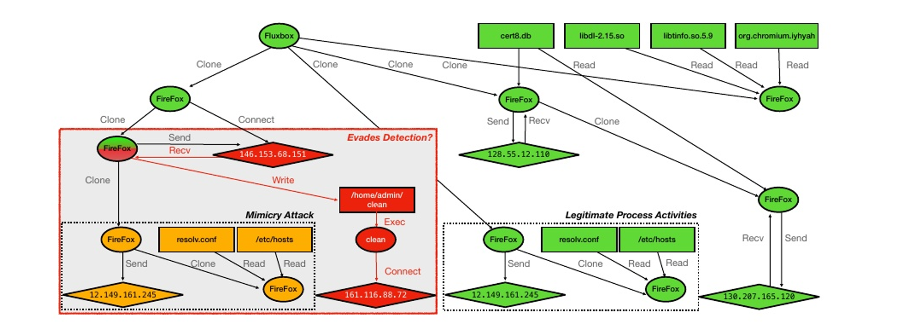

# 2024.01.10-2024.01.17

# 标书

完成了标书的文献综述部分，主要是溯源图的构建，

已发送给杨浩然学长

---

# 论文

> [Sometimes, You Aren’t What You Do：Mimicry Attacks against Provenance Graph Host Intrusion Detection Systems](https://x.sci-hub.org.cn/target?link=https://par.nsf.gov/biblio/10412012)初步阅读
> 
1. 思路
2. 文章首先通过一个攻击实例来说明它的做法
    
    
    
    这是一个来自DARPA 透明计算参与活动的一个起源图，描述了使用 Drakon 对 Firefox 后门攻击的情况，可以理解为通过浏览器脚本来操作被攻击者的操作系统。
    
    - 绿色表示良性系统行为
    - 红色表示攻击子图
    - 橙色表示模仿攻击，这种子图类似于合法的进程活动，这些活动可能足以迷惑分类器，
    导致对攻击的误分类。
    
    所以，我们是不是可以通过加入这种模仿攻击的子图来迷惑入侵检测器
    

## 分类

文章将入侵检测系统根据学习任务分成了两类，分别是**检测**和，在**检测**任务中，通过学习任务的不同将其分为多个子类

这是一个来自DARPA 透明计算参与活动的一个起源图，描述了使用 Drakon 对 Firefox 后门攻击的情况，可以理解为通过浏览器脚本来操作被攻击者的操作系统。

- 绿色表示良性系统行为
- 红色表示攻击子图
- 橙色表示模仿攻击，这种子图类似于合法的进程活动，这些活动可能足以迷惑分类器，
导致对攻击的误分类。

所以，我们是不是可以通过加入这种模仿攻击的子图来迷惑入侵检测器

## 方法

文章将入侵检测系统根据学习任务分成了两类，分别是**检测**和，在**检测**任务中，通过学习任务的不同将其分为多个子类

---

### StreamSpot

> 在介绍怎么攻击前，文章先讲述了`StreamSpot`入侵检测系统的思路，这个入侵检测系统是**基于领域的整个图**进行分析的。
> 

1. 以起源图作为输入
2. 遍历
3. 并划分图邻域以构建直方图表示
4. StreamHash编码（使用L个哈希函数，将shingles映射到{+1， - 1}）
5. 构建最终的二进制特征嵌入
6. 聚类进行入侵检测

## 第一个攻击工具-滥用非加权图编码

使用这个工具，可以反复向攻击图添加一批批良性子结构，直到发生误分类。

### 代码部分

代码部分

- **加载攻击路径和良性文件**：
    - `getAttackPath(fl)`：从pickle文件加载攻击路径，并按时间戳排序。
    - `getBenignFile(fl)`：读取良性文件，解析为DataFrame，并提取PID列表。
- **找到插入点**：
    - `findInsertPoint(rows, parentProcess, inFront = False, processName = None)`：在良性日志中找到可以插入攻击路径的起始点，通常是某个特定进程（如`firefox`）的首次出现位置。
- **接管进程**：
    - `takeOver(attackPath, parentP, benDf)`：修改良性日志中的某些行，以模拟攻击者接管了某个进程，并生成新的PID。
- **插入攻击路径**：
    - `insertAttackPath(attackPath, parentP, rows, tempDir, numberOfClones, inFront = False)`：根据攻击路径，在良性日志中插入恶意行为，调整时间戳和PID等信息，确保插入后的日志看起来合理。
- **插入良性子结构**：
    - `insertBenSubstructs(benSub, parentP, rows, tempDir, numberOfClones, inFront = False)`：在插入攻击路径之前或之后，插入一些额外的良性子结构，以增加混淆度。
- **保存结果**：
    - `saveRows(rows, fileName)`：将最终生成的日志保存为CSV文件。
    - `saveMalNodes(nodes, path)`：保存恶意节点信息到pickle文件。
- **主函数**：
    - `main(attackPath, benignFilePath, benignSubstructs, savePath, inFront = True)`：协调上述各个步骤，完成攻击路径的插入并保存结果。

根据论文描述，对于StreamSpot数据集，一些攻击图在添加25万条边后开始逃避检测，而添加30万条边后所有攻击都变得无法检测到。在DARPA数据集中，攻击在添加8万条边后开始逃避检测。对于这两个数据集，我们的逃避策略都达到了100%的成功率。

在 StreamSpot 数据集中，良性图平均有295K 条边，而攻击图平均有 28K 条边。必要的转换至少添加了 250K 条边，占良性图大小的 85%。说明第一个攻击工具虽然有效，但是代价过大。

## 第二攻击工具（还未看到）

---

# 工作计划

1. 继续阅读`Sometimes, You Aren’t What You Do：Mimicry Attacks against Provenance Graph Host Intrusion Detection Systems`
2. 国网已选定”**新能源可调资源异常检测 “**的题目