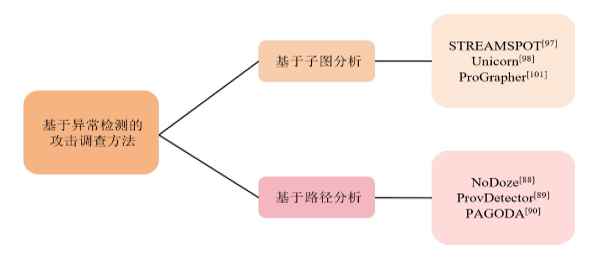

# 2024.10.25-2024.11.1

## 方向

我在研究前期主要想通过GNN这样的神经网络直接做异常检测分类，但是看了这篇综述后发现，**基于异常检测的攻击调查方法**能够融合基于因果分析和基于深度表示学习两种方法的优势，结合它们表征溯源图的方法，将溯源图转化为可度量的对象，并通过学习良性行为来判断系统异常状态，为攻击调查提供更多的线索。**基于异常检测的攻击调查方法才是目前异常检测的主流。大部分基于异常检测的攻击调查方法是使用图嵌入技术，将图转化为低纬度向量，在下游任务再做分类或聚类。**

本周，根据刚读的绪论《基于溯源图的网络攻击调查研究综述的基于异常检测的攻击调查方法》出发，主要研究了**基于子图分析**（不过这个分类只是拆解方式的不同，在文章中常常将子图分析和路径分析都作为BaseLine）这条路线，并阅读了**MAGIC**这篇论文

## 几个**基于异常检测的攻击调查方法**Baseline的介绍

| 方法 | 模型/算法 | 图拆解方法 | 语义单元度量 | 异常检测 | 数据集 | 特点 |
| --- | --- | --- | --- | --- | --- | --- |
| STREAMSPOT | StreamHash+K-me⁃doids | 以图为检测对象将溯源图分割成小块 | StreamHash算法将图映射为向量 | 利用K-medoids算法对向量进行聚类,距离簇较远的为异常图 | StreamSpot数据集 | 图级别的高效流式异常检测 |
|  UNICORN | WL子树图核算法+HistoSketch算法+聚类 | 一定时间内的增长图作为检测对象,并转化为直方图 | HistoSketch算法将直方图转化为向量 |K-medoids算法聚类并形成进化模型,表达工作模式 | UNICORN数据集、DARPA数据集 | 图级别检测,以图增长部分作为检测对象,提高精度并缩小调查范围 |
| PROGRAPHER | graph2vec+Tex⁃tRCNN | 将流式图的快照序列作为检测对象 | graph2vec算法将快照序列嵌入成向量 | 训练生成模型TextRCNN,计算模型嵌入和真实嵌入的差距,检测异常 | StreamSpot数据集、DARPA数据集、ATLAS数据集、企业EDR数据集 | 结合整图嵌入和序列学习,分析溯源图快照,学习了正常系统的行为表示 |
| THREATRACE | GraphSAGE+多模型框架 | 以节点为检测对象 | GraphSAGE聚合节点两跳邻居信息形成特征向量 | 多模型框架将无法正确分类的节点视作异常 | StreamSpot数据集、UNICORN数据集、DARPA数据集 | 学习节点行为模式,用有监督的分类任务替代无监督的异常检测任务 |
|  Log2vec | 随机游走+word2vec+聚类 | 根据启发式规则随机游走获取单日内、多日间关系 | word2vec算法将游走的路径转化为向量 | 无中心聚类根据簇内向量数量进行阈值判断 | CERT数据集、LANL数据集 | 检测企业内部用户异常行为,分析反映用户典型行为的信息,发现恶意事件 |
| PROV-GEM | 图神经网络(GNN)+自编码器 | 将溯源图分解为子图 | 使用GNN对子图进行嵌入 | 利用自编码器重构子图,重构误差大的为异常 | DARPA TC数据集、企业内部数据集 | 结合GNN和自编码器,能够捕获图的结构和语义信息,适用于大规模图数据 |
|  |  |  |  |  |  |  |

## 之前看的APT-KGL（An Intelligent APT Detection System Based on Threat Knowledge and Heterogeneous Provenance Graph Learning）

### 方法

- **基于威胁知识库和异构图神经网络学习**：APT-KGL利用基于数据的方法，结合威胁知识库（如网络威胁情报和战术、技术与程序）来检测APT攻击。

### 模型/算法

- **异构图神经网络（Heterogeneous Provenance Graph, HPG）**：通过定义节点类型集和边类型集，将系统实体和事件建模为异构图。

- **图嵌入技术**：使用图嵌入技术学习HPG中每个节点的低维向量表示，以保留图中的拓扑结构和语义关系。
- **局部图采样**：对新进入的系统实体，通过采样局部小图来整合新实体和相关现有节点。
- **图卷积网络（Graph Convolutional Network, GCN）**：用于基于局部图的节点分类任务，以检测APT攻击。

### 图拆解方法

- **元路径（Meta-path）**：在异构图中定义元路径来指导随机游走，生成不同类型的系统实体序列。
- **层次注意力机制（Hierarchical Attention）**：在图嵌入过程中，使用层次注意力机制学习不同邻居和元路径对特定节点的重要性。

### 语义单元度量

- **向量表示**：每个系统实体通过图嵌入技术被映射到一个低维向量空间，以保留实体间的语义和结构关系。

### 异常检测

- **节点分类任务**：将APT检测任务视为节点分类问题，通过图卷积网络对局部图中的每个“进程”节点进行分类，以检测恶意行为。

### 数据集

- **实验室数据集（Lab Dataset）**：包含通过红队活动模拟的APT攻击，以及正常活动的系统事件。
- **DARPA数据集（DARPA Dataset）**：收集自DARPA透明计算项目中APT攻击活动的数据集，包含敏感信息收集、内存攻击和恶意文件下载执行等攻击类型。

### 特点

- **自适应性和泛化能力**：APT-KGL能够自动从数据中学习模式，并适应新的APT攻击模式。
- **实时检测**：系统设计满足实时处理的要求，能够在新系统实体进入时快速检测APT攻击。
- **数据驱动**：完全基于数据驱动的方法，可以通过定期重新训练或在收集到新的攻击样本时自动适应宏观环境的变化。
- **半自动威胁知识提取**：通过自动化工具和安全专家的手动精炼，从CTIs或TTPs中提取威胁知识，并将其建模为查询图。

## 最新的一个研究MAGIC(Detecting Advanced Persistent Threats via Masked Graph Representation Learning)

[细读内容请点这里](/read/magic/)

### 方法

- **基于数据的检测方法**：MAGIC利用数据源分析和图神经网络技术来检测APT攻击。
- **自监督学习**：MAGIC采用自监督学习方法，不需要攻击数据和先验知识。
- **多粒度检测**：MAGIC能够在不同粒度级别上进行APT检测，包括批量日志级别和系统实体级别。

### 模型/算法

- **图表示学习**：MAGIC通过图表示学习来建模系统实体和行为，执行深度特征提取和结构抽象。
- **图掩码自编码器**：使用图掩码自编码器来训练图表示模块，通过掩码特征重建和基于样本的结构重建提供训练信号。
- **异常检测方法**：通过异常检测方法识别系统行为中的异常，从而检测APT攻击。

### 图拆解方法

- **构建数据源图**：从审计日志中构建数据源图，提取系统实体和它们之间的交互。
- **特征掩码**：在训练图表示模块之前，对节点进行掩码处理，以便自编码器可以训练特征重建。

### 语义单元度量

- **嵌入向量**：每个系统实体通过图表示学习被映射到一个低维向量空间，以保留实体间的语义和结构关系。

### 异常检测

- **无监督异常检测**：MAGIC使用无监督异常检测方法来分析计算出的嵌入，并得出最终的检测结果。

### 数据集

- **StreamSpot数据集**
- **Unicorn Wget数据集**
- **DARPA E3数据集**

### 特点

- **高效性**：MAGIC在训练和检测上具有高效率，能够在可接受的时间内完成训练和检测。
- **灵活性和可扩展性**：MAGIC能够适应不同的检测场景，并且可以处理不同来源的审计日志。
- **模型适应机制**：MAGIC包含一个可选的模型适应机制，以处理概念漂移和提高检测性能。
- **开源实现**：MAGIC的实现和预处理数据集对公众开放，以促进未来的研究和方法的改进。

## 之后的任务

1. 将精读MAGIC，考虑下一步的复现工作
2. 学习一下图自监督模型的内容，下周梳理一下最新的有关研究
3. 考虑下游的构造如何能达到更好效果，是监督学习还是非监督学习