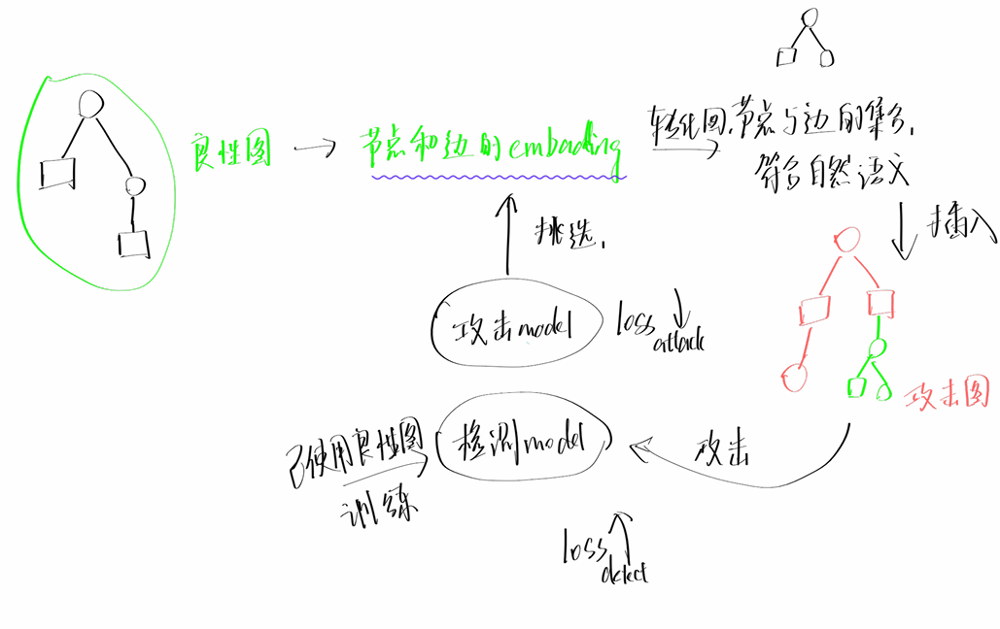

# 2025.02.08-2025.02.14

# 科研

- **继续阅读了[Sometimes, You Aren’t What You Do:Mimicry Attacks against Provenance Graph Host Intrusion Detection Systems](https://par.nsf.gov/biblio/10412012)**
- **阅读了代码，是简单的插入在攻击图中插入良性路径和插入良性图，但是其有根据算法的不同调整插入的策略，最不同的就是Prov-Detector这个入侵检测系统的插入策略**
- **对抗式生成攻击符合自然语义的样本的初步思路，**

> 点击下列链接可以看具体的文章阅读笔记


## 一、对于[StreamSpot](/record/2-0/StreamSpot%201997262428b4801abbedf4d2f23787fb.md)

使用了**第一个攻击工具-滥用非加权图编码（§V-B1）（abusing unweighted grpah encoding）**

对于StreamSpot，从训练数据集中将良性图拆解为K跳子结构，然后将**所有**子结构多次添加到攻击图中。

根据论文描述，对于StreamSpot数据集，一些攻击图在添加25万条边后开始逃避检测，而添加30万条边后所有攻击都变得无法检测到。在DARPA数据集中，攻击在添加8万条边后开始逃避检测。对于这两个数据集，我们的逃避策略都达到了100%的成功率。

在 StreamSpot 数据集中，良性图平均有295K 条边，而攻击图平均有 28K 条边。必要的转换至少添加了 250K 条边，占良性图大小的 85%。说明第一个攻击工具虽然有效，但是代价过大。

## 二、对于[Unicorn](/record/2-0/Unicorn%201997262428b4806d9e30cd016ed2a3b8.md)

使用了**第二个攻击工具-滥用分布图编码（§V-B2）（abusing distributional graph encoding）**

对于Unicorn，文章计算良性图内每个K跳子结构的**归一化**计数，然后将归一化计数，按子结构出现的频率，将K跳子结构的集合多次添加到攻击图中。

## 三、对于[ProvDetector](/record/2-0/ProvDetector%201997262428b480e2b169f36fd82f0861.md)

使用了**第三个攻击工具-滥用降采样图编码（§V-B3）（ abusing downsampled graph encoding ）**

对于ProvDetector，我们从良性图生成一个频率数据库（其中ProvDetector存储不同边的频率）然后我们从图中提取所有路径，并根据频率数据库识别最异常的路径。如果最异常路径的正则性得分低于攻击路径，则我们采样另一个良性图。我们将该路径多次引入攻击图。

## 四、对于[Pagoda](/record/2-0/Pagoda%201997262428b480289aadc352af3e577c.md)

使用了**第一个工具滥用未加权图编码（§V-B1）**和**第二个攻击工具滥用分布图编码（（§V-B2）**的模仿工具

由于Pagoda对每条路径的长度进行归一化，以比较不同大小的图，攻击者可以插入长但良性的路径，以减少较短攻击路径的权重，从而降低攻击图的图异常分数。在文中实验中，我们使用训练数据集来识别具有低异常分数的长良性路径，以降低图形异常分数。对于每条攻击路径，攻击者可以从频率数据库（常出现的良性路径）中插入边缘，以降低攻击路径的路径异常分数，防止其提高检测率。因此，在实验中，作者将频率数据库中的边插入到攻击路径中，以降低它们的异常分数。

## 五 对于图全自编码器FGA

文章模仿SIGL（一个关注于软件安全安装的检测系统），实现了一个全图自动编码器（FGA）来检测入侵，用于模拟分析。

**自编码器的主要思路：**对于输入图，编码器产生D维向量；解码器然后将D维向量作为输入，并尝试重建原始输入图。通过最小化输入图和重建图之间的差异（也称为重建损失）

**文章的实现：**FGA使用图卷积网络（GCN）[53]来嵌入每个节点，并使用内积解码器[54]来重建节点的邻域。我们将图的嵌入表示为图中所有节点的节点嵌入的平均值。

**检测方法：**在测试时，如果距离从嵌入到最近的训练图的距离大于某个预先设定的阈值。我们使用验证集来配置FGA中的阈值，该**验证集**被设置为我们能找到的最严格的界限，以正确地将所有验证图分类为良性。

为了规避FGA，文中利用**第二个工具，滥用分布图编码（§V-B2）**，将攻击图的节点邻域分布与良性起源图中的分布相匹配。因为FGA使用GCN来嵌入输入图，所以每个节点都是根据其“祖先”k-hop邻域进行编码的。GCN使用消息传递来聚合来自节点父节点的特征向量，以生成节点的D维向量。将训练数据集中发现的相同“祖先”k-hop邻域添加到给定的攻击图中，会引入与良性活动相关的节点具有相同嵌入的节点。这使得攻击图中所有节点的平均嵌入更接近良性图，从而成功地避开了检测

## 三个工具的总结

1. 第一个工具**不考虑子结构在良性图的分布**，直接将良性子结构添加到攻击图中来规避攻击，这样做符合直觉，相当于将攻击图的内容在下游的嵌入中被稀释，但是成本较大。
2. 第二个工具**考虑了子结构在良性图的分布**，按照子结构在良性图的分布插入到攻击图中，使得插入后的攻击图更类似自然良性图
3. 第三个工具是针对像**Prov-Detector**这样的入侵检测系统，**Prov-Detector**不分析整个溯源图，而是取嫌疑最大的几个路径来编码和分析，并且其建立了一个频率数据库，用来计算各路径的正则化分数。第三个工具针对这种情况，将正则化分数低的良性图路径挑选出来，再反复插入到已插入攻击路径的良性图中，使得攻击路径能逃逸检测

## 思路

**对抗式生成攻击符合自然语义的样本**

一个攻击样本生产模型（寻找攻击注入的节点和添加的良性图的路径或子图）
一个入侵检测的模型（提前用良性图训练好）用于和攻击样本生成模型进行对抗



# 电网项目

- **学习了孤立森林异常检测的方法**
- **找到了一个居民用电量的时序数据，这个数据和项目的数据类似**
- **用孤立森林方法进行异常检测代码编写**

## 孤立森林(Isolation Forest)

> 孤立森林（IF）算法是适用于连续数据的无监督异常检测方法。在孤立森林中，采用递归方法对数据集进行随机划分。2008年由[刘飞](https://zhida.zhihu.com/search?content_id=197569462&content_type=Article&match_order=1&q=%E5%88%98%E9%A3%9E&zhida_source=entity)、周志华等提出，算法不借助类似距离、密度等指标去描述样本与其他样本的差异，而是直接去刻画所谓的**疏离程度(isolation)**，因此该算法简单、高效，在工业界应用较多。
> 

**思想**

给你根棍子，还把你眼睛蒙上，要把下面的白棋巴拉出来，找个人在边上给你计数，看多少次能分出来，**A**这一堆，需要的次数非常多，可能一早上你都巴拉不出来；而**B**这一堆，可能一次就巴拉出来了，需要的次数非常少，那我们就可以通过计算巴拉的次数来衡量一个点的异常程度了，巴拉的次数越少，越不合群，也就越异常。一个人巴拉可能存在随机性，不大准，那我们找100个人来巴拉，然后将每个人巴拉的次数取的平均，那不就准了，孤立森林，大概也就是这个思想了。


检测由训练阶段和测试阶段２个阶段组成。训练阶段通过训练集构造孤立树，形成孤立森林；测试阶段是将样本点引入孤立树中，得到每个测试样本的异常得分。具体流程如下

**训练阶段**

步骤１.给出一个数据集随机选择样本点$X=\left\{x_1, x_2, \cdots, x_n\right\}\left(\forall x_i \in X\right. ， \left.x_i=\left(x_{i 1}, x_{i 2}, \cdots, x_{i d}\right)\right)。$，形成数据集Ｘ的子集Ｘ′。
步骤２.从数据集ｋ维中随机选择维度ｑ，在允许范围内随机设置切点p

$$
\min \left(x_{i j}, j=q, x_{i j} \in X^{\prime}\right)<p<\max \left(x_{i j}, j=\right. \left.q, x_{i j} \in X^{\prime}\right)
$$

步骤３.通过切点ｐ划分形成超平面，维度大于ｐ点放入右分支上，维度小于ｐ点放入左分支上。
步骤４.是否继续分割，如继续分割，转到步骤２，否则执行下一步。
步骤５重复步骤１至步骤４，直到生成ｔ棵孤立树。
（２）测试阶段
对于每个数据点ｘｉ，遍历所有孤立树（iTree），计算平均高度ｈ（ｘｉ），对ｈ（ｘｉ）进行归一化。最后，根据式（１）计算每个测试样本的异常得分。

$$
S(x, n)=2^{-\frac{E(h(x))}{C(n)}}
$$

式中，Ｃ（ｎ）为给定样本数ｎ的平均路径长度，Ｅ（ｈ（ｘ））为样本ｘ在孤立树中的期望路径长度，Ｓ（ｘ，ｎ）为样本ｘ的特征分数。


### 孤立森林实现居民用电量的异常检测

[**居民用电数据集**](https://www.kaggle.com/datasets/fedesoriano/electric-power-consumption/code)

由于电力消耗对国家至关重要，因此需要研究其对能源消耗的影响。数据集全面展示了摩洛哥特特乌安市的能源消耗情况。该分配网络由3个区域变电站供电，分别是：夸德斯（Quads）、斯米尔（Smir）和布萨福（Boussafou）。

**内容：**
数据包含52416个10分钟间隔的能源消耗观测值。每个观测值由9个特征列描述。

| **特征** | **描述** |
| --- | --- |
| Datetime | 以10分钟为间隔的时间戳 |
| Temperature | 环境温度数据 |
| Humidity | 环境湿度数据 |
| WindSpeed | 风速数据 |
| GeneralDiffuseFlows | 一般扩散流数据 |
| DiffuseFlows | 扩散流数据 |
| PowerConsumption_Zone1 | 区域1的电力消耗数据 |
| PowerConsumption_Zone2 | 区域2的电力消耗数据 |
| PowerConsumption_Zone3 | 区域3的电力消耗数据 |

```
"Datetime","Temperature","Humidity","WindSpeed","GeneralDiffuseFlows","DiffuseFlows","PowerConsumption_Zone1","PowerConsumption_Zone2","PowerConsumption_Zone3"
"1/1/2017 0:00",6.559,73.8,0.083,0.051,0.119,34055.6962,16128.87538,20240.96386
"1/1/2017 0:10",6.414,74.5,0.083,0.07,0.085,29814.68354,19375.07599,20131.08434
"1/1/2017 0:20",6.313,74.5,0.08,0.062,0.1,29128.10127,19006.68693,19668.43373
"1/1/2017 0:30",6.121,75,0.083,0.091,0.096,28228.86076,18361.09422,18899.27711
```

### 检测代码

```python
**import pandas as pd
import numpy as np
from sklearn.ensemble import IsolationForest
from sklearn.model_selection import train_test_split
from sklearn.metrics import classification_report, confusion_matrix

# 加载数据
data = pd.read_csv('powerconsumption.csv')  # 假设数据保存在 power_consumption.csv 文件中

# 数据预处理
# 将时间列转换为 datetime 类型
data['Datetime'] = pd.to_datetime(data['Datetime'])

# 提取特征（用电量数据）
features = data[['PowerConsumption_Zone1', 'PowerConsumption_Zone2', 'PowerConsumption_Zone3']]

# 划分训练集和测试集
# 假设前 80% 的数据作为训练集，后 20% 的数据作为测试集
train_size = int(len(data) * 0.8)
train_data = features[:train_size]
test_data = features[train_size:]

# 训练孤立森林模型
# 设置 contamination 参数为 0.01，表示异常值的比例约为 1%
model = IsolationForest(contamination=0.01, random_state=41)
model.fit(train_data)

# 在测试集上进行预测
# 使用 .loc 避免 SettingWithCopyWarning
test_data.loc[:, 'Anomaly'] = model.predict(test_data)
test_data.loc[:, 'Anomaly'] = test_data['Anomaly'].apply(lambda x: 1 if x == -1 else 0)  # 将 -1 转换为 1（异常），1 转换为 0（正常）

# 输出异常检测结果
anomalies = test_data[test_data['Anomaly'] == 1]
print("检测到的异常数据点：")
print(anomalies)

# 输出模型评估结果（如果有真实标签）
# 假设真实标签存储在 'TrueLabel' 列中（如果没有真实标签，可以跳过这部分）
if 'TrueLabel' in data.columns:
    y_true = data['TrueLabel'][train_size:]
    y_pred = test_data['Anomaly']
    print("混淆矩阵：")
    print(confusion_matrix(y_true, y_pred))
    print("分类报告：")
    print(classification_report(y_true, y_pred))**
```

