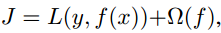

# 2025.02.15-2025.02.21

# 大模型项目

1. 协助唐和豪完成大模型微调框架的部署
2. 尝试部署RAG的框架

# 国网项目

阅读了一篇论文

# 科研

- [ ]  需要将良性子结构从原来的数据集中分割出来，因此要学习数据的解析，找到了Unicorn的parse工具解析DarpTransparent Computing（TC）
- [x]  寻找一个有监督的APT检测网络，只找到一个半监督学习的框架Flash，其可以对抗之前提到的黑盒攻击

## Flash:A Comprehensive Approach to Intrusion Detection via Provenance GraphRepresentation Learning

> Flash:通过溯源图进行入侵检测的综合方法表征学习 ；该文章针对23年文章的**evasion attacks**进行防御，值得关注，FLASH通过计算图中异常节点的数量来实现这一点。如果计数超过预定阈值，则该图被分类为异常，但是也做了StreamSpot 和Unicorn数据集的图级别的异常检测
> 

### 文章首先从目前的IDS（入侵检测系统）提出了他们的问题

1. **语义特征：**许多IDS忽略了溯源图的语义信息，如进程名、命令行或文件路径。这种疏忽可能导致误报率很高，因为区分良性和恶意实体变得越来越困难。
2. **时间顺序**：现有的IDS通常只关注每个节点的事件频率，而忽略了系统事件的时间顺序。这种忽略会导致模型对良性节点的分布理解不足，因为多个节点可能以不同的顺序执行相同的事件。例如，在一个攻击场景中，恶意进程可能在短时间内频繁访问特定文件，而良性进程则不会。如果IDS忽略了时间顺序，就可能无法准确区分这种异常行为，从而导致误报或漏报。因此，考虑时间顺序对于提高检测准确性至关重要。
3. **可扩展性**：许多现有的基于溯源图的IDS在处理大型溯源图时面临可扩展性挑战。随着企业网络的规模不断扩大，系统日志的数量呈指数级增长，传统的IDS在处理这些大规模数据时往往效率低下，无法实现实时检测。例如，在一个大型企业网络中，每天可能产生数百万条系统日志，如果IDS无法高效处理这些日志，就可能导致检测延迟，从而错过关键的攻击时机。因此，提高IDS的可扩展性是确保其在实际应用中有效运行的关键。
4. **检测粒度**：现有的IDS通常以图级别进行异常检测，这在面对具有最小活动的隐蔽攻击时效果不佳。例如，在一个APT攻击中，攻击者可能只在系统中执行少量恶意操作，这些操作在整体图中所占比例极小，导致图级别的检测方法难以发现这些异常。此外，图级别的检测方法无法准确定位异常节点，增加了安全分析师的工作负担。相比之下，**节点级别的检测方法**可以更准确地识别恶意节点，提高检测效率和准确性。
5. **对抗模仿攻击的鲁棒性**：现有的基于溯源图的IDS容易受到模仿攻击的威胁。攻击者可以通过修改攻击图中的节点邻域分布，使其与良性溯源图相似，从而规避IDS的检测。例如，攻击者可以在攻击图中添加一些良性节点，使其看起来与正常系统活动相似，从而降低IDS的检测准确性。因此，提高IDS对模仿攻击的鲁棒性是确保其在面对复杂攻击时有效运行的重要因素。

### 语义属性编码（Semantic Attribute Encoding）

> 通过结合节点及其1hop邻居之间的语义属性和因果事件（系统调用）类型，为每个节点形成总结句。系统事件按时间戳排序，以保持时间顺序。然后，每个句子通过在良性系统日志上训练的Word2Vec模型编码成固定长度的向量。
> 
1. 结合节点和其1-hop邻居的语义属性和因果事件
2. 使用word2vec生成嵌入（embadding）
3. 考虑事件顺序，使用了Transformer中的位置编码嵌入

$$
\begin{gathered}P E_{(p o s, 2 i)}=\sin \left(\frac{p o s}{10000^{2 i / d}}\right) \\P E_{(p o s, 2 i+1)}=\cos \left(\frac{p o s}{10000^{2 i / d}}\right)\\\\E m b_i=E m b_i+P E_i\end{gathered}
$$

### 在OpTC数据上使用了[*XGBoost*(分布式梯度增强库](http://www.baidu.com/link?url=qRihlpFpW9dwr5Moplp-lBVGX-sKvLoi-N3Th-awOFx2dOngh4Dz26JI0zl5daiCIZpoxwYmX7Iku_-ZMlq4t_)）



### 只使用OpTC的嵌入数据库

在检查E3数据集时，我们发现了很大一部分缺乏属性数据的节点。例如，在DARPA E3的四个数据集中——Cadets、Trace、FiveFirections和Theia——分别有70%、54%、72%和76%的节点缺少属性数据。如第4.4节所述，这些数据对于节点和邻居识别以及分配持久节点标识符（PNI）至关重要。没有这些PNI，我们就无法使用高效的嵌入数据库。然而，OpTC数据集提供了完整的节点信息，使FLASH能够实现两步流水线。因此，在推理（检测）阶段，我们只使用OpTC的嵌入数据库。

### 框架概述


1. 先将分块的系统日志转化为溯源图
2. 结合1-hop的信息，加入时间戳和位置编码信息，通过Word2vec生成节点的生成节点的掩码
3. 通过图的表征学习生成图的键值对向量数据库加快匹配搜索
4. 结合3和2经过一个简单的分类器完成入侵检测分类

虽然该文章存在有监督学习，但是该文章还是只使用良性行为进行训练，其实是半监督学习

### 模仿攻击防御

针对之前那篇文章[Mimicry attacks against provenance graph host intrusion detection systems](https://par.nsf.gov/biblio/10412012),可以使得。作者专门进行了实验，并通过实验证明，图级粒度的IDS（如第2节所述）（如Unicorn[30]、StreamSpot[51]、ProvDetector[66]和SIGL[31]）对对抗性攻击的敏感，目的是在攻击图中的节点邻域分布与良性来源图中的分布之间产生误导性的相似性。

文章说是解决了这个问题，如图5所示，实验结果显示了使用良性结构（x轴）添加到攻击图中的边数，以及所有攻击节点（y轴）相对于添加的良性边数的异常分数（最小、平均和最大）。最初，添加良性节点邻域会降低攻击节点的异常分数，但这种降低不足以确保成功规避，如图5中的阈值线所示。随后，随着引入更多良性边缘，攻击节点的异常得分增加。

这一趋势可以归因于这样一个事实，即在攻击节点周围加入额外的良性节点可以增强其嵌入，使其具有更良性的特征，从而降低节点的异常得分。持续添加更多良性节点会在模型中引起怀疑。模型学习到的节点分布的这种变化导致异常分数的增加。这种独特的行为可以与我们的模型从节点级学习任务中获得的强大语义理解联系起来。通过这个过程，FLASH全面了解了与起源图中不同语义节点相关的特征邻域结构。

**这里有点抽象，感觉是半监督的学习凑巧实现了防御，而且其给分类错的良性节点设置了阈值，给的节点一多，自然容易超过阈值**。

### 代码分析

1. 文章溯源图数据的标准格式是**[’行为者编号‘，’行为者类型‘，’目标编号‘，’目标类型‘，’行为‘，’时间戳‘]**

```python
df = pd.DataFrame (data, columns = ['actorID', 'actor_type','objectID','object','action','timestamp'])
```

1. **结合时间戳和位置编码的Word2Vec Embadding**

```python
class PositionalEncoder:

    def __init__(self, d_model, max_len=100000):
        position = torch.arange(max_len).unsqueeze(1)
        div_term = torch.exp(torch.arange(0, d_model, 2) * (-math.log(10000.0) / d_model))
        self.pe = torch.zeros(max_len, d_model)
        self.pe[:, 0::2] = torch.sin(position * div_term)
        self.pe[:, 1::2] = torch.cos(position * div_term)

    def embed(self, x):
        return x + self.pe[:x.size(0)]

def infer(document):
    word_embeddings = [w2vmodel.wv[word] for word in document if word in  w2vmodel.wv]
    
    if not word_embeddings:
        return np.zeros(20)

    output_embedding = torch.tensor(word_embeddings, dtype=torch.float)
    if len(document) < 100000:
        output_embedding = encoder.embed(output_embedding)

    output_embedding = output_embedding.detach().cpu().numpy()
    return np.mean(output_embedding, axis=0)

encoder = PositionalEncoder(30)
w2vmodel = Word2Vec.load("trained_weights/unicorn/unicorn.model")
```

1. **学习过程**: 
    1. 先用2的编码给节点编码生产节点特征
    2. 输入a中的节点特征（数据集有大图用子图（`SubGraph`）分析）以及边信息
    3. 使用加权交叉熵损失，对系统日志中的节点类型进行分类，不同数据集有不同策略：
        
        
        | 数据集 | 级别 | 特点 |
        | --- | --- | --- |
        | StreamSpot | 完整图 | 没有使用额外的策略 |
        | Unicorn | 子图 | 图规模太大，使用了子图分割和掩码学习 |
        | Darpa E3 Theia 、Trace、Fivedirections、Cadets | 节点 | 数据集缺少特定节点类型的某些基本节点属性。此限制意味着 Flash 不能在具有此数据集的离线 GNN 嵌入的解耦模式下运行。因此，采用在线 GNN 耦合 word2vec 语义嵌入来获得该数据集的有效评估结果。 |
        | Darpa OpTC | 节点 | OpTC 数据集丰富了节点属性，使其适合以解耦的方式运行 Flash。这包括使用离线 GNN 嵌入和下游分类器。文章的方法在这个数据集上测试了 Flash，其中 Flash 生成 word2vec 嵌入作为 GNN 嵌入的特征向量。这些嵌入存储在数据存储中，并与下游模型结合使用，以改善检测结果。 |
    4. 分类 
        
        将测试图预测节点的类型 ，设置阈值，预测失败的类型超过阈值，则说明异常，因为只使用良性图运算
        
        Darpa数据集通过子图聚合来判断节点的异常，然后和真实的异常数据，对于未正确分类的节点，更新 `flag` 掩码，标记为错误分类，再统计最后的度量指标
        

### 总结

1. 目前由于APT数据集不平衡的问题，大部分是无监督学习，有监督学习较少，目前我没有找到**有源码的**GNN的有监督学习的APT溯源图的文章，所以我感觉不太合理，该篇就是半监督学习，但只做了良性行为的分类，同时文章感觉有点“小技巧”，使用了分类器是对良性节点的分类，
2. 我主观的**认为无监督学习也可以做APT的黑盒数据攻击**，学习良性图的表征结构，将良性图的结构（节点和边）注入到攻击图中，可以用变分自编码器来做，也可以使用对抗生成学习，并结合强化学习。
3. 该文章的出现针对[**Mimicry attacks against provenance graph host intrusion detection systems**](https://par.nsf.gov/biblio/10412012)论文，提出了从节点级学习任务中获得的强大语义理解，从而使得模仿攻击无效,模仿攻击只在图编码无监督的系统上容易生效

## 在搜索时找到的有意思的论文

### 网络入侵检测系统-ARGANIDS：一种基于对抗学习正则化图自编码器的新型网络入侵检测系统[ARGANIDS: A Novel Network Intrusion Detection System Based on Adversarially Regularized Graph Autoencoder](https://dl.acm.org/doi/pdf/10.1145/3555776.3577651)

### 规避攻击新论文

[main.pdf](https://www.usenix.org/system/files/usenixsecurity23-mukherjee.pdf)  Evading Provenance-Based ML Detectors with Adversarial System Actions

### 用于无监督异常值检测的生成对抗主动学习（异常检测领域）

[Generative Adversarial Active Learning for Unsupervised Outlier Detection | IEEE Journals & Magazine | IEEE Xplore](https://ieeexplore.ieee.org/abstract/document/8668550)

异常值检测是机器学习中的一个重要主题，并已被广泛用于各种应用。在本文中，我们通过从均匀的参考分布中抽样潜在的异常值，将异常值检测作为一个二元分类问题来处理。然而，由于高维空间中数据的稀疏性，有限数量的潜在异常值可能无法提供足够的信息来帮助分类器描述可以有效地将异常值与正常数据分开的边界。为了解决这个问题，我们提出了一种新的用于异常值检测的单目标生成对抗主动学习 （SO-GAAL） 方法，该方法可以根据生成器和判别器之间的最小-最大博弈直接生成信息丰富的潜在异常值。此外，为了防止生成器陷入模式崩溃问题，当 SO-GAAL 能够提供足够的信息时，应确定训练的停止节点。但在没有任何先验信息的情况下，SO-GAAL 非常困难。因此，我们将 SO-GAAL 的网络结构从单个生成器扩展到多个不同目标的生成器 （MO-GAAL），从而可以为整个数据集生成合理的参考分布。我们在合成和真实世界数据集上将所提出的方法与几种最先进的异常值检测方法进行了实证比较。结果表明，MO-GAAL 在大多数情况下都优于其竞争对手，尤其是对于具有各种聚类类型或高不相关变量比率的数据集。

- 

### 面向异常检测的溯源样本增强方法_刘远志

[面向异常检测的溯源样本增强方法--《华中科技大学》2023年硕士论文](https://cdmd.cnki.com.cn/Article/CDMD-10487-1024393306.htm)

作为防范网络入侵的有效工具,基于溯源的异常检测系统在检测各类攻击中发挥着越来越重要的作用。如今的入侵攻击越来越复杂,标签化溯源样本的不足使溯源异常检测系统的训练充分度与检测性能大打折扣。而目前的标签化样本生成方法存在生成样本单调且重复的问题,不能有效提升入侵检测系统的检测性能。 为了解决这一问题,提出了面向异常检测的溯源样本增强方法,旨在对现有溯源数据进行深度挖掘,能够在标签化溯源样本缺乏的情况下,学习其特征生成大量的溯源样本以增强溯源异常检测系统的检测性能。该溯源样本增强方法主要由基于溯源关键路径提取与词嵌入的溯源图向量化技术、基于溯源生成对抗网络的溯源样本生成模型和大规模溯源样本的反向量化技术三个部分组成。面向异常检测的溯源样本增强方法首先使用溯源向量化技术有效提取原始溯源图中的关键路径信息,将原始溯源图转化为溯源向量矩阵;接着利用溯源生成模型学习矩阵特征,并据此稳定地生成具有高度有效性和数据多样性的大规模溯源样本;最后通过反向量化技术将这些溯源样本还原为异常检测系统可用的溯源图。 在多种数据集上的实验结果表示,面向异常检测的溯源样本增强方法相比目前的标签化样本生成方法优势明显。生成溯源样本的误检率不到0.1‰,生成样本的初始得分与Fréchet起始距离指标均优于现有方法。在真实数据集的实验结果中,平均误检率从8.6%下降到了1.3%,而平均检测率从88.1%上升到了99.2%,有效提升了不同溯源异常检测系统在实际检测中的检测效果。

