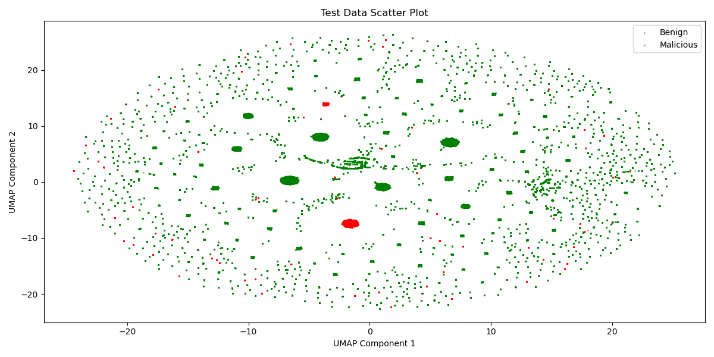

# 2025.4.18-2025.4.25

# 科研

## APT检测存在的问题：

1. **假阳率过高**
2. **存在对抗的逃逸和中毒攻击**
3. **恶意标签的数据集不足**

## 目前层层递进方向：

1. 给无监督学习加入恶意标签数据，实现**半监督的学习方法**，加大良性样本和恶意样本之间的嵌入区分度
2. 通过少量的标签数据，先基于规则组装数据，后续尝试使用深度学习算法，**构建攻击图生成模型**
3. 结合联邦学习

## 目前是**半监督的学习方法**

这周已经将攻击样本的数据集标注出来了，这周末就可以将图自编码器进行修改，将攻击样本加入到训练，看看效果

MAGIC原来的编码的热点图

原来MAGIC跑的theia数据集

加入标签学习对比学习后的热点图

## 计划

1. 在其他数据集
2. 寻找新数据，Flash有一个Darpa Optc的groundtruth，看看可以不可以用

# 电网

1. 下一步计划是将目前的可调用资源异常检测的工作做一个聚焦，聚焦到国网线路的异常检测上面来，通过电压，电流，功率等和线路相关的，将线路的异常进行分类:正常，中间熔断，末段熔断。