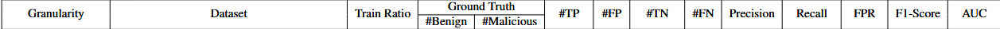

# 2025.5.5-2025.5.10

# 科研

## APT检测存在的问题：

1. **假阳率过高（**良性样本和恶意样本之间的嵌入区分度不足，良性样本和恶意样本各自的嵌入分布不集中，共同特征没被充分挖掘**）**
2. **鲁棒性不足（存在对抗的逃逸和中毒攻击能逃避检测）**
3. **恶意标签的数据集不足**

## 目前大方向：

1. 给无监督学习加入恶意标签数据，实现**半监督（弱监督）的学习方法**，加大良性样本和恶意样本之间的嵌入区分度
2. 通过少量的标签数据，先基于规则组装数据，后续尝试使用深度学习算法，**构建攻击图生成模型**
3. 结合联邦学习

## 第一个方向

1. 引入恶意子图，添加对比损失增加良性节点和恶意节点的嵌入差异
2. 紧凑损失，使得良性节点和恶意节点的嵌入相近
3. 分配权重，加大困难样本（如相似的恶意节点和良性节点）的学习程度

$x$是用于恶意子图和紧凑损失的样本集， $y=1$是， $x_1$和 $x_2$是 相同样本对， $y=-1$表示 $x_1$和 $x_2$是对比样本对

$$
        \text{loss}(x, y) =        \begin{cases}        1 - \cos(x_1, x_2), & \text{if } y = 1 \\        \max(0, \cos(x_1, x_2) - \text{margin}), & \text{if } y = -1        \end{cases}
$$

## 本周工作

实现了了三个节点数据集上的实验，验证了第一个方向的第1点的成功结果，相对于MAGIC假阳率降低显著

选取了恶意节点10%的数据

### MAGIC（无监督，baseline）

### Slot（半监督，10%恶意数据）

### Our Work

**Trace**

**Theia**

**Cadets**

## 计划

1. 在图级数据集`streamspot`，`unicorn wget`上实验
2. 引入紧凑损失和分配权重，并马上做实验
3. 寻找新数据，Flash有一个`Drapa Optc`的`groundtruth`，应该可以作为补充数据集

# 电网

聚焦于用户线路的异常以及分类，特征工程，从原始电力数据中提取**时域、频域和时频域特征**，用于对电力用户进行分类（如正常用户、异常用户、末端用户等），从而支持后续的智能识别与管理。基于统计学方法提取信号在时间维度上的基本特征，适用于捕捉趋势、波动等信息，并根据其对分类任务的重要性程度进行排序选择启用

加入频域和实频域特征并做了特征选择跑出来的结果

| 模型 | 特征处理 | Total ACC（3分类） |
| --- | --- | --- |
| Randomforest | 时序数据聚合 | 0.8334 |

相对于之前的0.722的ACC有进步

# 大模型

完成了大模型文档的编写