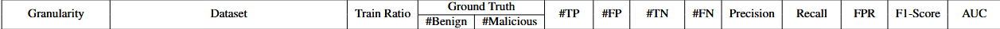

# 2025.5.10-2025.5.16

# 科研

## APT检测存在的问题：

1. **假阳率过高（**良性样本和恶意样本之间的嵌入区分度不足，良性样本和恶意样本各自的嵌入分布不集中，共同特征没被充分挖掘**）**
2. **鲁棒性不足（存在对抗的逃逸和中毒攻击能逃避检测）**
3. **恶意标签的数据集不足**

## 目前大方向：

1. 给无监督学习加入恶意标签数据，实现**半监督（弱监督）的学习方法**，加大良性样本和恶意样本之间的嵌入区分度
2. 通过少量的标签数据，先基于规则组装数据，后续尝试使用深度学习算法，**构建攻击图生成模型**
3. 结合联邦学习

## 第一个方向

1. 引入恶意子图，添加对比损失增加良性节点和恶意节点的嵌入差异
2. 紧凑损失，使得良性节点和恶意节点的嵌入相近
3. 分配权重，加大困难样本（如相似的恶意节点和良性节点）的学习程度

$x$是用于恶意子图和紧凑损失的样本集， $y=1$是， $x_1$和 $x_2$是 相同样本对， $y=-1$表示 $x_1$和 $x_2$是对比样本对

$$
        \text{loss}(x, y) =        \begin{cases}        1 - \cos(x_1, x_2), & \text{if } y = 1 \\        \max(0, \cos(x_1, x_2) - \text{margin}), & \text{if } y = -1        \end{cases}
$$

## 上周工作

实现了了三个节点数据集上的实验，验证了第一个方向的第1点的成功结果，相对于MAGIC假阳率降低显著

选取了恶意节点10%的数据

### MAGIC（无监督，baseline）




### Slot（半监督，10%恶意数据）


### Our Work

**Trace**


**Theia**


**Cadets**


## 本周工作

在图级数据集`streamspot`，`unicorn wget`上实验

取10%的恶意节点，并且实验100次取均值和标准差

### **streamspot**

**MAGIC**

```python

AUC: 0.9997029999999999+0.0005786976758204723
F1: 0.9968968355465048+0.006025929450581507
PRECISION: 0.9938838399030594+0.011813928858864547
RECALL: 1.0+0.0
TN: 99.37+1.230081298126266
FN: 0.0+0.0
TP: 100.0+0.0
FP: 0.63+1.230081298126266
#Test_AUC: 0.9997±0.0006
```

**Our**

```python
AUC: 0.9999716000000001+8.918206097639955e-05
F1: 0.9993681587039817+0.001656581949628212
PRECISION: 0.9987425742574257+0.0032967620977831405
RECALL: 1.0+0.0
TN: 99.873+0.33297297187609687
FN: 0.0+0.0
TP: 100.0+0.0
FP: 0.127+0.33297297187609687
```

### Unicorn Wget

**MAGIC**

```python
AUC: 0.9661599999999999+0.018792168581619306
F1: 0.9410173614366201+0.017852616776776416
PRECISION: 0.9572338827838827+0.03804139452279134
RECALL: 0.9264000000000001+0.015717506163510774
TN: 23.92+1.0166612021711066
FN: 1.84+0.39293765408777004
TP: 23.16+0.39293765408777004
FP: 1.08+1.0166612021711068
AUC (Best 4 by F1): 0.9835999999999998+0.008187795796183476
F1 (Best 4): 0.969795917867451+0.009795918367451084
PRECISION (Best 4 by F1): 0.98+0.020000000000000018
RECALL (Best 4 by F1): 0.96+0.0
TN (Best 4 by F1): 24.5+0.5
FN (Best 4 by F1): 1.0+0.0
TP (Best 4 by F1): 24.0+0.0
FP (Best 4 by F1): 0.5+0.5

```

**Our**

```python
AUC: 0.9843520000000001+0.013753635737505916
F1: 0.9609649325210065+0.018981612064451606
PRECISION: 0.9416128892818547+0.0369013442655719
RECALL: 0.9823999999999999+0.021406541056415453
TN: 23.43+1.0416813332300814
FN: 0.44+0.5351635264103861
TP: 24.56+0.535163526410386
FP: 1.57+1.0416813332300814
AUC (Best 4 by F1): 0.9952+0.008313843876330608
F1 (Best 4): 0.9950980387157342+0.008490445135058358
PRECISION (Best 4 by F1): 0.9903846153846154+0.01665433468816227
RECALL (Best 4 by F1): 1.0+0.0
TN (Best 4 by F1): 24.75+0.4330127018922193
FN (Best 4 by F1): 0.0+0.0
TP (Best 4 by F1): 25.0+0.0
FP (Best 4 by F1): 0.25+0.4330127018922193
```

可以看到相关效果有所提升，但是`Wget`数据集有些问题，考虑可能是随机种子的问题，取最好的4次结果分析。

## 计划

> 目前对所有数据集的测试都已经完成，
> 
1. 引入紧凑损失，做实验，目前设想引入对比学习常用的的三元组损失**`Triplet loss`**
    
    
    
    $$
    L = \max \left( {d\left( {a,p}\right)  - d\left( {a,n}\right)  + \text{ margin },0}\right)
    $$
    
2. 引入分配权重，做实验
3. 寻找新数据，Flash有一个`Drapa Optc`的`groundtruth`，应该可以作为补充数据集

# 电网

1. 讲过往的材料进行了总结
2. 尝试引入电压电流差分的特征
3. 开始了解专利格式，并撰写专利