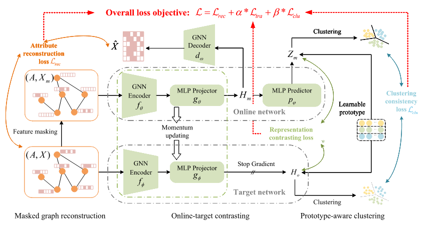

# 2025.2.29-2025.3.7

# 科研

在MAGIC的基础上进行改进

1. 重写了自编码器，模仿protoMGAE的对比学习的内容，加入一个线性层`projector`
    
    
    
    ```python
    class GraphEncoder(nn.Module):
        def __init__(self, n_dim, e_dim, enc_num_hidden, dec_in_dim,n_layers, n_heads, n_heads_out, 
                     activation, feat_drop, negative_slope, residual, norm, encoding=True):
            super().__init__()
            
            self.encoder =  GAT(
                n_dim=n_dim,
                e_dim=e_dim,
                hidden_dim=enc_num_hidden,
                out_dim=enc_num_hidden,
                n_layers=n_layers,
                n_heads=n_heads,
                n_heads_out=n_heads_out,
                concat_out=True,
                activation=activation,
                feat_drop=feat_drop,
                attn_drop=0.0,
                negative_slope=negative_slope,
                residual=residual,
                norm=create_norm(norm),
                encoding=encoding,
            )
            self.projector = nn.Linear(dec_in_dim, dec_in_dim, bias=False)
        
        def forward(self, g, x, return_hidden=False):
            enc, all_hidden = self.encoder(g, x, return_hidden=True)
            pro = self.projector(enc)
            return enc, all_hidden, pro
    ```
    
    ```python
      # contrasive loss
            pred_mask = self.s_predictor(pro_mask)
            contra_loss = contrastive_loss(pred_mask, pro_ori.detach(), loss="infonce", temperature=1)
    ```
    
2. 完成教师-学生网络编写，学生学习掩码图，教师学习未掩码的图，使得模型更稳定
    
    ```python
    class EMA():
        def __init__(self, beta):
            super().__init__()
            self.beta = beta
    
        def update_average(self, old, new):
            if old is None:
                return new
            return old * self.beta + (1 - self.beta) * new
    
    def update_moving_average(ema_updater, ma_model, current_model):
        for current_params, ma_params in zip(current_model.parameters(), ma_model.parameters()):
            old_weight, up_weight = ma_params.data, current_params.data
            ma_params.data = ema_updater.update_average(old_weight, up_weight)
    def set_requires_grad(model, val):
        for p in model.parameters():
            p.requires_grad = val
    ```
    

代码已经跑通，图对比学习部分的loss下降效果一般，后续寻找方案


# 国网项目

1. 与杨浩然学长开了会议
2. 明确了国网项目的专利编写分工——用户电力异常数据检测

# 大模型

1. 完成十个数据的微调工作
2. 对不好的数据进行了分析，并给出了数据的优化建议
    - **unsloth（测试了六个问题）**
        - 为什么肠道菌群检测报告从测序部收到样本后需要4到7天出报告？
        - 菌群如何影响免疫力?
        - 酒精对肠道菌群有什么影响?
        - V3+V4 是什么 ？
        - 在rRNA中，V3+V4片段是什么?
        - 不检测直接服用益生菌会带来哪些问题 ？
        可不可以不检测直接服用益生菌的修改
    - 提出对于训练集的问题稍作修改
3. 与杨进学长开了会议，明确了下一步需要的工作内容