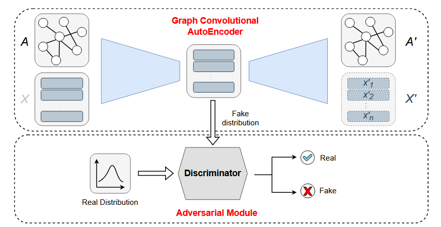

# 2025.3.8-2025.3.14

# 科研

## APT检测存在的问题：

1. **语义特征丢失，**现有的 IDS 通常会忽略有价值的语义数据，例如进程名称、命令行参数、文件路径和来源图中的 IP 地址。
2. **存在对抗攻击**，例如一张攻击图，可以反复添加良性子结构构造恶性数据来逃逸检测
3. **图嵌入生成稳定性不够**，APT攻击的隐蔽性导致溯源图数据稀疏且包含噪声（如不完整日志、误报）。对抗正则化通过对抗训练迫使嵌入分布接近先验分布（如高斯分布），增强了模型对噪声和缺失数据的鲁棒性，使生成的嵌入更稳定，避免因局部噪声导致检测失效。(也是目前多数自编码器在做的部分)
4. **~~概念偏移**，这一点很多论文在展望提到，但是缺少这方面的数据集，基本没人做~~

## 解决

我们现在聚焦到前两个问题，我看了两篇文章解决这些问题的：

- [Flash](https://ieeexplore.ieee.org/document/10646725/)文章解决了**第1.2个问题**，对于**语义特征丢失和对抗攻击**的问题
- [ARGANIDS](https://dl.acm.org/doi/10.1145/3555776.3577651)（网络入侵检测）解决了**第3个问题**，利用对抗正则化，获得稳健的嵌入

## [FLASH: A Comprehensive Approach to Intrusion Detection via Provenance Graph Representation Learning](https://ieeexplore.ieee.org/document/10646725/)

**语义特征丢失解决方案：**一些传统的方法是 one-hot 编码 [11] 和 bag of words [2] 方法。然而，这些方法会导致非常稀疏的向量，这些向量没有考虑到文档中每个单词周围的上下文。

**Flash**使用Word2Vec对节点进行语义的embading，Word2Vec是一种基于神经网络的方法，擅长学习单词向量表示。模型考虑每个节点类型的以下节点属性：进程节点的进程名称和命令行参数、文件节点的文件路径、套接字节点的网络 IP 地址和端口以及模块节点的模块名称。数据有助于生成语义丰富的特征向量。文章还**通过组合语义属性和节点与其 1 跳邻居之间的因果事件（系统调用）类型来形成每个节点的总结句子**。同时加入了Transformer的时间编码

**对抗攻击解决方案：**Flash其将其聚焦到聚合特征节点中，并用半监督学习节点，并作节点分类并采用统计异常节点的数量来判断异常，如 Goyal 等人 所详述的那样。具有图形级粒度（如第 2 节所述）的 IDS（如 Unicorn 、StreamSpot [、ProvDetector 和 SIGL  ）对对抗性攻击的敏感性是 Goyal 等人工作中的一个显着发现。这种对抗性策略纵分布图编码，对基于来源的 IDS 发起规避攻击最初，添加良性节点邻域会降低攻击节点的异常分数，但这种减少不足以确保成功规避，如图 5 中的阈值线所示。随后，随着更多良性边缘的引入，攻击节点的异常分数增加。这种趋势可以归因于这样一个事实，即在攻击节点周围加入额外的良性节点可以增强其嵌入，使其具有更良性的特征，从而降低节点的异常分数。但是，持续添加更多良性子节点在模型内引起怀疑。模型学习的节点分布的这种变化会导致异常分数增加。这种独特的行为可以与我们的模型强大的语义理解相关联，该理解源自节点级学习任务。通过这个过程，FLASH 全面了解了与出处图中不同语义的节点相关的特征邻域结构。这种理解使模型能够准确确定图中不同节点之间因果关系的合法性，使 FLASH 对对抗性拟态攻击具有很强的抵抗力。这种弹性代表了与图形级检测方法相比的显著优势。**因为盲目地添加良心子结构必然会导致其良性子节点的分布发生变化，而且Flash声称自己学习到节点强大的语义理解。**

## [ARGANIDS: a novel Network Intrusion Detection System based on Adversarially Regularized Graph Autoencoder](https://dl.acm.org/doi/10.1145/3555776.3577651)

> 对抗正则化的思路：ARGA它通过无监督自动编码器将图的拓扑信息和节点特征编码为紧凑的潜在表示。此外，它通过基于对抗性训练的额外正则化阶段获得稳健的嵌入。我们还考虑了两种 ARGA 变体，即用于变分自动编码器的 ARVGA 和用于内容信息重建的 ARVGA_AX。
> 

总体思路如下：判别器希望通过为从高斯分布中采样的真实对象分配高概率，为编码器生成的假对象分配低概率来最大化函数。同时，生成器（即编码器）试图通过最小化相同的方程来欺骗判别器。通过这种方式，自动编码器被引导产生遵循先验分布 pz 的嵌入。该文章给了我新的思路



## 总结

- 要防御对抗攻击，需要到节点级的检测，边的太消耗时间，图的太粗略，同时加强语义，做特征工程
- Flash的图编码是简单的GAT，可以融入新的结构，使得嵌入符合先验分布

# 大模型项目

1. 在公司的服务器完成了微调环境的搭建
2. 发现了Rag的模型使用了第一张显卡，导致模型训练后爆显存，模型不能保存
    
    ```python
    import os 
    os.environ["CUDA_DEVICE_ORDER"] = "PCI_BUS_ID"
    os.environ["CUDA_VISIBLE_DEVICES"] = "1" # set GPU number
    ```
    
    指定显卡，解决问题
    
3. 实现了ollama在公网访问，解决了网络映射的问题
4. 目前完成了微调模型到RagFlow的全流程
    
    
    
    图中的deepseek-qwen-7b-2025-3-13-test是微调的模型
    

# 国网项目

## 数据工程

目前用的数据是项目发方那边给的时序数据：

能用到无缺失字段：（用户编号，时间段（15分钟一次，每天96个采集点），A相电压，A相电流），时序数据一开始就想到用lstm来做


## 模型验证

用简单的时序网络lstm对国网数据做三分类


验证集上效果好，但是测试集上效果一般

周末训练增加特征更多轮次再测试一下