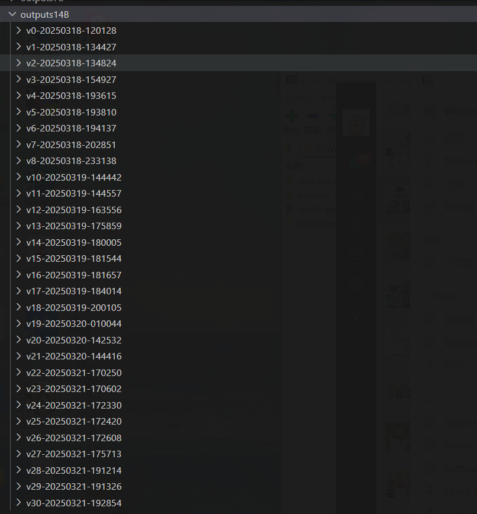

# 2025.3.15-2025.3.22

**本周大模型的项目比较紧急，大部分时间在忙大模型**

# 科研

## APT检测存在的问题：

1. **语义特征丢失，**现有的 IDS 通常会忽略有价值的语义数据，例如进程名称、命令行参数、文件路径和来源图中的 IP 地址。
2. **存在对抗的模拟攻击**，例如一张攻击图，可以反复添加良性子结构构造恶性数据来逃逸检测
3. **图嵌入生成稳定性不够**，APT攻击的隐蔽性导致溯源图数据稀疏且包含噪声（如不完整日志、误报）。对抗正则化通过对抗训练迫使嵌入分布接近先验分布（如高斯分布），增强了模型对噪声和缺失数据的鲁棒性，使生成的嵌入更稳定，避免因局部噪声导致检测失效。(也是目前多数自编码器在做的部分)

## 解决

我们现在聚焦到前两个问题，我看了两篇文章解决这些问题的：

- [Flash](https://ieeexplore.ieee.org/document/10646725/)文章解决了**第1.2个问题**，对于**语义特征丢失和对抗的模拟攻击**的问题

### **我们聚焦对抗的模拟攻击这个子问题**

Flash声称能应对**模拟攻击**，但其源码并没有相关实验，对于**对抗的模拟攻击的防御存疑，**对抗模拟攻击防御能力仍需加强，后续可以补充实验来看。

### 对抗模拟攻击插入的边缘虽然符合语义，但是对图结构有改变，和正常使用下的良性图有不同

通过这一点，我想到良性子结构也可以互相组合，即使他们符合语义，也不符合真实世界系统的操作逻辑。我想到将良性子结构互相组合生成样本，其结构于正常的良性图来说不同，**而且这种组合是不是类似于对抗模拟攻击插入的逻辑，模型有可能因此学习到模拟攻击的发生**。所以下一步我将把良性子结构的组合以对抗数据，以应对对抗模拟攻击，后续甚至可以往对抗生成模型的方向靠。

### 计划

我打算学习[Mimicry Attacks against Provenance Graph Host Intrusion Detection Systems](https://par.nsf.gov/biblio/10412012-sometimes-you-arent-what-you-do-mimicry-attacks-against-provenance-graph-host-intrusion-detection-systems)的符合语义的构造方法，构造良性的异构图

# 大模型项目

1. 学习了怎么从Swift的safetensor模型转化到GUFF格式并量化，以及Ollama创建和调用模型的方法。
    
    ```bash
    swift sft \
        --model deepseek-ai/DeepSeek-R1-Distill-Qwen-14B \
        --custom_register_path /home/root123/customize_dataset.py \
        --dataset /home/root123/data/medical-3-18.json \
        --output_dir /home/root123/outputs/14B \
        --train_type lora \
        --lora_rank 8 \
        --lora_alpha 32 \
        --num_train_epochs 40 \
        --split_dataset_ratio 0 \
        --torch_dtype bfloat16 \
        --per_device_train_batch_size 1 \
        --learning_rate 1e-4 \
        --target_modules all-linear \
        --save_steps 50 \
        --save_total_limit 5 \
        --logging_steps 5 \
        --max_length 2048 \
        --warmup_ratio 0 \
        --dataloader_num_workers 4
    
    推理：
    MODELSCOPE_CACHE=/home/root123/.cache/modelscope \
    swift infer \
        --adapters /home/root123/outputs14B/v19-20250320-010044/checkpoint-900 \
        --infer_backend pt \
        --stream true \
        --temperature 0 \
        --max_new_tokens 2048
    
    导出：
    MODELSCOPE_CACHE=/home/root123/.cache/modelscope
    swift export --ckpt_dir /home/root123/outputs14B/v8-20250318-233138/checkpoint-2500 --merge_lora true
    
    转化gguf模型并量化
    cd /home/root123/outputs14B/v8-20250318-233138/checkpoint-2500-merged
    python /home/root123/llama.cpp/convert_hf_to_gguf.py /home/root123/outputs14B/v8-20250318-233138/checkpoint-2500-merged --outtype f16 --outfile converted.gguf
    /home/root123/llama.cpp/llama-quantize converted.gguf quantized.gguf q4_0
    ```
    
2. 写了一个用于测试微调模型效果的Python脚本，可以输入问题，自动化喂给大模型得到回答，并保存起来
    
    ```bash
    import requests
    import openpyxl
    from openpyxl import Workbook
    import json
    import re
    from tqdm import tqdm
    # 定义 Ollama 的 API URL
    model_name = "DeepSeek-R1-Distill-Qwen-14B"
    OLLAMA_API_URL = "http://localhost:11434/api/chat"
    OPENAI_API_URL = "http://localhost:8000/v1/chat/completions"
    # prompt = "你是一个具有肠道菌群知识的医学专家，用中文回答问题："
    
    def load_questions_from_json(file_path):
        with open(file_path, 'r', encoding='utf-8') as file:
            data = json.load(file)
            questions = [item.get("Question", "") for item in data]
        return questions
         
    def get_answer_from_ollama(question):
        data = {
            "model": model_name,
            "messages": [
                {"role": "user", "content": question}
            ],
            "stream": False
        }
        # try:
        response = requests.post(OLLAMA_API_URL, json=data)
        
        if response.status_code == 200:
            result = response.json()
            answer = result.get("message", {}).get("content", "")
            print("完整回答:", answer)
            
            # 提取 </think> 前面的内容作为 complex_cot
            think_tag_end = answer.find('</think>')
            if think_tag_end != -1:
                complex_cot = answer[:think_tag_end].strip()
                # 提取 </think> 后面的内容作为 response_part
                response_part = answer[think_tag_end + len('</think>'):].strip()
            else:
                complex_cot = ""
                response_part = answer.strip()
            
            return complex_cot, response_part
        else:
            return "", f"Error: {response.status_code}"
    def write_to_excel(questions, thoughts, answers, output_file):
        wb = Workbook()
        ws = wb.active
        ws.title = "Ollama Responses"
        ws.append(["Question", "Complex_CoT", "Response"])
    
        for q, t, a in zip(questions, thoughts, answers):
            ws.append([q, t, a])
    
        wb.save(output_file)
        print(f"数据已成功写入到 {output_file} 文件中")
        
    json_file_path = "/home/root123/data/medical-3-14-update.json"  # JSON 文件路径
    output_excel_file = "/home/root123/outputs/ollama_responses.xlsx"  # 输出的 Excel 文件路径
    
    # 从 JSON 文件中加载问题
    questions = load_questions_from_json(json_file_path)
    print(questions)
    # questions = [
    #     "想做菌群移植，如何确认自己做的高配型？",
    #     "自闭症患者肠菌移植治疗后要注意什么？"
    # ]
    # 准备存储思考过程和答案的列表
    thoughts = []
    answers = []
    
    # 获取每个问题的回答
    for question in tqdm(questions):
        thought, answer = get_answer_from_openai(question,model_name=model_name)
        thoughts.append(thought)
        answers.append(answer)
    
    # 写入 Excel 文件\
    print(thoughts)
    print(answers)
    write_to_excel(questions, thoughts, answers, output_excel_file)
    ```
    
3. 应甲方要求，书写了一个数据集的规范文档，说明了良性数据的格式
4. 向Swift框架加入[自我认知数据集](https://huggingface.co/datasets/modelscope/self-cognition)
5. 加入`--gradient_checkpointing True` 参数降低显存占用，实现更好的训练
    
    ```bash
    MODELSCOPE_CACHE=/home/root123/.cache/modelscope \
    swift sft \
        --model deepseek-ai/DeepSeek-R1-Distill-Qwen-14B \
        --custom_register_path /home/root123/customize_dataset.py \
        --dataset /home/root123/data/medical-3-14-self.json \
        --output_dir /home/root123/outputs14B \
        --train_type lora \
        --lora_rank 16 \
        --lora_alpha 64 \
        --num_train_epochs 15 \
        --split_dataset_ratio 0 \
        --torch_dtype bfloat16 \
        --gradient_checkpointing True \
        --per_device_train_batch_size 2 \
        --learning_rate 5e-5 \
        --target_modules all-linear \
        --save_steps 50 \
        --save_total_limit 5 \
        --logging_steps 5 \
        --max_length 2048 \
        --warmup_ratio 0.05 \
        --dataloader_num_workers 4
    ```
    
6. 弃用Ollama框架，使用`Swift deploy` 部署模型
    
    ```bash
    swift deploy \
        --adapters /home/root123/outputs14B/v30-20250321-192854/checkpoint-810
        --infer_backend pt \
        --temperature 0 \
        --max_new_tokens 2048 \
        --served_model_name 'deepseek-qwen-14b-3-21'
        --port 8000
    ```
    
7. 编写了一个守护进程
    
    ```bash
    #!/bin/bash
    # 守护进程脚本 guard_swift.sh
    # 检测当前使用的 shell
    adapters=$1  # 从命令行参数获取适配器配置
    conda activate swift
    
    while true; do
        # 检查主进程是否存在（通过命令行特征匹配）
        if ! pgrep -f "swift deploy.*adapters $adapters" > /dev/null; then
            echo "[$(date)] 检测到服务停止，开始清理GPU内存并重启..."
            
            # 清理NVIDIA相关进程（精确匹配当前服务进程）
            nvidia-smi --query-compute-apps=pid,process_name --format=csv | grep "swift\|deploy" | cut -d, -f1 | xargs -r kill -9
            
            # 重启服务（后台运行）
            nohup swift deploy \
                --adapters $adapters \
                --infer_backend pt \
                --temperature 0 \
                --max_new_tokens 2048 \
                --port 8000 > /home/root123/swift_deploy.log 2>&1 &
            echo "[$(date)] 服务已重启"
        fi
        sleep 30  # 每30秒检查一次
    done
    ```
    
8. 修改测试数据的python脚本，因为`Swift deploy`通过Open AI访问
    
    ```bash
    def get_answer_from_openai(question, model_name="DeepSeek-R1-Distill-Qwen-14B", api_key="your_openai_api_key"):
        # OpenAI API 的 URL
        api_url = OPENAI_API_URL
        
        # 请求头
        headers = {
            "Content-Type": "application/json",
            "Authorization": f"Bearer {api_key}"
        }
        
        # 请求数据
        data = {
            "model": model_name,
            "messages": [{"role": "user", "content": question}],
            "temperature": 0,
            "max_tokens": 2048
        }
        
        try:
            # 发送 POST 请求
            response = requests.post(api_url, json=data, headers=headers)
            
            # 检查响应是否成功
            if response.status_code == 200:
                result = response.json()
                answer = result.get("choices", [{}])[0].get("message", {}).get("content", "").strip()
                print("完整回答:", answer)
                
                # 提取 </think> 前面的内容作为 complex_cot
                think_tag_end = answer.find('</think>')
                if think_tag_end != -1:
                    complex_cot = answer[:think_tag_end].strip()
                    # 提取 </think> 后面的内容作为 response_part
                    response_part = answer[think_tag_end + len('</think>'):].strip()
                else:
                    complex_cot = ""
                    response_part = answer.strip()
                
                return complex_cot, response_part
            else:
                return "", f"Error: {response.status_code}"
        except Exception as e:
            return "", f"Error: {str(e)}"
    ```
    
9. 项目结果
    1. 30轮模型
    
    
    
    b. 初步效果已达到，目前微调后的模型能够对照每个问题给出答案，并做到自我认知
    
    
    
    