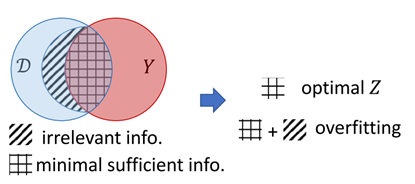

# 2025.3.23-2025.3.28

# 科研

## APT检测存在的问题：

1. **语义特征丢失，**现有的 IDS 通常会忽略有价值的语义数据，例如进程名称、命令行参数、文件路径和来源图中的 IP 地址。
2. **存在对抗的模拟攻击**，例如一张攻击图，可以反复添加良性子结构构造恶性数据来逃逸检测
3. **图嵌入生成稳定性不够**，APT攻击的隐蔽性导致溯源图数据稀疏且包含噪声（如不完整日志、误报）。对抗正则化通过对抗训练迫使嵌入分布接近先验分布（如高斯分布），增强了模型对噪声和缺失数据的鲁棒性，使生成的嵌入更稳定，避免因局部噪声导致检测失效。(也是目前多数自编码器在做的部分)

## 解决

我们现在聚焦到前两个问题，我看了两篇文章解决这些问题的：

- [Flash](https://ieeexplore.ieee.org/document/10646725/)文章解决了**第1.2个问题**，对于**语义特征丢失和对抗的模拟攻击**的问题

### **我们聚焦对抗的模拟攻击这个子问题**

Flash声称能应对**模拟攻击**，但其源码并没有相关实验，对于**对抗的模拟攻击（Mimicry Attacks）的防御存疑，**对抗模拟攻击防御能力仍需加强，后续可以补充实验来看。

**THREATRACE**（2023）是和**Flash**（2024）类似的做法，使用节点误分类来判断异常节点。其在第四节的评估部分讲述了其对适应性攻击（Adaptive Attacks）的防御能力。

具体来说，由于 THREATRACE 在错误分类时判断节点为异常，攻击者的目的是使异常节点被分类到正确的类别中，以避免被对抗性攻击的想法来开发对 THREATRACE 的自适应攻击，称为基于优化的规避攻击。发现。攻击者需要找到异常节点特征上的扰动，该扰动由节点与其邻居之间的边构成。。总之，假设 x 是 THREATRACE 最初可以检测到的异常节点的特征，基于优化的规避攻击的目标是将特征改为 xˆ 以逃避检测，约束条件为 ‖xˆ −x ‖2 ‖x‖2 < δa，其中 δa 限制了扰动。为了构造一个节点的对抗特征 xˆ，我们假设攻击者知道 §V 中提到的 THREATRACE 的特征提取方法。对于其他对抗方对 THREATRACE 的背景知识

1. 攻击者具有训练数据的攻击约束，攻击者拥有训练数据。使用训练数据的规避攻击可以分两步进行。第一步是在训练数据中找到一个良性节点 xb，它与异常节点 x 最相似，与 x 具有相同的类。
    
    $$
    \begin{array}{ccc}argmin_{x_b}\left\|x_b-x\right\|_2 & s.t. & class(x_b)=class(x)\end{array} \\ argmin_{\hat{x}}(loss(\hat{x}))\quad s.t.\quad\frac{\left\|\hat{x}-x\right\|_2}{\left\|x\right\|_2}<\delta_a,\hat{x}\in\mathbb{N}
    $$
    
2. 具有 THREATRACE 模型的攻击者。攻击者知道 THREATRACE 的模型，包括训练后的参数和超参数。因此，攻击者可以直接基于模型的损失来解决优化问题。
    
    $$
    argmin_{\hat{x}}(loss(\hat{x}))\quad s.t.\quad\frac{\left\|\hat{x}-x\right\|_2}{\left\|x\right\|_2}<\delta_a,\hat{x}\in\mathbb{N}
    $$
    

由此对抗性攻击有很多种，但是归根到底是对节点属性和与邻居边的干扰，下一步就应该去寻找增强模型鲁棒性的方法。

## 图信息瓶颈解决对抗攻击

> **对于图结构数据而言，什么是「优秀」的表示？**具体而言，信息瓶颈 (IB) 为表示学习提供了核心原则：最优表示应包含适合下游预测任务的最少充足信息。IB 鼓励表示最大程度地包含与目标相关的信息，以使预测结果尽可能准确（充足）。另一方面，IB 遏制表示从数据中获取与预测目标无关的额外信息（最少）。基于这一学习范式学得的模型自然而然可以避免过拟合，并对对抗攻击具备稳健性。
> 

[Graph information bottleneck](https://proceedings.neurips.cc/paper/2020/hash/ebc2aa04e75e3caabda543a1317160c0-Abstract.html)

这篇论文是关于图神经网络（GNNs）在对抗攻击下的鲁棒性研究。论文的核心思想是通过信息瓶颈理论（Information Bottleneck, IB）来学习图结构数据的最优表示，从而在保持表达力的同时增强模型的鲁棒性，和我要做的方向比较契合。

如图1所示，信息瓶颈准则激励表示ZZ尽可能捕获对任务目标YY有益的信息（sufficient的，图1中由方格阴影表示），同时尽可能去除输入DD中与任务目标无关的部分（minimal）。这种类似“提纯”的做法即“瓶颈”的含义，它使得训练的模型能够天然地避免过拟合并且对对抗性攻击变得更加鲁棒。

由于互信息的计算十分困难，在实际应用中不可能以上述公式为目标函数进行优化，常见的做法是计算互信息的上/下界作为目标函数进行优化。

图任务的输入数据包括节点属性和图结构，即D=(A,X)D=(A,X)。GIB继承了IB的基本思想，即同时从节点属性和图结构中捕获最小充分信息，如图2所示。但是也面临着两大挑战：

1. 一般的基于IB的模型都会假设样本是独立同分布的，而独立同分布的假设对图中的节点不成立；
2. 图结构信息对于图任务来说是不可或缺的，但是这种信息是离散的，故而难以优化。

1. **背景与动机**
- **图神经网络（GNNs）的挑战**：GNNs 在融合图结构和节点特征信息方面表现出色，但它们容易受到对抗攻击的影响。对抗攻击通过微小的扰动（如修改节点特征或图结构）可能导致模型的预测结果发生显著变化。
- **信息瓶颈理论（IB）**：IB 提供了一种学习最优表示的框架，要求表示既包含足够的信息来预测目标（充足性），又尽可能少地包含与目标无关的信息（最小性）。这种表示学习方法可以自然地提高模型的鲁棒性。

**2. 图信息瓶颈（GIB）**

- **核心思想**：`GIB` 是一种基于信息论的原则，旨在学习图结构数据的最优表示。它通过最大化表示与目标之间的互信息（I(Y; Z)）来确保预测的准确性，同时通过限制表示与输入数据（图结构和节点特征）之间的互信息（I(D; Z)）来减少无关信息的干扰。
- **结构信息约束（AIB）**：`GIB` 通过采样算法对图结构进行正则化，减少对抗攻击对图结构的扰动对模型的影响。（**符合模拟攻击的防御思想**）
- **特征信息约束（XIB）**：`GIB` 通过限制节点特征信息的冗余，减少对抗攻击对节点特征的扰动对模型的影响。（**符合自适应攻击的防御思想**）

**3. 模型实现**

论文提出了两种基于 GIB 的模型：

1. **`GIB-Cat`**：基于分类分布（Categorical Distribution）对图结构进行采样，适用于需要显式控制邻居节点数量的场景。
2. **`GIB-Bern`**：基于伯努利分布（Bernoulli Distribution）对图结构进行采样，适用于更灵活的邻居选择。

**上下文编码模块融合**

FLASH 的 `GNN` 基础上下文编码器可结合 `GIB` 的邻居采样算法。如 `GIB-Cat` 和 `GIB-Bern` 通过采样算法对图结构进行优化， FLASH 的 `GNN` 可借鉴这些算法，在进行图表示学习时，更关注与目标任务相关的结构信息，提高对图结构噪声和攻击的鲁棒性。

### 计划

1. 下一步尝试在Flash代码中加入`GIB`的思想，
2. 加入对抗性实验，以检测`GIB`的能力

# 大模型项目

思考下一步的做法，因为模型的泛化性不行，所以尝试写一个微调的脚本来改造数据，使其问题多样化，目前脚本还在编写

# 电网

1. 补充了一些研究背景和研究现状，将论文按方法进行归类
2. 对车辆电池异常检测进行了实验。
    - **飞桨学习赛：能源AI挑战赛——异常检测赛**
    1. 本赛题旨在更好地检验**电池安全**问题，促进智慧能源领域技术发展，比赛募集到的优秀异常检测方案，将应用于车辆预警、故障模式识别等多种场景。有些字段也是可调用资源能用的
    2. 数据信息如下所示
    
    | 字段 | 含义 |
    | --- | --- |
    | volt | 伏特，是电压的单位，用于表示电势差。在汽车等领域，volt用于表示电池的电压，电池电压的高低会影响电动汽车的性能和续航里程 |
    | current | 作为名词时，意思是电流，即电荷的定向移动形成的电流；作为形容词时，意思是当前的、现在的 |
    | soc | 在电池领域，soc是State of Charge的缩写，指电池的荷电状态，即电池剩余电量与完全充电状态的容量的比值，常用百分数表示。在集成电路领域，soc是System on Chip的缩写，指系统级芯片，是一种将多个电子元件集成在一个小型半导体基板上的技术 |
    | max_single_volt | 最大单体电压，指的是电池组中单个电池单元的最大电压值。 |
    | min_single_volt | 最小单体电压，指的是电池组中单个电池单元的最小电压值。 |
    | max_temp | 最高温度，表示某个设备、系统或环境中的最高温度值。 |
    | min_temp | 最低温度，表示某个设备、系统或环境中的最低温度值。 |
    | timestamp | 时间戳，是自1970年1月1日（UTC/GMT的午夜）以来经过的毫秒数 |
    1. 分别用赛题自带的自编码的无监督模型和自己写的监督的线性模型做实验，为了减少计算量，取时序数据最后一个滑动窗口为输入
    2. 实验结果如下：
        1. 自编码的无监督模型，使用encode-decode的模式，只用正样本（4000+）数据进行训练，学习正常模式，实验结果如下：
            
            
            
                AUC：0.5556
            
        2. 使用隐藏层128*64的线性模型，使用了7000+的数据（包括正样本和负样本），实验结果如下：
            
            
            
            AUC：0.9386
            
        3. 使用PCA主成成分分析对特征进行分析，将原来7维的数据降维到3维，精度有一定程度的下降，实验结果如下：
            
            
            
            
            
            AUC：0.8533
            

## **补充学习了知识inductive+transductive ML**

- 如果训练过程不需要测试集则是inductive，如经典样本独立的[supervised learning](https://zhida.zhihu.com/search?content_id=189421686&content_type=Article&match_order=1&q=supervised+learning&zhida_source=entity)
- 如果训练过程需要测试集（无标注）则是transductive，如样本间有连接的LPA算法

### **场景使用**

**数据集全部有label**

在图1上半部分中model1是半监督学习模式，因为训练数据有带标注的D1和无标注的D2，训练过程中窥见了D2的结构信息，因此是`transductive`模式。在图1的下半部分中，model2是经典的监督学习模式，训练过程不用D2所有信息，因此是`inductive`模式。

### 数据集样本部分有label

可以看到`inductive`模式在训练过程中不应有test数据集，