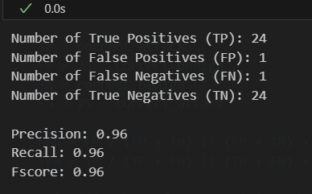
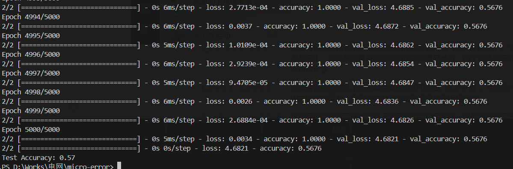

# 2025.3.28-2025.4.4

# 科研

## APT检测存在的问题：

1. **存在对抗的模拟攻击**，例如一张攻击图，可以反复添加良性子结构构造恶性数据来逃逸检测
2. **存在对抗的逃逸和中毒攻击**
3. **图嵌入生成稳定性不够**，APT攻击的隐蔽性导致溯源图数据稀疏且包含噪声（如不完整日志、误报）。对抗正则化通过对抗训练迫使嵌入分布接近先验分布（如高斯分布），增强了模型对噪声和缺失数据的鲁棒性，使生成的嵌入更稳定，避免因局部噪声导致检测失效。(也是目前多数自编码器在做的部分)

## 解决

我们现在聚焦到前两个问题，我看了两篇文章解决这些问题的：

- [Flash](https://ieeexplore.ieee.org/document/10646725/)文章解决了**第1.2个问题**，对于**语义特征丢失和对抗的模拟攻击**的问题

### **我们聚焦对抗的模拟攻击这个子问题**

- Flash声称能应对**模拟攻击**，但其源码并没有相关实验，对于**对抗的模拟攻击（Mimicry Attacks）的防御存疑，**对抗模拟攻击防御能力仍需加强，后续可以补充实验来看。
- 和老师的交流来看，我需要在训练的时候**加入攻击数据样本，来加大良性数据样本和攻击数据样本的分布差异**。

## 复现Flash源码

> 使用的是作者给出的源代码，但是复现过程中，按照作者训练模型的方法训练模型得到的模型参数，测试后，不能复现完整结果，作者也没有公布具体该怎么做调整超参数或方法进行训练😭
> 
1. **unicorn** （子图分类）
    1. 使用作者训练好的参数测试：
        
        可以达到论文标称的数据
        
        
        
    2. 自己使用作者给出源码训练后，效果不理想，和设置的阈值也没关系，因为良性图和恶性图的子图分类误分类的数值挺接近的。
        
        
        
        暂时还在排查问题，在该数据集上不排除作者使用了trick
        
2. **theia（节点分类）**
    1. 使用作者训练好的参数测试：
        
        可以达到论文标称的数据
        
        
        
    2. 自己使用作者给出源码训练后，效果不理想
        
        
        

### 计划

1. 下一步复现Flash在其他数据集上的表现
2. 继续消化上次老师和我讲的思路，尝试在其他框架上加入这个思路

# 大模型项目

1. 发布了新的模型并成功部署，得到了公司的反馈并做下一步的改进
2. 尝试优化模型对数据做更好的增强
    
    之前的数据增强将问题、思维链和回复做了处理。发现模型经过Rag仍有幻觉，所以我们尝试将回复不变
    
3. 完成了几个操作json，对数据集进行操作的脚本

# 电网

完成了**电力微电网中的故障检测的实验和代码复现**

- **数据集的含义**
    
    
    | 字段 | 含义 |
    | --- | --- |
    | P_L 1、P_L 2、P_L 3 | 这些特征可能代表不同测量点或相位的负载功率（Power Load）。通常在电力系统中，功率是衡量设备或线路负载的重要参数，用于评估系统的运行状态和稳定性。 |
    | Current 2、Current 3： | 这些特征可能表示不同测量点或相位的电流值（Current）。电流是电力系统中关键的物理量，用于评估设备的负载情况和系统稳定性。 |
    | P_L Ideal、Current Ideal | 这些特征可能表示理想状态下的负载功率和电流值。理想值通常用于与实际测量值进行对比，以评估系统是否偏离正常运行状态。 |
    | Time： | 这一特征表示时间戳，用于记录数据的时间点。时间戳在时间序列分析中非常重要，尤其是在电力系统异常检测和稳定性评估中。 |

**一些特征处理的细节**

1. 将时间特征进行独热编码（One-Hot Encoding），以便将其转换为适合神经网络输入的格式。
2. 将处理后的数据转换为NumPy数组，并提取特征（XX）和标签（yy）。标签yy表示故障类型，特征XX表示电流、负载和其他时间特征
3. 对特征数据进行标准化处理，以提高神经网络的训练效果。

将`current1`，`current2`，`current3`，`current Ideal`作为分类标签，组装数据集，这样的方法相当于在良性样本分布做分类

使用线性模型ANN进行训练

**结果**

准确度0.57