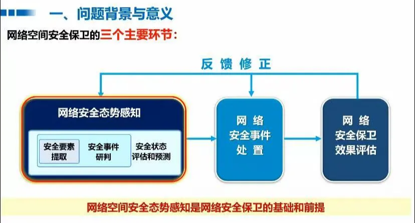
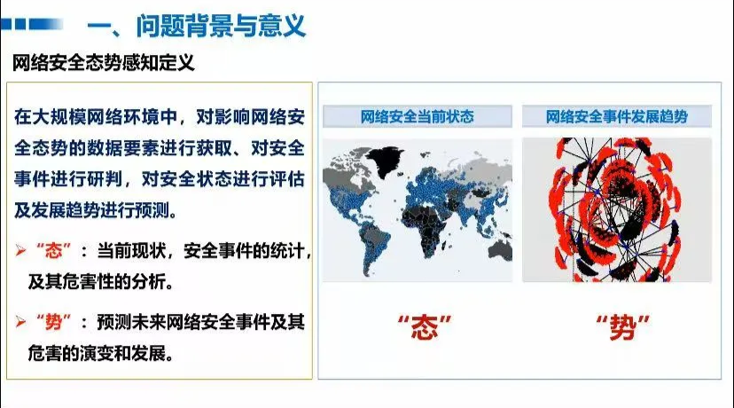
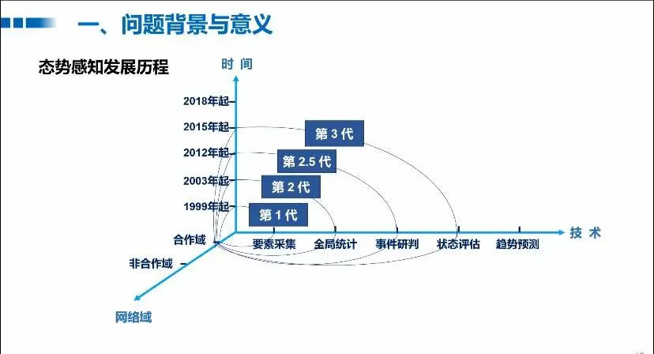
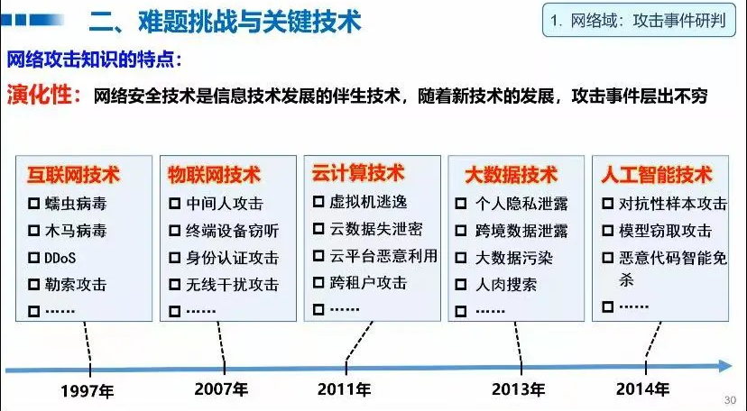
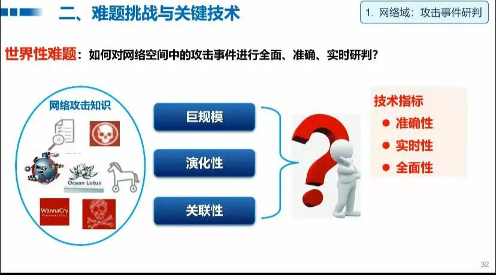
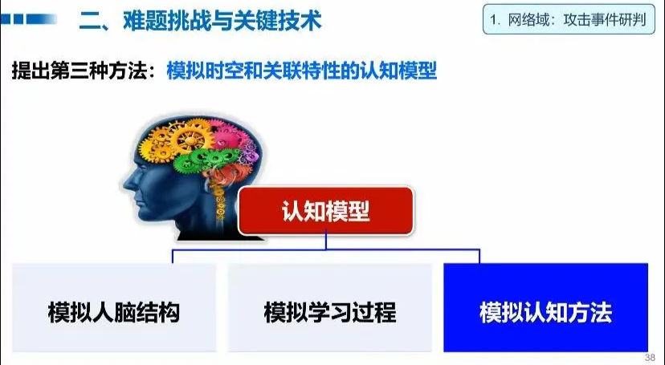

# 2025.3.5-2025.4.11 (1)

# 科研

## APT检测存在的问题：

1. **存在对抗的模拟攻击**，例如一张攻击图，可以反复添加良性子结构构造恶性数据来逃逸检测
2. **存在对抗的逃逸和中毒攻击**
3. **图嵌入生成稳定性不够**，APT攻击的隐蔽性导致溯源图数据稀疏且包含噪声（如不完整日志、误报）。对抗正则化通过对抗训练迫使嵌入分布接近先验分布（如高斯分布），增强了模型对噪声和缺失数据的鲁棒性，使生成的嵌入更稳定，避免因局部噪声导致检测失效。(也是目前多数自编码器在做的部分)

## 解决

我们现在聚焦到前两个问题，我看了两篇文章解决这些问题的：

- [Flash](https://ieeexplore.ieee.org/document/10646725/)文章解决了**第1.2个问题**，对于**语义特征丢失和对抗的模拟攻击**的问题

### **我们聚焦对抗的模拟攻击这个子问题**

- Flash声称能应对**模拟攻击**，但其源码并没有相关实验，对于**对抗的模拟攻击（Mimicry Attacks）的防御存疑，**对抗模拟攻击防御能力仍需加强，后续可以补充实验来看。
- 和老师的交流来看，我需要在训练的时候**加入攻击数据样本，来加大良性数据样本和攻击数据样本的分布差异**。

## 复现Flash源码

> 使用的是作者给出的源代码，但是复现过程中，按照作者训练模型的方法训练模型得到的模型参数，测试后，不能复现原来的结果，作者也没有公布具体该怎么做调整超参数或方法进行训练😭
> 
1. **unicorn** （子图分类）
    1. 使用作者训练好的参数测试：
        
        可以达到论文标称的数据
        
        
        
    2. 自己使用作者给出源码训练后，效果不理想，和设置的阈值也没关系，因为良性图和恶性图的子图分类误分类的数值挺接近的。
        
        
        
        暂时还在排查问题，在该数据集上不排除作者使用了trick
        
2. **theia（节点分类）**
    1. 使用作者训练好的参数测试：
        
        可以达到论文标称的数据
        
        
        
    2. 自己使用作者给出源码训练后，效果不理想
        
        
        
3. **Cadets**
    1. Cadets_origin 使用作者训练好的参数测试
        
        
        
    2. Cadets_self train自己训练的结果（未训练word2vec）
        
        
        
4. **Fivedirections**
    1. 使用作者训练好的参数测试
        
        
        
    2. 自己训练的结果
        
        
        
5. **streamspot**
    1. 使用作者训练好的参数测试
        
        
        
    2. 自己训练的结果
        
        
        
6. **OpTC**
    1. Optc 使用作者训练好的参数测试
        
        
        

## 在训练中加入攻击图

在图级别数据集中加入负样本对抗训练，即攻击图我们加入负损失

```python
        # 定义加权对抗损失函数
        def weighted_adversarial_loss(out, y, weight=1.0):
            return -weight * F.cross_entropy(out, y)
```

但是攻击图测试集中，存在一些和训练集中类似的图，下面就是一个例子，如图所示，161是分类错误的节点数，2.03是分类错误所占图的比例，和良性图中分类错误的节点数目和比例相近，应该是攻击特征不明显和训练集中的良性图相似


对于streamspot这种图数据集，可能该方法表现不够好，没有下一步计划在节点级的数据集如Cadets中加入此模块。

- github上面有多个issue提到无法复现原结果，可能作者有使用了特殊的超参数或者训练方法，这个也需要再研究一下


## 计划

1. 下一步复现Flash在其他数据集上的表现,实验并未跑完，还剩一个Optc数据集的自己训练的数据
2. 尝试加入加入负样本训练进入模块节点级的数据集

# 大模型项目

1. 尝试减少训练次数，使用回答不变的增强数据集进行微调
2. 客户要求和答案尽量一致，发现用户数据对模型的微调会让模型认知产生影响，所以我们只使用针对自我认知数据集微调一轮的模型，并且加大模型对上下文的感知能力，即加大max_token参数，最后使用`RAGFlow`的`prompt`解决
3. 解决了流式输出的问题，客户说`RAGFlow` 不能流式输出，实际上是对流式输出的接口不熟悉，我写了一个demo
    
    ```python
    import requests
    import json
    
    # 配置
    RAGFLOW_BASE_URL = "http://localhost:901"
    RAGFLOW_API_KEY = "ragflow-QzMmQzMDlhMDVmYTExZjBiZjE5ODI3Nz"
    CHAT_ID = "e07b72d4062311f0bd17827750c53287"
    
    # 创建会话
    def create_session():
        url = f"{RAGFLOW_BASE_URL}/api/v1/chats/{CHAT_ID}/sessions"
        headers = {
            "Content-Type": "application/json",
            "Authorization": f"Bearer {RAGFLOW_API_KEY}"
        }
        payload = {
            "name": "My Session",
            "user_id": "123@qq.com"  # 替换为你的用户 ID
        }
        response = requests.post(url, headers=headers, json=payload)
        
        if response.status_code == 200:
            data = response.json()
            session_id = data.get("data", {}).get("id")
            print(f"Session created with ID: {session_id}")
            return session_id
        else:
            print(f"Error creating session: {response.text}")
            return None
    
    # 与聊天助手对话
    def chat_with_assistant(session_id, question):
        url = f"{RAGFLOW_BASE_URL}/api/v1/chats/{CHAT_ID}/completions"
        headers = {
            "Content-Type": "application/json",
            "Authorization": f"Bearer {RAGFLOW_API_KEY}"
        }
        payload = {
            "question": question,
            "stream": True,
            "session_id": session_id,
            "user_id": "user123"  # 替换为你的用户 ID
        }
        response = requests.post(url, headers=headers, json=payload, stream=True)
        
        if response.status_code == 200:
            answer_parts = []  # 存储答案的片段
            for chunk in response.iter_lines():
                if chunk:
                    response_str = chunk.decode('utf-8')
                    if response_str.startswith("data:"):
                        json_str = response_str[5:]
                        try:
                            data = json.loads(json_str)
                            if isinstance(data.get("data", {}), bool):
                                break
                            answer = data.get("data", {}).get("answer")
                            if answer:
                                answer_parts.append(answer)
                                #打印每次生成的内容
                                print(answer, end="", flush=True)
                        except json.JSONDecodeError as e:
                            print(f"Error decoding JSON: {e}")
            # 最后一次性打印答案
            print("".join(answer_parts))
        else:
            print(f"Error chatting with assistant: {response.text}")
    
    # 主流程
    if __name__ == "__main__":
        session_id = create_session()
        if session_id:
            question = "你好"
            print("Assistant: ", end="", flush=True)
            chat_with_assistant(session_id, question)
    ```
    
4. 改进了原来的测试脚本，增加了`RAGFlow`的自动化测试
    
    ```python
    from unittest import result
    
    def get_answer_from_ragflow(question):
        """
        获取回答，使用 RAGFlow。
        
        Args:
            question (str): 用户问题。
        
        Returns:
            tuple: (complex_cot, response_part)
        """
        # 创建会话
        session_id = create_session()
        if session_id is None:
            return "", "Error: Failed to create session"
        
        # 与 RAGFlow 聊天助手对话
        url = f"{RAGFLOW_BASE_URL}/api/v1/chats/{CHAT_ID}/completions"
        headers = {
            "Content-Type": "application/json",
            "Authorization": f"Bearer {RAGFLOW_API_KEY}"
        }
        payload = {
            "question": question,
            "session_id": session_id,
            "user_id": "123@qq.com" , # 替换为你的用户 ID
            "stream": False
        }
        
        # try:
            # 发送 POST 请求
        response = requests.post(url, headers=headers, json=payload)
        
        # 检查响应是否成功
        if response.status_code == 200:
            response = response.json()
            # result = json.loads(response)
            # print(response)
            answer = response.get("data").get("answer", "").strip()
            # print("完整回答:", answer)
            
            # 提取 </think> 前面的内容作为 complex_cot
            think_tag_end = answer.find('</think>')
            if think_tag_end != -1:
                complex_cot = answer[:think_tag_end].strip()
                # 提取 </think> 后面的内容作为 response_part
                response_part = answer[think_tag_end + len('</think>'):].strip()
            else:
                complex_cot = ""
                response_part = answer.strip()
            
            return complex_cot, response_part
    
    def create_session():
        url = f"{RAGFLOW_BASE_URL}/api/v1/chats/{CHAT_ID}/sessions"
        headers = {
            "Content-Type": "application/json",
            "Authorization": f"Bearer {RAGFLOW_API_KEY}"
        }
        payload = {
            "name": "My Session",
            "user_id": "123@qq.com"  # 替换为你的用户 ID
        }
        response = requests.post(url, headers=headers, json=payload)
        
        if response.status_code == 200:
            data = response.json()
            session_id = data.get("data", {}).get("id")
            # print(f"Session created with ID: {session_id}")
            return session_id
        else:
            print(f"Error creating session: {response.text}")
            return None
    ```
    

# 电网

- **电力窃漏电用户数据**

问题背景：实际生活中，有很多人可能会偷别人的电用，或者计量电量的设备坏了，造成无法根据实际用电情况计价，可能导致用户多交或少交了钱。我们可以使用自动化设备实现对用户用电负荷等数据进行采集，通过从这个数据中找到异常的情况。这也是一种异常情况

1. **数据抽取：**
    1. 从营销系统抽取用户信息
    2. 从计量自动化系统采集电量、负荷等如下图，你可以看到能实际采集到的数据如下：
    
    
    
2. **数据预处理**
    1. 过滤掉无关的属性，例如用户编号。
    2. 数据填充：插补缺失值，调用python库中已经实现的拉格朗日函数对样本数据进行插值
    
    从大量数据中选取291个样本数据。
    
    现在，我们要对291个样本数据进行降维处理（也就是将相关属性合并为一个属性）
    
    
    
    我们构建三个指标（新属性，由旧属性变换而来）：
    
    （1）电量趋势下降指标。对每天的前后5天（总共11天）计算电量的下降趋势（即斜率）
    
    （2）线损指标。若第L天的线路供电为S,线路上各个用户用电总量为W,则线损率T=(S-W)/S * 100%
    
    （3）告警类指标。计算终端报警的次数总和。
    
3. **模型构建以及结果**

划分了训练集和测试集，80%的训练集，20%的测试集

1. 线性模型
    
    
    
    <center>图1 训练loss趋势</center>
    
    
    
    <center>各标签对比分析</center>
    
2. SVM
3. 随机森林
4. XGBoost

**结果**

| **模型** | **ACC** |
| --- | --- |
| 线性模型 | 91.53% |
| SVM | 89.83% |
| 随机森林 | 89.83% |
| XGBoost | 89.83% |

# 网络空间安全的态势感知

## 一、问题背景以及意义

### 主要环节



### 态势感知定义



### 两大区域


### 三大技术指标

1. 全面
2. 准确
3. 实时

### 发展历程



## 二、难题挑战与关键技术

### 三大领域

1. **攻击事件**
    1. 困难
        
        演化性
        
        
        
        存在的特性
        
        
        
        使用认知模型来应对，使用模拟时空和关联特性的认知模型
        
        
        
        **使用多维关联认知模型`MDATA` 来应对：**
        
        
        
        
        
        1.**知识表示和管理**
        
        攻击知识和地址，行为有关，目标是资产和漏洞
        
        
        
        因此加入`MDATA`表示方法：在知识图谱的基础上增加了时间维和空间维，有效支撑了巨规模，演化性和复杂关联的攻击研判知识的表示
        
        
        
        **2.知识获取**
        
        2.1归纳算子
        
        
        
        2.2演绎算子
        
        基于已知知识推演未知知识
        
        **3.知识利用（采用时空图流式匹配方法）**
        
        
        
    
2. **舆情事件**
    
    
    
    用的也是基于多维关联认知模型`MDATA` ，只不过是抽取的实体有所区别
    
    
    
3. **攻防演练**
    
    难点：
    
    
    
    MDATA的博弈演化模式核心思想是“对抗优化”
    
    
    
    根据任务的定制仿真，不断迭代系统
    
    **评估**
    
    
    

### 第二章总结


1. 知识获取
2. 知识利用

## 三、系统与应用

### 网络


### 舆情事件感系统和应用


### 攻防事件


## 小结


## 未来趋势


1. 非合作域（如其他国家）
2. 趋势预测（预测将要到来的攻击）


1. 全面（不漏报，可以做已知的已知，部分已知的未知，未知的未知无法被覆盖）
2. 准确
3. 实时