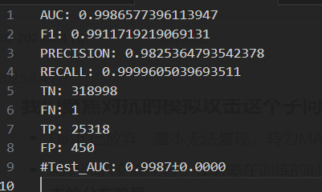

# 2025.4.12-2025.4.18

# 科研

## APT检测存在的问题：

1. **存在对抗的模拟攻击**，例如一张攻击图，可以反复添加良性子结构构造恶性数据来逃逸检测
2. **存在对抗的逃逸和中毒攻击**
3. **图嵌入生成稳定性不够**，APT攻击的隐蔽性导致溯源图数据稀疏且包含噪声（如不完整日志、误报）。对抗正则化通过对抗训练迫使嵌入分布接近先验分布（如高斯分布），增强了模型对噪声和缺失数据的鲁棒性，使生成的嵌入更稳定，避免因局部噪声导致检测失效。(也是目前多数自编码器在做的部分)

## 解决

我们现在聚焦到前两个问题，我看了两篇文章解决这些问题的：

- [Flash](https://ieeexplore.ieee.org/document/10646725/)文章解决了**第1.2个问题**，对于**语义特征丢失和对抗的模拟攻击**的问题
- MAGIC这种节点级检测应该也能应对图的模拟攻击问题，但是论文没做有关实验，在鲁棒性上可以做有关实验来验证。

### **我们聚焦对抗的模拟攻击这个子问题**

- Flash 已放弃，基本无法复现，转为MAGIC为基线。
- 和老师的交流来看，在训练的时候**加入攻击数据样本，来加大良性数据样本和攻击数据样本之间的嵌入距离**
- 生成模拟攻击数据样本用于训练（初步设想是可以先使用基于规则的方法），加强模型的鲁棒性

## 复现MAGIC

> 图的基本不用看，每篇论文的数据都很好看，节点级数据的复现效果基本一致，比Flash的复现效果要好很多
> 

**节点级数据集`Theia`** 

- 自己训练和验证

- 作者给出的模型跑的结果
    
    
    

**节点级数据集`Trace`** 

- 自己训练和验证
    
    
    
- 作者给出的模型跑的结果
    
    
    

**节点级数据集`Cadets`**

- 自己训练和验证

- 作者给出的模型跑的结果
    
    
    

## 在训练中加入攻击图

这周已经将攻击样本的数据集标注出来了，这周末就可以将图自编码器进行修改，将攻击样本加入到训练，看看其效果

# Magic的局限：

在复现Magic代码的时候，发现其只使用了**边的类型（实体间的活动类型：Open,Write）**和**节点类型（节点属于什么种类：MemoryObject，FileObject）**变为独热编码作为图数据输入，那么根据Flash，他有以下的缺陷：

1. 利用的语义信息不足，像一些cmd的命令，也是有用的信息，是不是可以将其嵌入到特征中去
2. 没有利用到时间顺序

## 计划

1. Magic将攻击样本加入到训练，加大攻击样本和良性样本之间的嵌入距离
2. 生成模拟攻击的数据，测试MAGIC，并针对生成模拟攻击的数据构建新的鲁棒性的模型
3. 语义信息和时间信息加入到编码

# 电网

1. 和杨浩然学长开会，说明了我们这几周的进展，商讨了下一步我们的计划
2. 下一步计划是将目前的可调用资源异常检测的工作做一个聚焦，聚焦到国网线路的异常检测上面来，通过电压，电流，功率等和线路相关的，将线路的异常进行分类:正常，中间熔断，末段熔断。
3. 复现了一个电力系统异常值监测（自编码器，孤立森林，SVMD）
    
    数据是某个用户的用电量的数据